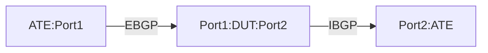

# PF-1.4: Interface based GUE Decapsulation to IPv4 tunnel

## Summary

This is to test the the functionality of policy-based forwarding (PF) to decapsulate Generic UDP Encapsulation (GUE) traffic. These tests verify the use case of IPv4, and IPv6 encapsulated traffic in IPv4 GUE tuennel. The tests are meant for `Tunnel Interface` or `Policy Based` implementation of IPv4 GUE tunnel. The tests validate that the DUT performs the following action.

 - Decapsulate the outer (transport) layer 3 and GUE headers of GUE packets destined to locally-configured decap VIP and forward them based on the exposed inner (payload) L3 header.
 - GUE Inner protocol type must be derived from a unique DST port. If not specifically configured, then the following default DST UDP port will be used.
    - For inner IPv4 - GUE UDP port 6080
    - For inner IPv6 - GUE UDP port 6615
 - Post decapsulation the DUT should copy outer TTL(and decrement) to inner header and maintain the inner DSCP vaule.
    - If explicit configration is present to not copy the TTL, then it will be honored. 
 - Decapsulate the packet only if it matches the locally configured GUE VIP and associated UDP port/port-range.
    - Traffic not subject to match criteria will be forwared using traditional IP forwarding. 
 - UDP checksum in the transport (outer) header is used for the packet integrity validation, and the DUT will ignore the GUE checksum (non-zero or all-zero). 

## Testbed type

* [`featureprofiles/topologies/atedut_2.testbed`](https://github.com/openconfig/featureprofiles/blob/main/topologies/atedut_2.testbed)

## Procedure

### Test environment setup

  Create the following connections:
  


*  ATE Port 1: Generates GRE-encapsulated traffic with various inner (original) destinations.
*  ATE Port 2: Receives decapsulated traffic whose inner destination matches the policy.
  
### DUT Configuration

1.  Interfaces: Configure all DUT ports as singleton IP interfaces.
 
2.  Static Routes/LSPs:
    *  Configure an IPv4 static route to GRE decapsulation destination (DECAP-DST) to Null0.
    *  Configure static routes for encapsulated traffic destinations IPV4-DST1 and IPV6-DST1 towards ATE Port 2.
    *  Configure static MPLS label binding (LBL1) towards ATE Port 2. Next hop of ATE Port 1 should be indicated for MPLS pop action.
    *  Configure static routes for destination IPV4-DST2 and IPV6-DST2 towards ATE Port 2.

3.  Policy-Based Forwarding: 
    *  Rule 1: Match GRE traffic with destination DECAP-DST using destination-address-prefix-set and decapsulate.
    *  Rule 2: Match all other traffic and forward (no decapsulation).
    *  Apply the defined policy with to the ingress ATE Port 1 interface. 
    
    **TODO:** OC model does not have a provision to apply decap policy at the network-instance level for traffic destined to device loopback interface (see Cisco CLI config exepmt below). Needs clarification and/or augmentation by vendors if required. [PR #1150](https://github.com/openconfig/public/pull/1150)

    ```
    vrf-policy
      vrf default address-family ipv4 policy type pbr input DECAP-POLICY
    ```

*  
  * Description of procedure to configure ATE and DUT with pre-requisites making it possible to cover the intended paths and RPC's.

* TestID-x.y.z - Name of subtest
  * Step 1
  * Step 2
  * Validation and pass/fail criteria

* TestID-x.y.z - Name of subtest
  * Step 1
  * Step 2
  * Validation and pass/fail criteria

## OpenConfig Path and RPC Coverage

This example yaml defines the OC paths intended to be covered by this test.  OC paths used for test environment setup are not required to be listed here.

```yaml
paths:
  # interface configuration
  /interfaces/interface/config/description:
  /interfaces/interface/config/enabled:
  # name of chassis and linecard components
  /components/component/state/name:
    platform_type: ["CHASSIS", "LINECARD"]

rpcs:
  gnmi:
    gNMI.Set:
      union_replace: true
    gNMI.Subscribe:
      on_change: true
```

## Required DUT platform

* Specify the minimum DUT-type:
  * MFF - A modular form factor device containing LINECARDs, FABRIC and redundant CONTROLLER_CARD components
  * FFF - fixed form factor
  * vRX - virtual router device
