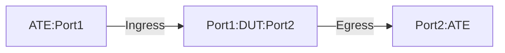

# PF-1.5: Interface based MPLSoGUE Decapsulation to IPv4 tunnel

## Summary

This is to test the the functionality of policy-based forwarding (PF) to decapsulate Generic UDP Encapsulation (GUE) traffic. These tests verify the use case of MPLSoGUE to IPv4 GUE tuennel. The tests are meant for `Tunnel Interface` or `Policy Based` implementation of IPv4 GUE tunnel. The tests validate that the DUT performs the following action.

 - Decapsulate the outer (transport) layer 3 and GUE headers of GUE packets destined to locally-configured decap VIP and matching UDP port after that it will forward them based on the exposed inner (payload) L3 header.
 - GUE Inner protocol type must be derived from a unique DST port. If not specifically configured, then the following default DST UDP port will be used.
    - For inner MPLS - GUE UDP port 6635
  - Post decapsulation the DUT should forward traffic as per the label action for inner MPLS label.
    - If the the label action is POP, then MPLS labeled will be removed.
      - Lookup for inner IP address will be performed. TTL should be taken from the outer GUE header, decremented by 1 and copied to egress IP packet header.
    - If the label action is SWAP, then packet will be swapped with the egress MPLS label and forwarded.
 - Decapsulate the packet only if it matches the locally configured GUE VIP and associated UDP port/port-range.
    - Traffic not subject to match criteria will be forwared using traditional IP forwarding. 
 - UDP checksum in the transport (outer) header is used for the packet integrity validation, and the DUT will ignore the GUE checksum (non-zero or all-zero). 

## Testbed type

* [`featureprofiles/topologies/atedut_2.testbed`](https://github.com/openconfig/featureprofiles/blob/main/topologies/atedut_2.testbed)

## Procedure

### Test environment setup

* Create the following connections:
* DUT has ingress and egress port connected to the ATE.
  


*  ATE Port 1: Generates GUE-encapsulated traffic with various inner (original) destinations.
*  ATE Port 2: Receives decapsulated traffic whose inner destination matches the policy.
  
### DUT Configuration

1.  Interfaces: Configure all DUT ports as singleton IP interfaces.
 
2.  Static Routes/LSPs:
    *  Configure an IPv4 static route to GUE decapsulation destination (DECAP-DST) to Null0.
    *  Have policy configuration that match GUE decapsulation destination and default/non-default GUE UDP port/port-range for the decapsulation.
       *  If udp port is not configured then the default GUE UDP port will be inherited/used.
    *  Apply the defined policy on the Ingress (DUT port1) port.
    *  Configure static routes for encapsulated traffic destinations IPV4-DST1 and IPV6-DST1 towards ATE Port 2.
    *  Configure static MPLS label binding (LBL1) towards ATE Port 2. Next hop of ATE Port 1 should be indicated for MPLS pop action.
    *  Configure static routes for destination IPV4-DST2 and IPV6-DST2 towards ATE Port 2.

3.  Policy-Based Forwarding: 
    *  Rule 1: Match GUE traffic with destination DECAP-DST using destination-address-prefix-set and default/non-default GUE UDP port/port-range for decapsulation.
      * If udp port is not configured then the default GUE UDP port will be inherited/used.   
    *  Rule 2: Match all other traffic and forward (no decapsulation).
    *  Apply the defined policy on the Ingress (DUT port1) port. 
    
### PF-1.5.1: GUE Decapsulation of inner MPLS traffic using default GUE UDP port 6635 label action POP

### PF-1.5.2: GUE Decapsulation of inner MPLS traffic using non-default GUE UDP port or port-range label action POP

### PF-1.5.3: GUE Decapsulation of inner MPLS traffic using default GUE UDP port 6635 label action SWAP

### PF-1.5.4: GUE Decapsulation of inner MPLS traffic using non-default GUE UDP port or port-range label action SWAP

### PF-1.5.5: GUE Decapsulation of inner MPLS traffic using default GUE UDP port 6635 label action POP GUE checksum ALL-ZERO

### PF-1.5.6: GUE Decapsulation of inner MPLS traffic using non-default GUE UDP port or port-range label action POP and GUE checksum ALL-ZERO

### PF-1.5.7: GUE Decapsulation of inner MPLS traffic using default GUE UDP port 6635 label action POP and NO-TTL propogation

### PF-1.5.8: GGUE Decapsulation of inner MPLS traffic using non-default GUE UDP port or port-range label action POP and NO-TTL propogation

### PF-1.5.9: GUE Decapsulation of inner IPv4 traffic using default default GUE UDP port 6635 (Negative)

### PF-1.5.10: GUE Decapsulation of inner IPv4 traffic using non-default GUE UDP port or port-range (Negative)

### PF-1.5.11: GUE Decapsulation of inner IPv6 traffic using default default GUE UDP port 6635 (Negative)

### PF-1.5.12: GUE Decapsulation of inner IPv6 traffic using non-default GUE UDP port or port-range (Negative)

### PF-1.5.13: GUE Pass-through (Negative).

## Config Parameter Coverage

## Telemetry Parameter Coverage

## OpenConfig Path and RPC Coverage

This example yaml defines the OC paths intended to be covered by this test.  OC paths used for test environment setup are not required to be listed here.

```
```

## Required DUT platform

* Specify the minimum DUT-type:
  * MFF - A modular form factor device containing LINECARDs, FABRIC and redundant CONTROLLER_CARD components
  * FFF - fixed form factor
  * vRX - virtual router device
