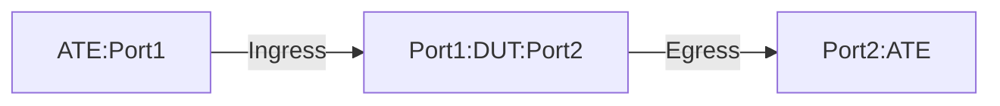

# PF-1.5: Interface based MPLSoGUE Decapsulation to IPv4 tunnel

## Summary

This is to test the the functionality of policy-based forwarding (PF) to 
decapsulate Generic UDP Encapsulation (GUE) traffic. These tests verify the use
case of MPLSoGUE to IPv4 GUE tunnel. The tests are meant for `Tunnel Interface`
or `Policy Based` implementation of IPv4 GUE tunnel. The tests validate that 
the DUT performs the following action.

 - DUT is a transient node to forward MPLSoGUE traffic.
 - DUT is a target node to decapsulate IPv4GUE and forward inner MPLSoGUE to the destination. 


## Testbed type

* [`featureprofiles/topologies/atedut_2.testbed`](https://github.com/openconfig/featureprofiles/blob/main/topologies/atedut_2.testbed)

## Procedure

### Test environment setup

* Create the following connections:
* DUT has ingress and egress port connected to the ATE.
  


*  ATE Port 1: Generates GUE-encapsulated traffic with various inner (original) destinations.
*  ATE Port 2: Receives decapsulated traffic whose inner destination matches the policy.
  
### DUT Configuration

1.  Interfaces: Configure all DUT ports as singleton IP interfaces.
 
2.  Static Routes/LSPs:
    *  Configure an IPv4 static route to GUE decapsulation destination (DECAP-DST) to Null0.
    *  Have policy configuration that match GUE decapsulation destination and default/non-default GUE UDP port/port-range for the decapsulation.
       *  If udp port is not configured then the default GUE UDP port will be inherited/used.
    *  Apply the defined policy on the Ingress (DUT port1) port.
    *  Configure static routes for encapsulated traffic destinations IPV4-DST1 towards ATE Port 2.
    *  Configure static MPLS label binding (LBL1) towards ATE Port 2. Next hop of ATE Port 1 should be indicated for MPLS pop action.

3.  Policy-Based Forwarding: 
    *  Rule 1: Match GUE traffic with destination DECAP-DST using destination-address-prefix-set and default/non-default GUE UDP port/port-range for decapsulation.
      * If udp port is not configured then the default GUE UDP port will be inherited/used.   
    *  Rule 2: Match all other traffic and forward (no decapsulation).
    *  Apply the defined policy on the Ingress (DUT port1) port. 
    
### PF-1.5.1: MPLSoGUE Pass-Through for DUT.

-  Push DUT configuration.

Traffic: 
-  Generate MPLSoGUE-encapsulated traffic from ATE Port 1 with destinations matching IPV4-DST1 and default GUE UDP port 6635.
-  Inner MPLS label is Label (L
-  BL2 - a valid MPLS label)
-  Inner IPv4 destination should match IPV4-DST2.
-  Inner-packet DSCP value should be set to 32.
-  Inner-packet TTL value should be set to 64.
  
Verification: 
- DUT will lookup the route for IPV4-DST1 in its route table and forward towards ATE port 2.
- ATE port 2 will decapsulate the outer header and take action on MPLS label. 
- No packet loss.
- Inner-packet DSCP should be preserved.
- Inner-packet TTL value should be decremented by 1 to 63.
- PF counters reflect decapsulated packets.

### PF-1.5.2: GUE decapsulation of IPv4 carrying inner MPLSoGUE.

-  Push DUT configuration.

Traffic: 
-  Generate GUE-encapsulated traffic from ATE Port 1 with destinations matching DECAP-DST and default GUE UDP port 6080.
     -  Inner frame will be MPLSoGUE-encapsulated traffic with destinations matching IPV4-DST1 and default GUE UDP port 6635.
        -  Outer IPGUE + Inner MPLSoGUE+ Payload
-  Inner IPv4 destination should match IPV4-DST2.
-  Inner-packet DSCP value should be set to 32.
-  Inner-packet TTL value should be set to 64.
  
Verification: 
- DUT will lookup the route for IPV4-DST1 in its route table and forward towards ATE port 2.
- ATE port 2 will decapsulate the outer header and take action on MPLS label. 
- No packet loss.
- Inner-packet DSCP should be preserved.
- Inner-packet TTL value should be decremented by 1 to 63.
- PF counters reflect decapsulated packets.


## Config Parameter Coverage

## Telemetry Parameter Coverage

## OpenConfig Path and RPC Coverage

This example yaml defines the OC paths intended to be covered by this test.  OC paths used for test environment setup are not required to be listed here.

```
```

## Required DUT platform

* Specify the minimum DUT-type:
  * MFF - A modular form factor device containing LINECARDs, FABRIC and redundant CONTROLLER_CARD components
  * FFF - fixed form factor
  * vRX - virtual router device
