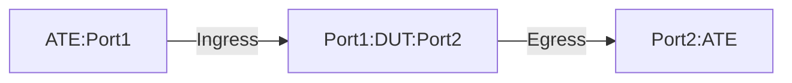

# PF-1.5: Interface based IPGUE Decapsulation for MPLSoGUE traffic

## Summary

This is to test the the functionality of policy-based forwarding (PF) to 
decapsulate Generic UDP Encapsulation (GUE) traffic. These tests verify the use
case of MPLSoGUE to IPv4 GUE tunnel. The tests are meant for `Tunnel Interface`
or `Policy Based` implementation of IPv4 GUE tunnel. The tests validate that 
the DUT performs the following action.

 - DUT is a transient node to forward MPLSoGUE traffic.
 - DUT is a target node to decapsulate IPv4GUE and forward inner MPLSoGUE to the
   destination. 


## Testbed type

* [`featureprofiles/topologies/atedut_2.testbed`](https://github.com/openconfig/featureprofiles/blob/main/topologies/atedut_2.testbed)

## Procedure

### Test environment setup

* Create the following connections:
* DUT has ingress and egress port connected to the ATE.
  


*  ATE Port 1: Generates GUE-encapsulated traffic :IP+UDP+MPLS+<Payload> OR IP+UDP+IP+UDP+MPLS+<Payload>.
   *   For the IPGUE header;
       * Source IP, Source port, Destinatin IP will vary.
       * Protocol UDP and Destination port 6080 (default/ or configured non-default)
         will remain consistent.
    *   For the MPLSoGUE header;
       * Source IP, Source port, Destinatin IP, MPLS label will vary.
       * Protocol UDP and Destination port 6635 (default/ or configured non-default)
         will remain consistent.        
*  ATE Port 2: Receives MPLSoGUE traffic.
  
### DUT Configuration

1.  Interfaces: Configure all DUT ports as singleton IP interfaces.
 
2.  Static Routes:
    *  Configure an IPv4 static route to GUE decapsulation destinations IPV4-DST1 (DECAP-DST)
       to the blackhole (Drop).
    *  Configure static routes for the encapsulated traffic destinations IPV4-DST2 towards ATE Port 2.
    *  Have the policy configuration (policy (DECAP-DST) to match the GUE destinations (Outer IPv4 Destinations)
      IPV4-DST1 and GUE UDP port for the decapsulation.
       *  If thr udp port is not configured, then the default GUE UDP port will be inherited/used.
    *  Apply the policy (DECAP-DST) on the Ingress (DUT port1) port.
  
3.  Policy-Based Forwarding (DECAP-DEST): 
    *  Rule 1: Match GUE traffic with destination DECAP-DST using destination-address-prefix-set and
       default/non-default GUE UDP port for decapsulation.
      * If udp port is not configured, then the default GUE UDP port will be inherited/used.   
    *  Rule 2: Match all other traffic and forward (no decapsulation).
    *  Apply the (DECAP-DEST) on the Ingress (DUT port1) port, the one connected to ATE port 1. 
    
### PF-1.5.1: MPLSoGUE Pass-Through for DUT.

-  Push DUT configuration.

Traffic: 
-  Generate MPLSoGUE traffic from ATE Port 1 with destinations matching IPV4-DST2
   and default GUE UDP port 6635.
-  This is a use case of (MPLSoGUE + Payload).
-  MPLS label is Label (LBL1- a valid MPLS label)
-  DSCP value should be set to 32.
-  TTL value should be set to 64.
  
Verification: 
- DUT will lookup the route for IPV4-DST2 in its route table and forward towards ATE port 2.
- ATE will receive MPLSoGUE traffic . 
- No packet loss.
- DSCP should be preserved.
- TTL value should be decremented by 1 to 63.
- PF counters will not show any match.

### PF-1.5.2: GUE decapsulation of IPv4 carrying inner MPLSoGUE.

-  Push DUT configuration.

Traffic: 
-  Generate GUE-encapsulated traffic from ATE Port 1 with destinations matching DECAP-DST and
   default GUE UDP port 6080.
     - This is a use case of (Outer IPGUE + Inner MPLSoGUE + Payload).
     - The destination address in outer IP header (IPv4-DST1) will match policy DECAP-DST
     - Source IP, Source port, Destinatin IP will vary.
     -  Inner packet will be MPLSoGUE-encapsulated traffic with destinations matching IPV4-DST2
        and default GUE UDP.
-  Inner IPv4 destination should match IPV4-DST2.
-  Inner-packet DSCP value should be set to 32.
-  Inner-packet TTL value should be set to 64.
  
Verification: 
- The destination address in the outer IP header (IPv4-DST1) will match the policy DECAP-DST on
  DUT for the port connected to ATE port 1.
- The DUT will perform decap and lookup the route for IPV4-DST2 in its route table and forward
  towards ATE port 2.
- No packet loss.
- Inner-packet DSCP should be preserved.
- Inner-packet TTL value should be decremented by 1 to 63.
- PF counters reflect decapsulated packets.


## Config Parameter Coverage

## Telemetry Parameter Coverage

## OpenConfig Path and RPC Coverage

This example yaml defines the OC paths intended to be covered by this test.  OC paths used for test 
environment setup are not required to be listed here.

```
```

## Required DUT platform

* Specify the minimum DUT-type:
  * MFF - A modular form factor device containing LINECARDs, FABRIC and redundant CONTROLLER_CARD components
  * FFF - fixed form factor
  * vRX - virtual router device
