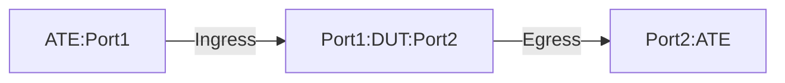

# PF-1.5: Interface based IPGUE Decapsulation for MPLSoGUE traffic

## Summary

This is to test the the functionality of policy-based forwarding (PF) to 
decapsulate Generic UDP Encapsulation (GUE) traffic. These tests verify the use
case of MPLSoGUE to IPv4 GUE tunnel. The tests are meant for `Policy Based` implementation of IPv4 GUE tunnel. 

The tests validate that the DUT performs the following action-

 - DUT is a transit node to forward MPLSoGUE traffic.
 - DUT is a target decap node to decapsulate IPv4GUE and forward inner MPLSoGUE to the
   destination. 


## Testbed type

* [`featureprofiles/topologies/atedut_2.testbed`](https://github.com/openconfig/featureprofiles/blob/main/topologies/atedut_2.testbed)

## Procedure

### Test environment setup

* Create the following connections:
* DUT has ingress and egress port connected to the ATE.
  


* ATE Port 1 hosted prefixes:
  * IPV4-SRC1

* ATE Port 2 hosted prefixes:
  * IPV4-DST1

* DUT hosted prefixes:
  * DECAP-DST

*  ATE Port 1 generates below flow types:
 
 * Flow type 1:  IP+UDP+IP+UDP+MPLS+Payload
   * For the outer IPGUE header:
     * Source IP and Destination IP will be ATE-PORT1 address and DECAP-DST respectively.
     * Source port will vary depending on the application.
     * Destination port 6080 (default/ or configured non-default)
      will remain consistent.
   * For the inner IPGUE header:
     * Source IP and Destination IP will be IPV4-SRC1 and IPV4-DST1 respectively.
     * Source port will vary depending on the application.
     * Destination port 6615 (default/ or configured non-default)
      will remain consistent.
     * MPLS label is Label (LBL1- a valid MPLS label)
     * DSCP value should be set to 32.
     * TTL value should be set to 64.
 
 *  Flow type 2: IP+UDP+MPLS+Payload (MPLSoGUE)
    * Source IP and Destination IP will be IPV4-SRC1 and IPV4-DST1 respectively.
    * Source port will vary depending on the application.
    * Destination port 6615 (default/ or configured non-default)
      will remain consistent.
    * MPLS label is Label (LBL1- a valid MPLS label)
    * DSCP value should be set to 32.
    * TTL value should be set to 64.
          
*  ATE Port 2 receives below flow/packet types:
   * Flow type 1: IP+UDP+IP+UDP+MPLS+Payload
      * Recieves the inner MPLSoGUE packet after IPGUE header gets decapsulated by DUT:
        * Source IP and Destination IP will be IPV4-SRC1 and IPV4-DST1 respectively.
        * Source port will vary depending on the application.
        * Destination port 6635 (default/ or configured non-default)
         will remain consistent.

   *  Flow type 2: IP+UDP+MPLS+Payload(MPLSoGUE)
      *  Recieves the MPLSoGUE packet as is: 
         * Source IP and Destination IP will be IPV4-SRC1 and IPV4-DST1 respectively.
         * Source port will vary depending on the application.
         * Destination port 6635 (default/ or configured non-default)
           will remain consistent.
  
### DUT Configuration

1.  Interfaces: Configure all DUT ports as singleton IP interfaces.
 
2.  Policy-Based Forwarding: 
    *  Rule 1: Match GUE traffic with destination DECAP-DST using destination-address-prefix-set and default/non-default GUE UDP port/port-range for decapsulation.
      * If udp port is not configured then the default GUE UDP port 6080 should be used for IPv4 payload, port 6615 should be used for IPv6 payload and port 6635 for MPLS payload.
      * In this scenario, if udp port is not configured then the default GUE UDP port 6080 will be used.
    *  Apply the defined policy on the Ingress (DUT port1) port.
    *  Configure static route for encapsulated traffic destinations IPV4-DST1 towards ATE Port 2.
    *  Configure static MPLS label binding (LBL1) towards ATE Port 2. Next hop of ATE Port 2 should be indicated for MPLS pop action.
    
### PF-1.5.1: MPLSoGUE Pass-Through for DUT.

-  Push DUT configuration.

Traffic: Generate flow type 2
  
Verification: 
- DUT will lookup the route for IPV4-DST2 in its route table and forward towards ATE port 2.
- ATE will receive MPLSoGUE traffic . 
- No packet loss.
- DSCP should be preserved.
- TTL value should be decremented by 1 to 63.
- Policy-based forwarding counters will not increment(no match).

### PF-1.5.2: GUE decapsulation of IPv4 carrying inner MPLSoGUE.

-  Push DUT configuration.

Traffic: Generate flow type 1
  
Verification: 
- The destination address in the outer IP header (DECAP-DST) will match the policy prefix-set destination-address-prefix-set on
  DUT for decapsulation.
- The destination port will also match the decapsulation port for IPv4 protocol (6080).
- The DUT will perform decap and lookup the route for IPV4-DST1 in its route table and forward
  towards ATE port 2.
- No packet loss.
- Inner-packet DSCP should be preserved.
- Inner-packet TTL value should be decremented by 1 to 63.
- Policy-based forwarding counters should increment, matching the number of packets send by ATE port 1 and number of packets received by ATE port 2.

## OpenConfig Path and RPC Coverage


```
paths:
    # match condition
    /network-instances/network-instance/policy-forwarding/policies/policy/rules/rule/transport/config/destination-port:
    /network-instances/network-instance/policy-forwarding/policies/policy/rules/rule/ipv4/config/destination-address:
    /network-instances/network-instance/policy-forwarding/policies/policy/rules/rule/ipv4/config/destination-address-prefix-set:
    # decap action
    //network-instances/network-instance/policy-forwarding/policies/policy/rules/rule/action/config/decapsulate-gue:
    # telemetry
    /network-instances/network-instance/policy-forwarding/policies/policy/rules/rule/state/matched-pkts:
    /network-instances/network-instance/policy-forwarding/policies/policy/rules/rule/state/matched-octets:

rpcs:
  gnmi:
    gNMI.Set:
      union_replace: true
      replace: true
    gNMI.Subscribe:
      on_change: true
```

## Required DUT platform

* Specify the minimum DUT-type:
  * MFF - A modular form factor device containing LINECARDs, FABRIC and redundant CONTROLLER_CARD components
  * FFF - fixed form factor
  * vRX - virtual router device
