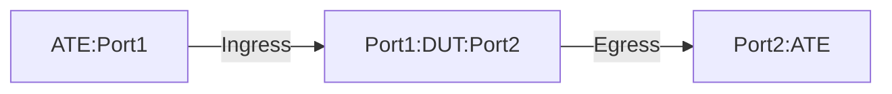

# PF-1.4: GUEv1 Decapsulation rule using destination-address-prefix-set and TTL and DSCP behavior test

## Summary

This is to test the functionality of decapsulation of static GUEv1 to IPv4 or IPv6 payload ([GUE Variant 1](https://datatracker.ietf.org/doc/html/draft-ietf-intarea-gue-09#section-4)). These tests verify the use case of IPv4 and IPv6 encapsulated traffic in an IPv6 GUE tunnel. 

The tests validate that the DUT performs the following action-

 - Decapsulate the outer (UDPoIPv6) headers of GUE packets destined to the locally configured decap IPv6 over DECAP subnet range and matching UDP port. 
 - Decapsulate the packet only if it matches the locally configured decap IPv6 address/addresses and matching UDP port port/port-range.
 - Post decapsulation the DUT should 
	- Maintain the inner TTL (do not copy outer TTL to the inner TTL)
	- Maintain the inner DSCP (do not copy outer DSCP to inner DSCP)
 - Post decapsulation, the inner TTL value will be decremented before egressing to next-hop
 - Traffic not subject to match criteria will be forwared using the traditional IP forwarding.

 Comprehensive GUEv1 decapsulation and ECMP hashing test for GUE flows with IPv6|UDP outer header on decapsulation node is documented in PF-1.22

## Procedure

### Test environment setup

* Create the following connections:
* DUT has ingress and egress port connected to the ATE.
  


### ATE Configuration

*  ATE Port 1: Generates GUE-encapsulated traffic
*  ATE Port 2: Receives traffic
  
* ATE Port 1 hosted prefixes:

  * ATE-Port1 IPv6 address = ATE-P1-Address-V6
  * Additional Source Address advertised
    - IPV4-SRC1
    - IPV6-SRC1 

* ATE Port 2 hosted prefixes:

  * ATE-Port2 IPv6 address = ATE-P2-Address-V6
  * Additional destination address advertised
    - IPV4-DST1
    - IPV6-DST1

*  ATE Port 1 generates below flow types:

| Flow type   | Payload Description   | Header Level   | Source IP        | Destination IP                                                                             | Source Port                             | Destination Port                             | DSCP | TTL |
|-------------|-----------------------|----------------|------------------|--------------------------------------------------------------------------------------------|-----------------------------------------|----------------------------------------------|------|-----|
| Flow type#1 | IP+UDP+IPv4 Payload | Outer IPGUE    | ATE-P1-Address-V6   | Randomized: DECAP-DST_1-V6/128, DECAP-DST_2-V6/128, DECAP-DST_3-V6/128, DECAP-DST_4-V6/128                   | Varies depending on the application     | 6081 (DUT configured decap port)                | 35   | 70  |
|             |                       | Inner IPv4     | IPV4-SRC1        | IPV4-DST1                                                                                  | N/A                                     | N/A                                          | 32   | 50  |
| Flow type#2 | IP+UDP+IPv6 Payload | Outer IPGUE    | ATE-P1-Address-V6   | Randomized: DECAP-DST_1-V6/128, DECAP-DST_2-V6/128, DECAP-DST_3-V6/128, DECAP-DST_4-V6/128                   | Varies depending on the application     | 6081 (DUT configured decap port)                | 35   | 70  |
|             |                       | Inner IPv6     | IPV6-SRC1        | IPV6-DST1                                                                                  | N/A                                     | N/A                                          | 32   | 50  |
| Flow type#3 | IP+UDP+IPv4 Payload | Outer IPGUE    | ATE-P1-Address-V6   | Randomized: DECAP-DST_1-V6/128, DECAP-DST_2-V6/128, DECAP-DST_3-V6/128, DECAP-DST_4-V6/128                   | Varies depending on the application     | 6085 (DUT unconfigured decap port)              | 35   | 70  |
|             |                       | Inner IPv4     | IPV4-SRC1        | IPV4-DST1                                                                                  | N/A                                     | N/A                                          | 32   | 50  |
| Flow type#4 | IP+UDP+IPv6 Payload | Outer IPGUE    | ATE-P1-Address-V6   | Randomized: DECAP-DST_1-V6/128, DECAP-DST_2-V6/128, DECAP-DST_3-V6/128, DECAP-DST_4-V6/128                   | Varies depending on the application     | 6085 (DUT unconfigured decap port)              | 35   | 70  |
|             |                       | Inner IPv6     | IPV6-SRC1        | IPV6-DST1                                                                                  | N/A                                     | N/A                                          | 32   | 50  |
| Flow type#5 | IP+UDP+IPv4 Payload | Outer IPGUE    | ATE-P1-Address-V6   | ATE-P2-Address-V6                                                                             | Varies depending on the application     | 6081 (DUT configured decap port)         | 35   | 70  |
|             |                       | Inner IPv4     | IPV4-SRC1        | IPV4-DST1                                                                                  | N/A                                     | N/A                                          | 32   | 50  |
| Flow type#6 | IP+UDP+IPv6 Payload | Outer IPGUE    | ATE-P1-Address-V6   | ATE-P2-Address-V6                                                                             | Varies depending on the application     | 6081 (DUT configured decap port)         | 35   | 70  |
|             |                       | Inner IPv6     | IPV6-SRC1        | IPV6-DST1                                                                                  | N/A                                     | N/A                                          | 32   | 50  |

*  ATE Port 2 receives below flow/packet types:

| RX-Flow-type   | Payload Type        | Header Level   | Source IP        | Destination IP   | DSCP | TTL | UDP Source Port                             | UDP Destination Port                             |
|----------------|---------------------|----------------|------------------|------------------|------|-----|-----------------------------------------|----------------------------------------------|
| RX-Flow-type#1 | IPv4 Payload        | N/A            | IPV4-SRC1        | IPV4-DST1        | 32   | 49  | N/A                                     | N/A                                          |
| RX-Flow-type#2 | IPv6 Payload        | N/A            | IPV6-SRC1        | IPV6-DST1        | 32   | 49  | N/A                                     | N/A                                          |
| RX-Flow-type#5 | IP+UDP+IPv4 Payload | Outer IPGUE    | ATE-P1-Address-V6   | ATE-P2-Address-V6   | 35   | 68  | Varies depending on the application     | 6081 (configured non-default on DUT)         |
|                |                     | Inner IPv4     | IPV4-SRC1        | IPV4-DST1        | 32   | 50  | N/A                                     | N/A                                          |
| RX-Flow-type#6 | IP+UDP+IPv6 Payload | Outer IPGUE    | ATE-P1-Address-V6   | ATE-P2-Address-V6   | 35   | 68  | Varies depending on the application     | 6081 (configured non-default on DUT)         |
|                |                     | Inner IPv6     | IPV6-SRC1        | IPV6-DST1        | 32   | 50  | N/A                                     | N/A                                          |
 
 ### DUT Configuration

1.  Interfaces: Configure all DUT ports as singleton IP interfaces towards the ATE ports
 
2. GUE Decapsulation:
    *  Configure a Loopback address with DECAP-DST_3-V6/128 address
    *  Configure static routes for destination IPV4-SRC1 and IPV6-SRC1 towards ATE Port 1
    *  Configure static routes for destination IPV4-DST1 and IPV6-DST1 towards ATE Port 2
    *  Configure the DUT as GUEv1 decapsulator with below fields:
       - DECAP-DST-SUBNET-V6/64 as decapsulation subnet-range
          - One of the DECAP-DST_n-V6/128 addresses is one of the IP prefixes from DECAP-DST-SUBNET-V6/64
       - Do not enable copying TTL bits from outer to inner header post decapsulation
       - Use single decapsulation UDP destination port 6081 for both IPv4 and IPv6 payload type
    *  Configure IXIA with a static route for `DECAP-DST-SUBNET-V6/64` towards the DUT<>ATE Port 1 

* DECAP-DST-SUBNET-V6/64 subnet comprises of below IP prefixes:
    *  DECAP-DST_1-V6/128,
    *  DECAP-DST_2-V6/128,
    *  DECAP-DST_3-V6/128,
    *  DECAP-DST_4-V6/128

* DUT hosted IPv6 prefixes:
  * Loopback Address = DECAP-DST_3-V6/128

### Test Procedure
Traffic: 
-  Generate the applicable GUE-encapsulated flow from ATE Port 1
     -  Send 1000 packets at the 10%  of the line rate.
     -  Keep the frame size [Internet Mix](https://datatracker.ietf.org/doc/html/rfc6985#section-4).
     	-  Do not include the 16,000 MTU frame size in the testing, as DUT is not enabled to support it. 
   
  
### PF-1.4.1: GUE Decapsulation of inner IPv4 traffic over DECAP subnet range
-  Push DUT configuration
-  Initiate traffic flow type#1
- Verification:
    -  The outer header destination IP of the traffic falls within the configured decap range (DECAP-DST-SUBNET-V6/64)
    -  The outer header destination port of the traffic (UDP 6081) matches the configured decap port criteria
    -  The DUT will decapsulate the outer header and perform the lookup based on the inner IP address
    -  The TTL bits will not be copied to the inner header
    -  The inner header TTL value will be decremented by 1
    -  The inner packet's DSCP value (32) will be preserved
    -  The DUT will forward the traffic towards ATE Port 2
    -  The relevant DUT counters will reflect 1000 decapsulated packets
    -  ATE Port 2 receives 1000 packets structured as RX-Flow-type#2
    -  No packet loss should be observed

### PF-1.4.2: GUE Decapsulation of inner IPv6 traffic over DECAP subnet range
-  Push DUT configuration.
-  Initiate traffic flow type#2
- Verification:
    -  The outer header destination IP of the traffic falls within the configured decap range (DECAP-DST-SUBNET-V6/64)
    -  The outer header destination port of the traffic (UDP 6081) matches the configured decap port criteria
    -  The DUT will decapsulate the outer header and perform the lookup based on the inner IP address
    -  The TTL bits will not be copied to the inner header
    -  The inner header TTL value will be decremented by 1
    -  The inner packet's DSCP value (32) will be preserved
    -  The DUT will forward the traffic towards ATE Port 2
    -  The relevant DUT counters will reflect 1000 decapsulated packets
    -  ATE Port 2 receives 1000 packets structured as RX-Flow-type#4
    -  No packet loss should be observed

### PF-1.4.3: GUE Decapsulation of inner IPv4 traffic using non-default and unconfigured GUE UDP port (Negative).
-  Push DUT configuration.
-  Initiate traffic flow type#3
- Verification: 
    -  The outer header destination IP of the traffic falls within the DECAP-DST-SUBNET-V6/64 range
    -  The outer header destination UDP port (6085) of the traffic is not configured for decapsulation, therefore it does not match the decapsulation criteria.
    -  The DUT should not decapsulate these packets. Packets with `DECAP-DST_3-V6/128` will be sent to the device controller/CPU while the packets with `DECAP-DST_1-V6/128`, `DECAP-DST_2-V6/128` and `DECAP-DST_4-V6/128` will be dropped due to specific no-route to the destination present in local FIB
    -  The DUT decapsulation counters should not increment for this flow
    -  100% packet loss should be observed on ATE Port 2

### PF-1.4.4: GUE Decapsulation of inner IPv6 traffic using non-default and unconfigured GUE UDP port (Negative).
-  Push DUT configuration.
-  Initiate traffic flow type#4
- Verification:
    -  The outer header destination IP of the traffic falls within the DECAP-DST-SUBNET-V6/64 range
    -  The outer header destination UDP port (6085) of the traffic is not configured for decapsulation, therefore it does not match the decapsulation criteria.
    -  The DUT should not decapsulate these packets. Packets should be dropped since no specific drop rule exists for unmatched GUE
    -  The DUT decapsulation counters should not increment for this flow
    -  The DUT drop counters will reflect the packets to 1000
    -  100% packet loss should be observed on ATE Port 2

### PF-1.4.5: Inner IPV4 GUE Pass-through (Negative)
-  Push DUT configuration.
-  Initiate traffic flow type#5
- Verification: 
    -  The outer header destination UDP port (6081) matches a configured decap port
    -  The outer header destination IP (ATE-P2-Address-V6) of the traffic does not fall within the configured decap range (DECAP-DST-SUBNET-V6/64), therefore it does not match the decapsulation criteria for the destination IP
    -  The DUT will not decapsulate the outer header. Instead, it will perform a lookup based on the outer destination IP address and forward the packets as standard IP traffic
    -  ATE Port 2 receives 1000 packets structured as RX-Flow-type#7 (original GUE encapsulated packets, outer TTL decremented by DUT)
    -  No packet loss should be observed for this flow

### PF-1.4.6: Inner IPV6 GUE Pass-through (Negative)
-  Push DUT configuration.
-  Initiate traffic flow type#6
    - Verification:
    -  The outer header destination UDP port (6081) matches a configured decap port
    -  The outer header destination IP (ATE-P2-Address-V6) of the traffic does not fall within the configured decap range (DECAP-DST-SUBNET-V6/64), therefore it does not match the decapsulation criteria for the destination IP
    -  The DUT will not decapsulate the outer header. Instead, it will perform a lookup based on the outer destination IP address and forward the packets as standard IP traffic
    -  ATE Port 2 receives 1000 packets structured as RX-Flow-type#8 (original GUE encapsulated packets, outer TTL  decremented by DUT)
    -  No packet loss should be observed

## Canonical OC

```json
{
  "defined-sets": {
    "ipv6-prefix-sets": {
      "ipv6-prefix-set": [
        {
          "config": {
            "name": "dst_prefix_v6_gue",
            "prefix": [
              "2001:db8::/64"
            ]
          },
          "name": "dst_prefix_v6_gue"
        }
      ]
    }
  },
  "network-instances": {
    "network-instance": [
      {
        "config": {
          "name": "DEFAULT"
        },
        "name": "DEFAULT",
        "policy-forwarding": {
          "policies": {
            "policy": [
              {
                "config": {
                  "policy-id": "decap-policy"
                },
                "policy-id": "decap-policy",
                "rules": {
                  "rule": [
                    {
                      "action": {
                        "config": {
                          "decapsulate-gue": true
                        }
                      },
                      "config": {
                        "sequence-id": 1
                      },
                      "ipv6": {
                        "config": {
                          "destination-address-prefix-set": "dst_prefix_v6_gue",
                          "protocol": "IP_UDP"
                        }
                      },
                      "sequence-id": 1,
                      "transport": {
                        "config": {
                          "destination-port": 6081
                        }
                      }
                    }
                  ]
                }
              }
            ]
          }
        }
      }
    ]
  }
}

```

## OpenConfig Path and RPC Coverage

```yaml
<<<<<<< HEAD
paths:
  /interfaces/interface/state/counters/in-unicast-pkts:
  /interfaces/interface/state/counters/out-unicast-pkts:
  /network-instances/network-instance/policy-forwarding/policies/policy/config/policy-id:
  /network-instances/network-instance/policy-forwarding/policies/policy/rules/rule/ipv4/config/protocol:
  /network-instances/network-instance/policy-forwarding/policies/policy/rules/rule/transport/config/destination-port:
  /network-instances/network-instance/protocols/protocol/bgp/neighbors/neighbor/state/session-state:
  /interfaces/interface/state/counters/out-pkts:
  /network-instances/network-instance/policy-forwarding/policies/policy/rules/rule/state/matched-pkts:
  /network-instances/network-instance/policy-forwarding/policies/policy/rules/rule/state/matched-octets:
=======

# paths:

/network-instances/network-instance/policy-forwarding/policies/policy/config/policy-id:
/network-instances/network-instance/policy-forwarding/policies/policy/rules/rule/ipv6/config/destination-address-prefix-set:
/network-instances/network-instance/policy-forwarding/policies/policy/rules/rule/ipv6/config/protocol:
/network-instances/network-instance/policy-forwarding/policies/policy/rules/rule/transport/config/destination-port:
/network-instances/network-instance/policy-forwarding/policies/policy/rules/rule/action/decapsulate-gue:
/defined-sets/prefix-sets/prefix-set/config/name
/defined-sets/prefix-sets/prefix-set/config/mode
/defined-sets/prefix-sets/prefix-set/prefixes/prefix/config/ip-prefix
/defined-sets/prefix-sets/prefix-set/prefixes/prefix/config/masklength-range

# telemetry
openconfig-interfaces/interfaces/interface/state/counters/out-pkts:
openconfig-interfaces/interfaces/interface/state/counters/out-unicast-pkts:
openconfig-network-instance/network-instances/network-instance/policy-forwarding/policies/policy/rules/rule/state/matched-pkts:
openconfig-network-instance/network-instances/network-instance/policy-forwarding/policies/policy/rules/rule/state/matched-octets:

>>>>>>> f2144295 (Update `Static GUE decap` README.md with IPv6 transport)
rpcs:
  gnmi:
    gNMI.Set:
      replace: true
      union_replace: true
    gNMI.Subscribe:
      on_change: true
```

## Required DUT platform

* Specify the minimum DUT-type:
  * FFF - fixed form factor
