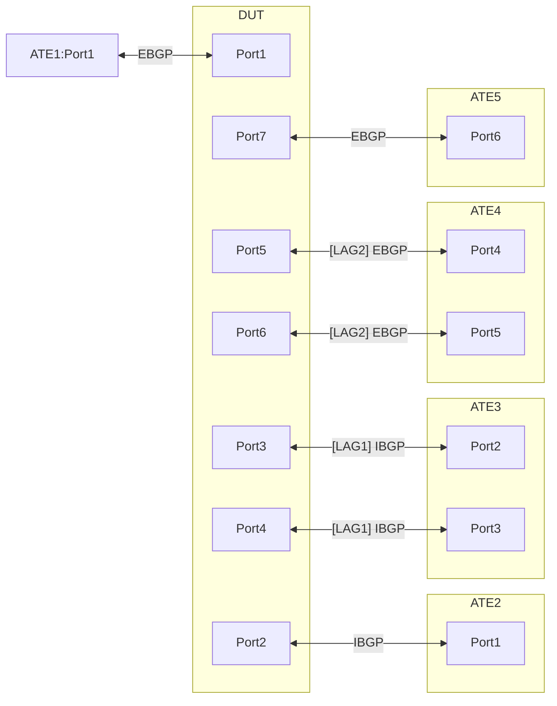

# PF-1.22 GUEv1 Decapsulation and ECMP test for IPv4 and IPv6 payload
## Summary
This is to test the functionality of decapsulation of GUEv1 to IPv4 or IPv6 payload and ensures that only
the outer header (IPv4 | UDP) of GUEv1 encapsulated packets are used for hashing on decapsulating nodes. 

GUEv1 decapsulation matching destination-address-prefix-set and TTL and DSCP behavior test is documented in [#4178](https://github.com/openconfig/featureprofiles/pull/4178).

## Topology


## Configuration generation of DUT and ATE

### Baseline DUT configuration
1. The DUT's loopback interface must be passive for IS-IS.
2. Configure IPv4 and IPv6 EBGP[ASN200:ASN100] between ATE:Port1 <> DUT:Port1 
3. Configure IPv4 and IPv6 IBGP[ASN100] between DUT <> ATE2
4. Configure IPv4 and IPv6 IBGP[ASN100] between DUT <> ATE3
5. Configure IPv4 and IPv6 EBGP[ASN100:ASN200] between DUT <> ATE4
6. Configure IPv4 and IPv6 EBGP[ASN100:ASN200] between DUT <> ATE5
7. Configure DUT as decapsulation node for IP|UDP (GUE v1)using "DUT-DECAP-Address" and decap UDP port as 6080
8. Enable BGP multipath for both EBGP and IBGP sessions to enable load balancing traffic across multiple paths/links
9. Enable BGP multihop for BGP(IBGP/EBGP) sessions on LAG interfaces 
10. DUT has multiple paths to Host2 via multiple nodes, ATE2 & ATE3
11. DUT can reach Host3 via a bundle interface towards ATE3
12. DUT has multiple paths to Host4 via multiple nodes, ATE4 & ATE5
13. Host1(v4/v6) route is installed and active via ATE1
14. Host2(v4/v6) route is installed and active via ATE2 and ATE3, therefore the traffic for Host2 should be load-balanced across both the nodes
15. Host3v4 route is installed and active via ATE3, therefore the traffic for Host3 should be load-balanced across the bundle members
16. Host4(v4/v6) route is installed and active via ATE4 and ATE5, therefore the traffic for Host4 should be load-balanced across both the nodes

### Baseline ATE configuration
1. The ATE's loopback interface must be passive for IS-IS
2. Establish BGP sessions as shown in the DUT configuration section
3. ATE1 hosts Host1v4 and Host1v6
4. ATE2 and ATE3 hosts Host2v4 and Host2v6 
5. ATE3 hosts Host3v4
    - Reachability to Host3v4 from ATE3 is via a static MPLS label
6. ATE4 and ATE5 hosts Host4v4 and Host4v6

#### ATE Route Advertisements
| **Source ATE Nodes** | **Advertisement Type** | **Prefixes**  | **Via BGP Sessions**                   | **Host Mapping** |
| -------------- | ---------------------- | ------------------  | ---------------------------------------| ---------------- |
| ATE1           | EBGP                   | IPv4prefix1-10/24   | IPv4 DUT <--> ATE1                     | Host1v4         |
| ATE1           | EBGP                   | IPv6prefix1-10/64   | IPv6 DUT <--> ATE1                     | Host1v6         |
| ATE1           | EBGP                   | Loopback[1-10]v4/32 | IPv4 DUT <--> ATE1                     | ATE1LO[1-10]v4   |
| ATE2 and ATE3  | IBGP                   | IPv4prefix11-20/24  | IPv4 DUT <--> ATE2 and DUT <--> ATE3   | Host2v4         |
| ATE2 and ATE3  | IBGP                   | IPv6prefix11-20/64  | IPv6 DUT <--> ATE2 and DUT <--> ATE3   | Host2v6         |
| ATE3           | IBGP                   | IPv4prefix21-30/24  | IPv4 DUT <--> ATE2 and DUT <--> ATE3   | Host3v4         |
| ATE4 and ATE5  | EBGP                   | IPv4prefix31-40/24  | IPv4 DUT <--> ATE4 and DUT <--> ATE5   | Host4v4         |
| ATE4 and ATE5  | EBGP                   | IPv6prefix31-40/64  | IPv6 DUT <--> ATE4 and DUT <--> ATE5   | Host4v6         |


**_To simplify this document, Host1, Host2, and Host3 will be referred to as H1, H2, H3 and H4 respectively._**

### Packet types
### IPv4 and IPv6 Packet Constructs Detailed Table

| Packet#  | Layer       | Protocol          | Source Address      | Destination Address | Source Port         | Destination Port          | MPLS Label  |  Notes                                      |
| :------- | :---------- | :---------------- | :------------------ | :------------------ | :------------------ | :------------------------ | :-----------| :------------------------------------------ |
| **1** | **Overall** | **Payload o IPv4\|TCP o MPLS o IPv4\|UDP o IPv4\|UDP(GUE v1)** |                     |                     |                     |                           |                   |
|          | Inner       | IPv4\|TCP         | H1v4 address        | H3v4 address        | 14                  | 15                        |             |Src Port: Any unassigned TCP port; Dst Port: Any App/unassigned TCP port |
|          | MPLS        | MPLS              | N/A                 | N/A                 | N/A                 | N/A                       | Static label for ATE3 to reach H3v4    | *Note: Inner Dst is H3v4* |
|          | Middle      | IPv4\|UDP         | ATE1LO1v4 IPv4 addr | ATE3-port IPv4 addr | 5995 (randomizable) | 6080                      |             | Src Port: Any unreserved UDP port |
|          | Outer       | IPv4\|UDP(GUE v1) | ATE1-port IPv4 addr | DUT-DECAP-Address   | 5996 (randomizable) | 6080                      |             | Src Port: Any unassigned UDP port; GUE v1 encapsulation |
| **2** | **Overall** | **Payload o IPv4\|UDP o IPv4\|UDP(GUE v1)** |                     |                     |                     |                           |                                                         |
|          | Inner       | IPv4\|UDP         | H1v4 address        | H2v4 address        | 14 (randomizable)   | 15                        |              | Src Port: Any unassigned UDP port; Dst Port: Any App/unassigned UDP port |
|          | Outer       | IPv4\|UDP(GUE v1) | ATE1-port IPv4 addr | DUT-DECAP-Address   | 5996 (randomizable) | 6080                      |              | Src Port: Any unassigned UDP port; GUE v1 encapsulation    |
| **3** | **Overall** | **Payload o IPv4\|TCP o IPv4\|UDP(GUE v1)** |                     |                     |                     |                           |                                                         |
|          | Inner       | IPv4\|TCP         | H1v4 address        | H2v4 address        | 14 (randomizable)   | 15                        |              | Src Port: Any unassigned TCP port; Dst Port: Any App/unassigned TCP port |
|          | Outer       | IPv4\|UDP(GUE v1) | ATE1-port IPv4 addr | DUT-DECAP-Address   | 5996 (randomizable) | 6080                      |              | Src Port: Any unassigned UDP port; GUE v1 encapsulation    |
| **4** | **Overall** | **Payload o IPv4\|UDP o IPv4\|UDP(GUE v1)** |                     |                     |                     |                           |                                                         |
|          | Inner       | IPv4\|UDP         | H1v4 address        | H4v4 address        | 14 (randomizable)   | 15                        |              | Src Port: Any unassigned UDP port; Dst Port: Any App/unassigned UDP port|
|          | Outer       | IPv4\|UDP(GUE v1) | ATE1-port IPv4 addr | DUT-DECAP-Address   | 5996 (randomizable) | 6080                      |              | Src Port: Any unassigned UDP port; GUE v1 encapsulation    |
| **5** | **Overall** | **Payload o IPv4\|TCP o IPv4\|UDP(GUE v1)** |                     |                     |                     |                           |                                                         |
|          | Inner       | IPv4\|TCP         | H1v4 address        | H4v4 address        | 14 (randomizable)   | 15                        |              | Src Port: Any unassigned TCP port; Dst Port: Any App/unassigned TCP port |
|          | Outer       | IPv4\|UDP(GUE v1) | ATE1-port IPv4 addr | DUT-DECAP-Address   | 5996 (randomizable) | 6080                      |              | Src Port: Any unassigned UDP port; GUE v1 encapsulation    |
| **6** | **Overall** | **Payload o IPv6\|TCP o MPLS o IPv4\|UDP o IPv4\|UDP(GUE v1)** |                     |                     |                     |                           |                                                             |
|          | Inner       | IPv6\|TCP         | H1v6 address        | H3v6 address        | 14                  | 15                        |             | Src Port: Any unassigned TCP; Dst Port: Any App/unassigned TCP |
|          | MPLS        | MPLS              | N/A                 | N/A                 | N/A                 | N/A                       | Static label for ATE3 to reach H3v4 | *Note: Inner Dst is H3v6* |
|          | Middle      | IPv4\|UDP         | ATE1LO1v4 IPv4 addr | ATE3-port IPv4 addr | 5995 (randomizable) | 6080                      |              | Src Port: Any unassigned UDP port | 
|          | Outer       | IPv4\|UDP(GUE v1) | ATE1-port IPv4 addr | DUT-DECAP-Address   | 5996 (randomizable) | 6080                      |              | Src Port: Any unassigned UDP port; GUE v1 encapsulation     |
| **7** | **Overall** | **Payload o IPv6\|UDP o IPv4\|UDP(GUE v1)** |                     |                     |                     |                   |                      |                                                             |
|          | Inner       | IPv6\|UDP         | H1v6 address        | H2v6 address        | 5995 (randomizable) | 5994 (randomizable)       |              | Src/Dst Ports: Any unassigned UDP port  |
|          | Outer       | IPv4\|UDP(GUE v1) | ATE1-port IPv4 addr | DUT-DECAP-Address   | 5996 (randomizable) | 6080                      |              | Src Port: Any unassigned UDP port; GUE v1 encapsulation  |
| **8** | **Overall** | **Payload o IPv6\|TCP o IPv4\|UDP(GUE v1)** |                     |                     |                     |                   |                      |                                                             |
|          | Inner       | IPv6\|TCP         | H1v6 address        | H2v6 address        | 14 (randomizable)   | 15                        |              | Src Port: Any unassigned TCP port; Dst Port: Any App/unassigned TCP port |
|          | Outer       | IPv4\|UDP(GUE v1) | ATE1-port IPv4 addr | DUT-DECAP-Address   | 5996 (randomizable) | 6080                      |              | Src Port: Any unassigned UDP port; GUE v1 encapsulation |
| **9** | **Overall** | **Payload o IPv6\|UDP o IPv4\|UDP(GUE v1)** |                     |                     |                     |                   |                      |                                                             |
|          | Inner       | IPv6\|UDP         | H1v6 address        | H4v6 address        | 5995 (randomizable) | 5994 (randomizable)       |              | Src/Dst Ports: Any unreserved UDP port  |
|          | Outer       | IPv4\|UDP(GUE v1) | ATE1-port IPv4 addr | DUT-DECAP-Address   | 5996 (randomizable) | 6080                      |              | Src Port: Any unreserved UDP port; GUE v1 encapsulation |
| **10**| **Overall** | **Payload o IPv6\|TCP o IPv4\|UDP(GUE v1)**  |                     |                            |       |                     |                           |                                                             |
|          | Inner       | IPv6\|TCP         | H1v6 address        | H4v6 address        | 14 (randomizable)   | 15                        |              | Src Port: Any unassigned TCP port; Dst Port: Any App/unassigned TCP port |
|          | Outer       | IPv4\|UDP(GUE v1) | ATE1-port IPv4 addr | DUT-DECAP-Address   | 5996 (randomizable) | 6080                      |              | Src Port: Any unreserved UDP port; GUE v1 encapsulation |
| **11**| **Overall** | **Payload o IPv4\|TCP o IPv4\|UDP(GUE v1)**  |                     |                            |       |                     |                           |                                                             |
|          | Inner       | IPv6\|TCP         | H1v4 address        | H4v4 address        | 14   | 15                        |              | Src Port: Any unassigned TCP port; Dst Port: Any App/unassigned TCP port |
|          | Outer       | IPv4\|UDP(GUE v1) | ATE1-port IPv4 addr | ATE2-port-Address IPv4 addr  | 5996 | 6080                      |              | Src Port: Any unreserved UDP port; GUE v1 encapsulation |
| **12**| **Overall** | **Payload o IPv6\|TCP o IPv4\|UDP(GUE v1)**  |                     |                            |       |                     |                           |                                                             |
|          | Inner       | IPv6\|TCP         | H1v6 address        | H4v6 address        | 14   | 15                        |              | Src Port: Any unassigned TCP port; Dst Port: Any App/unassigned TCP port |
|          | Outer       | IPv4\|UDP(GUE v1) | ATE1-port IPv4 addr | ATE2-port-Address IPv4 addr | 5996 | 6080                      |              | Src Port: Any unreserved UDP port; GUE v1 encapsulation |
| **13**| **Overall** | **Payload o IPv4\|TCP o IPv4\|UDP(GUE v1)**  |                     |                            |       |                     |                           |                                                             |
|          | Inner       | IPv6\|TCP         | H1v4 address        | H4v4 address        | 14   | 15                        |              | Src Port: Any unassigned TCP port; Dst Port: Any App/unassigned TCP port |
|          | Outer       | IPv4\|UDP(GUE v1) | ATE1-port IPv4 addr | DUT-DECAP-Address  | 5996  | 6085                      |              | Src Port: Any unreserved UDP port; GUE v1 encapsulation |
| **14**| **Overall** | **Payload o IPv6\|TCP o IPv4\|UDP(GUE v1)**  |                     |                            |       |                     |                           |                                                             |
|          | Inner       | IPv6\|TCP         | H1v6 address        | H4v6 address        | 14   | 15                        |              | Src Port: Any unassigned TCP port; Dst Port: Any App/unassigned TCP port |
|          | Outer       | IPv4\|UDP(GUE v1) | ATE1-port IPv4 addr | DUT-DECAP-Address  | 5996  | 6085                      |              | Src Port: Any unreserved UDP port; GUE v1 encapsulation |

### Flow types

| **Flow-type**  | **Description**        | **Packet#**         | 
| -------------- | ---------------------- | ------------------  |
| 1              | H1 --> H3 with IPv4    | Packet#1            | 
| 2              | H1 --> H2 with IPv4    | Packet#2            | 
| 3              | H1 --> H2 with IPv4    | Packet#3            | 
| 4              | H1 --> H4 with IPv4    | Packet#4            | 
| 5              | H1 --> H4 with IPv4    | Packet#5            | 
| 6              | H1 --> H3 with IPv6    | Packet#6            | 
| 7              | H1 --> H2 with IPv6    | Packet#7            | 
| 8              | H1 --> H2 with IPv6    | Packet#8            | 
| 9              | H1 --> H4 with IPv6    | Packet#9            | 
| 10             | H1 --> H4 with IPv6    | Packet#10           |

## Procedure

- Traffic towards a destination is spread evenly across nodes and LAGs (if applicable):
    - Tolerance for delta: 5%
- Start the Ixia traffic as specified for test
    - Sent 1000000 packets at the 10% of the line rate.
    - Packets are generated based on different header field entropy which can be defined by the test case
- Repeat each test with the each ATE Flow-type or explicitly mentioned flow-type
- Conduct each of the following test, using a single flow-type with 1024 flows

### PF-1.22.1[Baseline]: GUE Decapsulation over ipv4 decap address and Load-balance test
- Configure the DUT and ATE as stated above
- Initiate a single flow-type and follow the below stated and applicable verification steps
- L4 source port of outer header(GUEv1 encap header) should be randomized for each flow-type that's running
- Repeat the test for all flow-types
- Validations:
-  The outer header destination IP of the traffic is the DUT-DECAP-Address and the destination port of the traffic (UDP 6080) matches the configured UDP decap port criteria
-  Therefore, DUT will decapsulate the outer header and perform a lookup based on the inner IP address
-  The following traffic distribution validations are applicable as per the flow-type that is being tested
    - Flow#1 for H3 should be load-balanced across the bundle members via ATE3
    - Flow#2 for H2 should be load-balanced via ATE2 and ATE3
        - Traffic via ATE3 should be load-balanced across the bundle members 
    - Flow#3 for H2 should be load-balanced via ATE2 and ATE3
        - Traffic via ATE3 should be load-balanced across the bundle members
    - Flow#4 for H4 should be load-balanced via ATE4 and ATE5
        - Traffic forwarded towards ATE4 (via LAG2) should be load-balanced across the LAG members
    - Flow#5 for H4 should be load-balanced via ATE4 and ATE5
        - Traffic forwarded towards ATE4 (via LAG2) should be load-balanced across the LAG members
    - Flow#6 for H3 should be load-balanced across the bundle members via ATE3
    - Flow#7 for H2 should be load-balanced via ATE2 and ATE3
        - Traffic via ATE3 should be load-balanced across the bundle members 
    - Flow#8 for H2 should be load-balanced via ATE2 and ATE3
        - Traffic via ATE3 should be load-balanced across the bundle members
    - Flow#9 for H4 should be load-balanced via ATE4 and ATE5
        - Traffic forwarded towards ATE4 (via LAG2) should be load-balanced across the LAG members
    - Flow#10 for H4 should be load-balanced via ATE4 and ATE5
        - Traffic forwarded towards ATE4 (via LAG2) should be load-balanced across the LAG members
    - No packet loss should be observed
    - Port traffic counters will be leveraged to verify the loab-balance behavior

### PF-1.22.2: GUE Decapsulation over non-matching ipv4 decap address [Negative]
- Configure the DUT and ATE as stated above
- Repeat the test for flow-type#11 and flow-type#12 (one at a time)
- Validations:
-  The outer header destination UDP port (6080) matches a configured decap port
-  The outer header destination IP of the traffic does not matches the locally configured decapsulation address(DUT-DECAP-Address), therefore it does not match the decapsulation criteria for the destination IP
-  The DUT will not decapsulate the outer header. Instead, it will perform a lookup based on the outer destination IP address and forward the packets as standard IP traffic
-  ATE Port 2 receives 1000000 packets
-  No packet loss should be observed

### PF-1.22.3: GUE Decapsulation over non-matching UDP decap port [Negative]
- Configure the DUT and ATE as stated above
- Repeat the test for flow-type#13 and flow-type#14 (one at a time)
- Validations:
-  The outer header destination IP of the traffic matches a configured decap IP address
-  The outer header destination UDP port (6085) of the traffic does not matches the locally configured decapsulation port(6080), therefore it does not match the decapsulation criteria for the destination port
-  The DUT should not decapsulate these packets. Packets should be dropped since no specific policy-forwarding rule exists for unmatched GUE
-  The DUT decapsulation counters should not increment for this flow
-  The drop counters on DUT will reflect the packets to 1000000
    - These drop packets count will be reflected in DUT control-plane drop counters  
-  100% packet loss should be observed on ATE Port 2

### PF-1.22.4: Verify the Immediate next header's L4 fields are not considered in Load-Balancing Algorithm
- Set up the DUT and ATE as previously specified.
- For each flow type, configure a single source and destination IP address for both the inner and middle IPv4 and IPv6 headers. Specifically:
    - For IPv4 flows that would typically use an H1v4 range, use IPv4prefix1/24.
    - For IPv6 flows that would typically use an H1v6 range, use IPv6prefix1/64.
    - For IPv4 flows that would typically use an H2v4 range, use IPv4prefix11/24.
    - For IPv6 flows that would typically use an H2v6 range, use IPv6prefix11/64.
    - For IPv4 flows that would typically use an H4v4 range, use IPv4prefix31/24.
    - For IPv6 flows that would typically use an H4v6 range, use IPv6prefix31/64.
- Randomize the L4 source port of the inner/middle header (the header immediately following the outer header) for each flow type being tested.
- Test Execution:
    - Initiate each flow type sequentially.
    - Perform the applicable verification steps for each flow.
    - Repeat this process for all flow types, applying the modified field as described above.
- Validation:
    - Expected Outcome: The traffic should not be load-balanced; instead, it would simply forwarded along a single path.
    - Port traffic counters will be leveraged to verify this behavior.
    - Failure Condition: If traffic distribution is observed across multiple paths, the test fails.

### PF-1.22.5: Verify the Immediate next header's L3 fields are not considered in Load-Balancing Algorithm
- Set up the DUT and ATE as previously specified.
- For each flow type, configure a single destination IP address for both the inner and middle IPv4 and IPv6 headers. Specifically:
    - For IPv4 flows that would typically use an H1v4 range, use IPv4prefix1/24.
    - For IPv6 flows that would typically use an H1v6 range, use IPv6prefix1/64.
    - For IPv4 flows that would typically use an H2v4 range, use IPv4prefix11/24.
    - For IPv6 flows that would typically use an H2v6 range, use IPv6prefix11/64.
    - For IPv4 flows that would typically use an H4v4 range, use IPv4prefix31/24.
    - For IPv6 flows that would typically use an H4v6 range, use IPv6prefix31/64.
- For each flow type, configure a source IP addresses for both the inner and middle IPv4 and IPv6 headers. Specifically:
    - For IPv4 flows that would typically use an H1v4 addresses, continue to use the range IPv4prefix1-10/24.
    - For IPv6 flows that would typically use an H1v6 addresses, continue to use the range IPv6prefix1-10/64.
    - For IPv4 flows that would typically use an ATE1LO1v4 IPv4 address, use the range ATE1LO[1-10] addresses for each applicable flow-type.
- Randomize the L4 source port of the inner/middle header (the header immediately following the outer header) for each flow type being tested.
- Test Execution:
    - Initiate each flow type sequentially.
    - Perform the applicable verification steps for each flow.
    - Repeat this process for all flow types, applying the modified field as described above.
- Validation:
    - Expected Outcome: The traffic should not be load-balanced; instead, it would simply forwarded along a single path.
    - Port traffic counters will be leveraged to verify this behavior.
    - Failure Condition: If traffic distribution is observed across multiple paths, the test fails.

## Canonical OpenConfig for GUEv1 Decapsulation configuration
TODO: decap policy to be updated by https://github.com/openconfig/public/pull/1288

```json
{
    "network-instances": {
        "network-instance": {
            "config": {
                "name": "DEFAULT"
            },
            "name": "DEFAULT",
            "policy-forwarding": {
                "policies": {
                    "policy": [
                        {
                            "config": {
                                "policy-id": "decap-policy"
                            },
                            "rules": {
                                "rule": [
                                    {
                                        "sequence-id": 1,
                                        "config": {
                                            "sequence-id": 1
                                        },
                                        "ipv4": {
                                            "config": {
                                                "destination-address-prefix-set": "dst_prefix",
                                                "protocol": "IP_UDP"
                                            }
                                        },
                                        "transport": {
                                            "config": {
                                                "destination-port": 6080
                                            }
                                        }
                                        "action": {
                                            "decapsulate-gue": true
                                        },
                                    },
                                ]
                            }
                        }
                    ]
                }
            }
        }
    }
}

```
## OpenConfig Path and RPC Coverage
```yaml
paths:

/network-instances/network-instance/policy-forwarding/policies/policy/config/policy-id:
/network-instances/network-instance/policy-forwarding/policies/policy/rules/rule/config/ipv4/config/destination-address-prefix-set:
/network-instances/network-instance/policy-forwarding/policies/policy/rules/rule/config/ipv4/config/protocol:
/network-instances/network-instance/policy-forwarding/policies/policy/rules/rule/transport/config/destination-port:
/network-instances/network-instance/policy-forwarding/policies/policy/rules/rule/action/decapsulate-gue:

# telemetry
/interfaces/interface/state/counters/out-pkts:
/interfaces/interface/state/counters/out-unicast-pkts:
/components/component/integrated-circuit/pipeline-counters/control-plane-traffic/state/dropped-bytes-aggregate:
/components/component/integrated-circuit/pipeline-counters/control-plane-traffic/state/dropped-aggregate:

rpcs:
  gnmi:
    gNMI.Set:
      union_replace: true
      replace: true
    gNMI.Subscribe:
      on_change: true
```
## Required DUT platform
* Specify the minimum DUT-type:
  * FFF - fixed form factor
