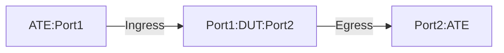

# PF-1.4: Static GUEv1 Decapsulation to IPv4 or IPv6 payload

## Summary

This is to test the functionality of decapsulation of static GUEv1 to IPv4 or IPv6 payload ([GUE Variant 1](https://datatracker.ietf.org/doc/html/draft-ietf-intarea-gue-09#section-4)). These tests verify the use case of IPv4 and IPv6 encapsulated traffic in IPv4 GUE tunnel. 

The tests validate that the DUT performs the following action-

 - Decapsulate the outer ((UDPoIPv4)) headers of GUE packets destined to the locally configured decap IPv4 address/addresses and matching UDP port. 
    - The first two bits of the UDP payload will be used to determine GUE varient 1 (MSB bits 01) and first four bits will determine the payload protocol version IPv4/IPv6.
    - If the first four bits of the payload protocol has bit combination of 0100, it specifies the inner payload protocol is IPv4.
    - If the first four bits of the payload protocol has bit combination of 0110, it specifies the inner payload protocol is IPv6. 
 - Decapsulate the packet only if it matches the locally configured decap IPv4 address/addresses and matching UDP port port/port-range.
    - If not specifically configured, then the DST UDP port 6080 will be used as a match criteria for the decapsulation.
 - Post decapsulation the DUT should not copy outer TTL to inner header and maintain the inner DSCP vaule as is.
    - If explicit configration is present to copy the TTL from outer to inner header after decapsulation, then it will be honored.
 - Post decapsulation, the inner TTL value will be decremented before egressing to next-hop
 - Traffic not subject to match criteria will be forwared using the traditional IP forwarding.

## Procedure

### Test environment setup

* Create the following connections:
* DUT has ingress and egress port connected to the ATE.
  


### ATE Configuration

*  ATE Port 1: Generates GUE-encapsulated traffic
*  ATE Port 2: Receives traffic
  
* ATE Port 1 hosted prefixes:

  * ATE-Port1 IPV4 address = ATE-P1-Address
  * Additional Source Address = IPV4-SRC1
  * Additional Source Address = IPV6-SRC1 

* ATE Port 2 hosted prefixes:

  * ATE-Port2 IPV4 address = ATE-P2-Address
  * Additional destination address = IPV4-DST1
  * Additional destination address = IPV6-DST1

*  ATE Port 1 generates below flow types:

| Flow type   | Payload Description   | Header Level   | Source IP        | Destination IP                                                                             | Source Port                             | Destination Port                             | DSCP | TTL |
|-------------|-----------------------|----------------|------------------|--------------------------------------------------------------------------------------------|-----------------------------------------|----------------------------------------------|------|-----|
| Flow type#1 | IP+UDP+IPv4 Payload | Outer IPGUE    | ATE-P1-Address   | Randomized: DECAP-DST_1/32, DECAP-DST_2/32, DECAP-DST_3/32, DECAP-DST_4/32                   | Varies depending on the application     | 6080 (DUT default decap port)                               | 35   | 70  |
|             |                       | Inner IPv4     | IPV4-SRC1        | IPV4-DST1                                                                                  | N/A                                     | N/A                                          | 32   | 50  |
| Flow type#2 | IP+UDP+IPv4 Payload | Outer IPGUE    | ATE-P1-Address   | Randomized: DECAP-DST_1/32, DECAP-DST_2/32, DECAP-DST_3/32, DECAP-DST_4/32                   | Varies depending on the application     | 6081 (DUT configured non-default decap port)                | 35   | 70  |
|             |                       | Inner IPv4     | IPV4-SRC1        | IPV4-DST1                                                                                  | N/A                                     | N/A                                          | 32   | 50  |
| Flow type#3 | IP+UDP+IPv6 Payload | Outer IPGUE    | ATE-P1-Address   | Randomized: DECAP-DST_1/32, DECAP-DST_2/32, DECAP-DST_3/32, DECAP-DST_4/32                   | Varies depending on the application     | 6080 (DUT default decap port)                               | 35   | 70  |
|             |                       | Inner IPv6     | IPV6-SRC1        | IPV6-DST1                                                                                  | N/A                                     | N/A                                          | 32   | 50  |
| Flow type#4 | IP+UDP+IPv6 Payload | Outer IPGUE    | ATE-P1-Address   | Randomized: DECAP-DST_1/32, DECAP-DST_2/32, DECAP-DST_3/32, DECAP-DST_4/32                   | Varies depending on the application     | 6081 (DUT configured non-default decap port)                | 35   | 70  |
|             |                       | Inner IPv6     | IPV6-SRC1        | IPV6-DST1                                                                                  | N/A                                     | N/A                                          | 32   | 50  |
| Flow type#5 | IP+UDP+IPv4 Payload | Outer IPGUE    | ATE-P1-Address   | Randomized: DECAP-DST_1/32, DECAP-DST_2/32, DECAP-DST_3/32, DECAP-DST_4/32                   | Varies depending on the application     | 6085 (DUT unconfigured non-default port)              | 35   | 70  |
|             |                       | Inner IPv4     | IPV4-SRC1        | IPV4-DST1                                                                                  | N/A                                     | N/A                                          | 32   | 50  |
| Flow type#6 | IP+UDP+IPv6 Payload | Outer IPGUE    | ATE-P1-Address   | Randomized: DECAP-DST_1/32, DECAP-DST_2/32, DECAP-DST_3/32, DECAP-DST_4/32                   | Varies depending on the application     | 6085 (DUT unconfigured non-default port)              | 35   | 70  |
|             |                       | Inner IPv6     | IPV6-SRC1        | IPV6-DST1                                                                                  | N/A                                     | N/A                                          | 32   | 50  |
| Flow type#7 | IP+UDP+IPv4 Payload | Outer IPGUE    | ATE-P1-Address   | ATE-P2-Address                                                                             | Varies depending on the application     | 6081 (DUT configured non-default decap port)         | 35   | 70  |
|             |                       | Inner IPv4     | IPV4-SRC1        | IPV4-DST1                                                                                  | N/A                                     | N/A                                          | 32   | 50  |
| Flow type#8 | IP+UDP+IPv6 Payload | Outer IPGUE    | ATE-P1-Address   | ATE-P2-Address                                                                             | Varies depending on the application     | 6081 (DUT configured non-default decap port)         | 35   | 70  |
|             |                       | Inner IPv6     | IPV6-SRC1        | IPV6-DST1                                                                                  | N/A                                     | N/A                                          | 32   | 50  |

*  ATE Port 2 receives below flow/packet types:

| RX-Flow-type   | Payload Type        | Header Level   | Source IP        | Destination IP   | DSCP | TTL | UDP Source Port                             | UDP Destination Port                             |
|----------------|---------------------|----------------|------------------|------------------|------|-----|-----------------------------------------|----------------------------------------------|
| RX-Flow-type#1 | IPv4 Payload        | N/A            | IPV4-SRC1        | IPV4-DST1        | 32   | 49  | N/A                                     | N/A                                          |
| RX-Flow-type#2 | IPv4 Payload        | N/A            | IPV4-SRC1        | IPV4-DST1        | 32   | 49  | N/A                                     | N/A                                          |
| RX-Flow-type#3 | IPv6 Payload        | N/A            | IPV6-SRC1        | IPV6-DST1        | 32   | 49  | N/A                                     | N/A                                          |
| RX-Flow-type#4 | IPv6 Payload        | N/A            | IPV6-SRC1        | IPV6-DST1        | 32   | 49  | N/A                                     | N/A                                          |
| RX-Flow-type#7 | IP+UDP+IPv4 Payload | Outer IPGUE    | ATE-P1-Address   | ATE-P2-Address   | 35   | 68  | Varies depending on the application     | 6081 (configured non-default on DUT)         |
|                |                     | Inner IPv4     | IPV4-SRC1        | IPV4-DST1        | 32   | 50  | N/A                                     | N/A                                          |
| RX-Flow-type#8 | IP+UDP+IPv6 Payload | Outer IPGUE    | ATE-P1-Address   | ATE-P2-Address   | 35   | 68  | Varies depending on the application     | 6081 (configured non-default on DUT)         |
|                |                     | Inner IPv6     | IPV6-SRC1        | IPV6-DST1        | 32   | 50  | N/A                                     | N/A                                          |
 
 ### DUT Configuration

1.  Interfaces: Configure all DUT ports as singleton IP interfaces towards the ATE ports
 
2. GUE Decapsulation:
    *  Configure a Loopback address with DECAP-DST_3/32 address
    *  Configure the DUT as GUEv1 decapsulator with below fields:
       - DECAP-DST-SUBNET/30 as decapsulation subnet-range
          - DECAP-DST/32 is one of the IP prefix from DECAP-DST-SUBNET/30
       - Do not enable copying TTL bits from outer to inner header post decapsulation
       - Use single UDP destination port 6080 for both IPv4 and IPv6 payload type
    *  Configure static routes for destination IPV4-DST2 and IPV6-DST2 towards ATE Port 2
    *  Configure the UDP decap destination port as 6081 

* DECAP-DST-SUBNET/30 subnet comprises of below IP prefixes:
   - DECAP-DST_1/32
   - DECAP-DST_2/32
   - DECAP-DST_3/32
   - DECAP-DST_4/32

* DUT hosted IPv4 prefixes:
  * Loopback Address = DECAP-DST_3/32

### Test Procedure
Traffic: 
-  Generate the applicable GUE-encapsulated flow from ATE Port 1
     -  Sent 1000000 packets at the 10%  of the line rate.
     -  Keep the frame size Internet Mix.
   
### PF-1.4.1: GUE Decapsulation of inner IPv4 traffic using default GUE UDP port 6080
-  Push DUT configuration
-  Initiate traffic flow type#1  
Verification:
-  The outer header destination IP of the traffic falls within the configured decap range (DECAP-DST-SUBNET/30)
-  The outer header destination port of the traffic (UDP 6080) matches the default UDP decap port criteria
-  The DUT will decapsulate the outer header and perform a lookup based on the inner IP address
-  The TTL bits will not be copied to the inner header
-  The inner header TTL value will be decremented by 1
-  The inner packet's DSCP value (32) will be preserved
-  The DUT will forward the traffic towards ATE Port 2
-  The relevant DUT counters will reflect 1,000,000 decapsulated packets
-  ATE Port 2 receives 1,000,000 packets structured as RX-Flow-type#1
-  No packet loss should be observed
  
### PF-1.4.2: GUE Decapsulation of inner IPv4 traffic using non-default and configured GUE UDP port
-  Push DUT configuration
-  Initiate traffic flow type#2
Verification:
-  The outer header destination IP of the traffic falls within the configured decap range (DECAP-DST-SUBNET/30)
-  The outer header destination port of the traffic (UDP 6081) matches the configured non-default UDP decap port criteria
-  The DUT will decapsulate the outer header and perform the lookup based on the inner IP address
-  The TTL bits will not be copied to the inner header
-  The inner header TTL value will be decremented by 1
-  The inner packet's DSCP value (32) will be preserved
-  The DUT will forward the traffic towards ATE Port 2
-  The relevant DUT counters will reflect 1,000,000 decapsulated packets
-  ATE Port 2 receives 1,000,000 packets structured as RX-Flow-type#2
-  No packet loss should be observed

### PF-1.4.3: GUE Decapsulation of inner IPv6 traffic using default GUE UDP port
-  Push DUT configuration.
-  Initiate traffic flow type#3
Verification:
-  The outer header destination IP of the traffic falls within the configured decap range (DECAP-DST-SUBNET/30)
-  The outer header destination port of the traffic (UDP 6080) matches the default UDP decap port criteria
-  The DUT will decapsulate the outer header and perform a lookup based on the inner IP address
-  The TTL bits will not be copied to the inner header
-  The inner header TTL value will be decremented by 1
-  The inner packet's DSCP value (32) will be preserved
-  The DUT will forward the traffic towards ATE Port 2
-  The relevant DUT counters will reflect 1,000,000 decapsulated packets
-  ATE Port 2 receives 1,000,000 packets structured as RX-Flow-type#3
-  No packet loss should be observed

### PF-1.4.4: GUE Decapsulation of inner IPv6 traffic using non-default and configured GUE UDP port
-  Push DUT configuration.
-  Initiate traffic flow type#4
Verification:
-  The outer header destination IP of the traffic falls within the configured decap range (DECAP-DST-SUBNET/30)
-  The outer header destination port of the traffic (UDP 6081) matches the configured non-default UDP decap port criteria
-  The DUT will decapsulate the outer header and perform the lookup based on the inner IP address
-  The TTL bits will not be copied to the inner header
-  The inner header TTL value will be decremented by 1
-  The inner packet's DSCP value (32) will be preserved
-  The DUT will forward the traffic towards ATE Port 2
-  The relevant DUT counters will reflect 1,000,000 decapsulated packets
-  ATE Port 2 receives 1,000,000 packets structured as RX-Flow-type#4
-  No packet loss should be observed

### PF-1.4.5: GUE Decapsulation of inner IPv4 traffic using non-default and unconfigured GUE UDP port (Negative).
-  Push DUT configuration.
-  Initiate traffic flow type#5
Verification: 
-  The outer header destination IP of the traffic falls within the DECAP-DST-SUBNET/30 range
-  The outer header destination UDP port (6085) of the traffic is not configured for decapsulation, therefore it does not match the decapsulation criteria.
-  The DUT should not decapsulate these packets. Packets should be dropped since no specific drop rule exists for unmatched GUE
-  The DUT decapsulation counters should not increment for this flow
-  The drop counters will reflect the packets to 1000000
-  100% packet loss should be observed on ATE Port 2 for RX-Flow-type equivalent

### PF-1.4.6: GUE Decapsulation of inner IPv6 traffic using non-default and unconfigured GUE UDP port (Negative).
-  Push DUT configuration.
-  Initiate traffic flow type#6
Verification:
-  The outer header destination IP of the traffic falls within the DECAP-DST-SUBNET/30 range
-  The outer header destination UDP port (6085) of the traffic is not configured for decapsulation, therefore it does not match the decapsulation criteria.
-  The DUT should not decapsulate these packets. Packets should be dropped since no specific drop rule exists for unmatched GUE
-  The DUT decapsulation counters should not increment for this flow
-  The drop counters will reflect the packets to 1000000
-  100% packet loss should be observed on ATE Port 2 for RX-Flow-type equivalent

### PF-1.4.7: Inner IPV4 GUE Pass-through (Negative)
-  Push DUT configuration.
-  Initiate traffic flow type#7
Verification: 
-  The outer header destination UDP port (6081) matches a configured decap port
-  The outer header destination IP (ATE-P2-Address) of the traffic does not fall within the configured decap range (DECAP-DST-SUBNET/30), therefore it does not match the decapsulation criteria for the destination IP
-  The DUT will not decapsulate the outer header. Instead, it will perform a lookup based on the outer destination IP address and forward the packets as standard IP traffic
-  ATE Port 2 receives 1,000,000 packets structured as RX-Flow-type#7 (original GUE encapsulated packets, outer TTL decremented by DUT)
-  No packet loss should be observed for this flow

### PF-1.4.8: Inner IPV6 GUE Pass-through (Negative)
-  Push DUT configuration.
-  Initiate traffic flow type#8
Verification:
-  The outer header destination UDP port (6081) matches a configured decap port
-  The outer header destination IP (ATE-P2-Address) of the traffic does not fall within the configured decap range (DECAP-DST-SUBNET/30), therefore it does not match the decapsulation criteria for the destination IP
-  The DUT will not decapsulate the outer header. Instead, it will perform a lookup based on the outer destination IP address and forward the packets as standard IP traffic
-  ATE Port 2 receives 1,000,000 packets structured as RX-Flow-type#8 (original GUE encapsulated packets, outer TTL decremented by DUT)
-  No packet loss should be observed

  ## Canonical OpenConfig for GUEv1 Decapsulation configuration

```json
{
    "network-instances": {
        "network-instance": {
            "config": {
                "name": "DEFAULT"
            },
            "name": "DEFAULT",
            "policy-forwarding": {
                "policies": {
                    "policy": [
                        {
                            "config": {
                                "policy-id": "decap-policy"
                            },
                            "rules": {
                                "rule": [
                                    {
                                        "sequence-id": 1,
                                        "config": {
                                            "sequence-id": 1
                                        },
                                        "ipv4": {
                                            "config": {
                                                "destination-address-prefix-set": "dst_prefix",
                                                "protocol": "IP_UDP"
                                            }
                                        },
                                        "transport": {
                                            "config": {
                                                "destination-port": 6080
                                            }
                                        }
                                        "action": {
                                            "decapsulate-gue": true
                                        },
                                    },
                                ]
                            }
                        }
                    ]
                }
            }
        }
    }
}
```


## OpenConfig Path and RPC Coverage

```yaml

# paths:

/network-instances/network-instance/policy-forwarding/policies/policy/config/policy-id:
/network-instances/network-instance/policy-forwarding/policies/policy/rules/rule/config/ipv4/config/destination-address-prefix-set:
/network-instances/network-instance/policy-forwarding/policies/policy/rules/rule/config/ipv4/config/protocol:
/network-instances/network-instance/policy-forwarding/policies/policy/rules/rule/transport/config/destination-port:
/network-instances/network-instance/policy-forwarding/policies/policy/rules/rule/action/decapsulate-gue:

# telemetry
openconfig-interfaces/interfaces/interface/state/counters/out-pkts:
openconfig-interfaces/interfaces/interface/state/counters/out-unicast-pkts:
openconfig-network-instance/network-instances/network-instance/policy-forwarding/policies/policy/rules/rule/state/matched-pkts:
openconfig-network-instance/network-instances/network-instance/policy-forwarding/policies/policy/rules/rule/state/matched-octets:

rpcs:
  gnmi:
    gNMI.Set:
      union_replace: true
      replace: true
    gNMI.Subscribe:
      on_change: true
```

## Required DUT platform

* Specify the minimum DUT-type:
  * FFF - fixed form factor
