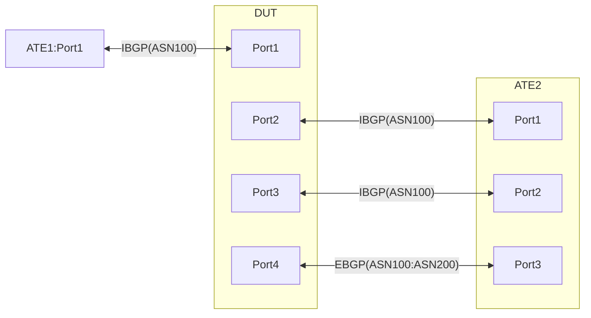

# PF-1.6 Static GUE Encap and BGP path selection

## Summary
This is to
1. Test implementation of Static GUE encap whereby Tunnel endpoint is resolved over EBGP while the Payload's destination is learnt over IBGP
2. Prior to being GUE encaped, the LPM lookup on the payload destination undergoes route selection between different IBGP learnt routes and selects the ones w/ higher Local preference. In the absence of which, the backup routes are selected.
3. Encaped traffic also gets the TTL and the TOS bits copied over from the inner header to the outer header. Also, depending on the tunnel destination IP, the implementation must mark the TZ bits (bit #1 and 2 of the DSCP header) as either TZ=11 or TZ=10.
4. The DUT is also expected to performs GUEv1 Decap of the traffic received in the reverse direction. During Decap, the outer DSCP and the TTL bits arent copied to the inner header.

## Topology


### Advertisements:

   * ATE1 <-IBGP-> DUT:Port1 over IPv4-unicast and IPv6-Unicast
       * ATE1:Port1 --> DUT:Port1. Following simulated Internet prefixes:
           * IPv4Prefix1/24 IPv6Prefix1/64
           * IPv4Prefix2/24 IPv6Prefix2/64
           * IPv4Prefix3/24 IPv6Prefix3/64
           * IPv4Prefix4/24 IPv6Prefix4/64
           * IPv4Prefix5/24 IPv6Prefix5/64

       * DUT:Port1 --> ATE1:Port1
           * All prefixes for different services learnt from either ATE2:Port1 or ATE2:Port2 depending on the one that is placed in the FIB. 
	
   * ATE2:Port1 <-IS-IS(L2)-> DUT:Port2
       * ATE2:Port1 --> DUT:Port2
           * IPv4Prefix13, IPv6Prefix13 <<--- ATE2:Port1 IBGP address
       * DUT:Port2 --> ATE2:Port1
           * IPv4Prefix14, IPv6Prefix14   <<--- DUT:Port2 Loopback for IBGP peering with ATE2:Port1 and ATE2:Port2


   * ATE2:Port1 <-IBGP-> DUT:Port2 over IPv4-unicast and IPv6-Unicast
       * ATE2:Port1 -> DUT:Port2. Following prefixes for different application services and are advertised with default local-preference:
           * IPv4Prefix6/24 IPv6Prefix6/64
           * IPv4Prefix7/24 IPv6Prefix7/64
           * IPv4Prefix8/24 IPv6Prefix8/64
           * IPv4Prefix9/24 IPv6Prefix9/64
           * IPv4Prefix10/24 IPv6Prefix10/64
           * IPv4Prefix15/32, IPv6Prefix15/128   <<--- ATE2:Port2 IBGP address 
       * DUT:Port2 --> ATE2:Port1
           * All Intternet Prefixes learnt from ATE1:Port1
			

   * ATE2:Port2 <-IBGP-> DUT:Port3 over IPv4-unicast and IPv6-Unicast
       * ATE2:Port2 -> DUT:Port3. Following prefixes for different services advertised with local-preference 200 and a Virtual Protocol Next-Hop (VPNH) of IPv4Prefix17-21 for IPv4 destination prefixes and a VPNH of IPv6Prefix17 for IPv6 destination prefixes. [Please note: Following advertisements are made gradually as suggested in the subtests below]:
           * IPv4Prefix6/24 IPv6Prefix6/64 <--- Advertised in PF-1.6.2 to PF-1.6.9
           *  IPv4Prefix7/24 IPv6Prefix7/64 <--- Advertised in PF-1.6.3 to PF-1.6.9
           * IPv4Prefix8/24 IPv6Prefix8/64 <--- Advertised in PF-1.6.4 to PF-1.6.9
           * IPv4Prefix9/24 IPv6Prefix9/64 <--- Advertised in PF-1.6.5 to PF-1.6.9
           * IPv4Prefix10/24 IPv6Prefix10/64 <--- Advertised in PF-1.6.6 to PF-1.6.9
       * DUT:Port3 --> ATE2:Port2
           * All Intternet Prefixes learnt from ATE1:Port1
			


   * ATE2:Port3 <-EBGP-> DUT:Port4 over IPv4-unicast and IPv6-Unicast
       * ATE2:Port3 --> DUT:Port4
           * IPv4Prefix12/28 <<-- Edge Encap destination
       * DUT:Port4 --> ATE2:Port3
           * IPv4Prefix11/28

### DUT configuration:
   * EBGP peering between DUT:Port1 and ATE1:Port1
   * IS-IS adjancency between DUT:Port2 and ATE:Port1
       * Loopback interface is passive.
   * IBGP peering between DUT:Por2 and ATE2:Port1
   * IBGP peering between DUT:Port3 and ATE2:Port2
   * EBGP peering between DUT:Port4 and ATE2:Port3
   * Import and export route policies to match the advertisements for each BGP peering.
   * Config for Static GUE encap [Implementations choice to use Policy based or Interface based GUEv1 encap]
       * If Interface based GUE encap
           * Set tunnel interface details:
               * UDP source address as IPv4Prefix11/28
               * UDP destination address as IPv4Prefix12/28 [Reachability to this is learnt over the EBGP peering with ATE2:Port3]
               * UDP tunnel Port-group
           * Define UDP tunnel port-group
               * For IPv4, IPv6 payload of the UDP encap.
           * Static routes that point "IPv4 and IPv6 Virtual Protocol Next-hops" learnt over IBGP peering with ATE2:port2 to the tunnel interface.
       * If Policy based Encap
           * Set the next-hop-group type of IPv4oUDP and IPv6oUDP with respective UDP ports [Defualt for IPv4oUDP=6080, Default for IPv6oUDP=6081]
           * Define Tunnel NHG configuration with the following parameters
               * ttl = 43
               * tunnel-source = IPv4Prefix11/28 <<-- Host address in this prefix
               * tunnel-destination = IPv4Prefix12/28  <<-- Host address in this prefix [Reachability to this is learnt over the EBGP peering with ATE2:Port3]
           * Static routes that point "IPv4 and IPv6 Virtual Protocol Next-hops" learnt over IBGP peering with ATE2:port2 to the tunnel interface.
   * Configure Policy/Interface based GUEv1 tunnel Decap


### Flows:

   * Flows from ATE1:Port1 to ATE2:[Either Port1 or Port3 depending on the FIB entries of the DUT]
       * IPv4Prefix1/24 to IPv4Prefix6/24 [DSCP:BE1]
       * IPv6Prefix1/64 to IPv6Prefix6/64 [DSCP:BE1]
       * IPv4Prefix2/24 to IPv4Prefix7/24 [DSCP:AF1]
       * IPv6Prefix2/64 to IPv6Prefix7/64 [DSCP:AF1]
       * IPv4Prefix3/24 to IPv4Prefix8/24 [DSCP:AF2]
       * IPv6Prefix3/64 to IPv6Prefix8/64 [DSCP:AF2]
       * IPv4Prefix4/24 to IPv4Prefix9/24 [DSCP:AF3]
       * IPv6Prefix4/64 to IPv6Prefix9/64 [DSCP:AF3]
       * IPv4Prefix5/24 to IPv4Prefix10/24 [DSCP:AF4]
       * IPv6Prefix5/64 to IPv6Prefix10/64 [DSCP:AF4]
   
   * Following flows from ATE2:Port3 to ATE1:Port1 are GUE encaped with Tunnel destination as IPv4Prefix11/28. 
       * IPv4Prefix6/24 to IPv4Prefix1/24 [DSCP:BE1]
       * IPv6Prefix6/64 to IPv6Prefix1/64 [DSCP:BE1]
       * IPv4Prefix7/24 to IPv4Prefix2/24 [DSCP:AF1]
       * IPv6Prefix7/64 to IPv6Prefix2/64 [DSCP:AF1]
       * IPv4Prefix8/24 to IPv4Prefix3/24 [DSCP:AF2]
       * IPv6Prefix8/64 to IPv6Prefix3/64 [DSCP:AF2]
       * IPv4Prefix9/24 to IPv4Prefix4/24 [DSCP:AF3]
       * IPv6Prefix9/64 to IPv6Prefix4/64 [DSCP:AF3]
       * IPv4Prefix10/24 to IPv4Prefix5/24 [DSCP:AF4]
       * IPv6Prefix10/64 to IPv6Prefix5/64 [DSCP:AF4]

   * Following flows from ATE2:Port1 to ATE1:Port1 are sent Unencaped. 
       * IPv4Prefix6/24 to IPv4Prefix1/24 [DSCP:BE1]
       * IPv6Prefix6/64 to IPv6Prefix1/64 [DSCP:BE1]
       * IPv4Prefix7/24 to IPv4Prefix2/24 [DSCP:AF1]
       * IPv6Prefix7/64 to IPv6Prefix2/64 [DSCP:AF1]
       * IPv4Prefix8/24 to IPv4Prefix3/24 [DSCP:AF2]
       * IPv6Prefix8/64 to IPv6Prefix3/64 [DSCP:AF2]
       * IPv4Prefix9/24 to IPv4Prefix4/24 [DSCP:AF3]
       * IPv6Prefix9/64 to IPv6Prefix4/64 [DSCP:AF3]
       * IPv4Prefix10/24 to IPv4Prefix5/24 [DSCP:AF4]
       * IPv6Prefix10/64 to IPv6Prefix5/64 [DSCP:AF4]
<br><br><br>

### Following Health checks to be run Pre and Post every sub test
  * No system/kernel/process/component coredumps
  * No high CPU spike or usage on control or forwarding plane
  * No high memory utilization or usage on control or forwarding plane
  * No processes/daemons high CPU/Memory utilization
  * No generic drop counters
    * QUEUE drops
    * Interfaces
    * VOQ
    * Fabric drops
    * ASIC drops
  * No flow control frames tx/rx
  * No CRC or Layer 1 errors on interfaces
  * No config commit errors
  * No system level alarms
  * In spec hardware should be in proper state
    * No hardware errors
    * Major Alarms
  * No HW component or SW processes crash
Openconfig-paths for the above are covered in the `OpenConfig Path and RPC Coverage` section below<br><br><br>


**PF-1.6.1: [Baseline]**
   * Situation:
       * BE1-AF4 traffic from ATE1:Port1 to ATE2:Port1 while there are no IBGP advertisements from ATE2:Port2 to DUT:Port3
       * Unencaped traffic received from ATE2 to ATE1:Port1 is routed via the IBGP session between DUT:Port2 and ATE2:Port1<br>

   * Test Steps:
       * Please run all the health checks suggested above prior to starting the test as a baseline.
       * Configure DUT as suggested above.
           * Make sure the IBGP peering between DUT:Port3 and ATE2:Port2 are down for this subtest.
       * Start above mentioned flows
           * Dont start the above mentioned encaped flows from ATE2:Port3<br>
           
   * Expectations:
	    * ATE1:Port1 to ATE2:Port1 flows are expected to be 100% successful and routing over the IBGP peering between DUT:Port2 and ATE2:Port1
	    * ATE2 to ATE1:Port1 Unencaped flows must be 100% successful. The flows are expected to route through the IBGP peering between ATE2:Port1 --> DUT:Port2 --> ATE
	    * Run post test Healthchecks and compare. Ensure there are no drops, coredumps etc.<br><br><br>


**PF-1.6.2: Migrate routing of BE1 flows from ATE1:Port1 to ATE2:Port1 to ATE2:Port3 instead**
   * Situation:
       * The IBGP session between ATE2:Port2 and DUT:Port3 is up and advertising only IPv4Prefix6/24, IPv6Prefix6/64. Hence now traffic to these destination prefixes must be GUE encaped and sent over the EBGP peering between DUT:Port4 and ATE2:Port3
       * Unencaped traffic received from ATE2 to ATE1:Port1 is routed via the IBGP session between DUT:Port2 and ATE2:Port1
   * Test Steps
       * Please run all the health checks suggested above prior to starting the test as a baseline.
       * Configure DUT as suggested above.
           * Make sure the IBGP peering between DUT:Port3 and ATE2:Port2 is up and advertising only IPv4Prefix6/24, IPv6Prefix6/64 with a VPNH as explained in the `Advertisements` section above.
       * Start above mentioned flows
           * Dont start the above mentioned encaped flows from ATE2:Port3
       * The Traffic that gets encaped, Ensure the TTL value of the inner header is decremented and copied to the outer header. Similarly, TOS byte in the inner header is copied to the Outer header.<br>
         
   * Expectations:
       * Routes to Prefixes IPv4Prefix6/24, IPv6Prefix6/64 learnt from ATE2:Port2 will have a Local-Preference of 200 and hence placed in the FIB. Routes to other prefixes from ATE2 will be learnt from the IBGP peering with ATE2:Port1, will continue to have the default local-Preference of 100 and will be placed in the DUT's FIB  
       * Flows to destination prefixes IPv4Prefix6/24, IPv6Prefix6/64 will be GUE encaped to tunnel destination IPv4Prefix12/28. the flows must be successful.
           * Ensure that the TTL on the outer heder is decremented and lower than that of the inner header.
           * TOS byte in the outer header is the same as the TOS value in the inner header.
           * Ensure the DUT is streaming accurate data on the number of packets/bytes being Encaped.
	   * ATE2 to ATE1:Port1 Unencaped flows must be 100% successful. The flows are expected to route through the IBGP peering between ATE2:Port1 --> DUT:Port2 --> ATE
	   * Run post test Healthchecks and compare. Ensure there are no drops, coredumps etc.<br><br><br>


**PF-1.6.3: Migrate routing of AF1-AF4 flows from ATE1:Port1 to ATE2:Port1 to ATE2:Port3 instead**
   * Follow the same steps as above in PF-1.6.2 and gradually move one Traffic class at a time in the following order
       * PF-1.6.3: Migrate routing of AF1 flows from ATE1:Port1 to ATE2:Port1 to ATE2:Port3 instead
           * So now BE1 and AF1 are migrated
       * PF-1.6.4: Migrate routing of AF2 flows from ATE1:Port1 to ATE2:Port1 to ATE2:Port3 instead
           * So now BE1-AF2 are migrated
       * PF-1.6.5: Migrate routing of AF3 flows from ATE1:Port1 to ATE2:Port1 to ATE2:Port3 instead
           * So now BE1-AF3 are migrated
       * PF-1.6.6: Migrate routing of AF4 flows from ATE1:Port1 to ATE2:Port1 to ATE2:Port3 instead
           * So now BE1-AF4 are migrated.<br>

   * Expectations:
       * Same as above in PF-1.6.2 for each traffic class migrated.<br><br><br>

**PF-1.6.7: Encap all traffic flows from ATE2 to ATE1:Port1**
   * Situation:
       * Test starts from the situation as in PF-1.6.3 above. Therefore all traffic from ATE1 to ATE2 is being encaped in the DUT and routed towards ATE2:Port3

   * Test Steps:
       * Please run all the health checks suggested above prior to starting the test as a baseline.
       * Start all flows above:
           * Dont start the above mentioned Unencaped flows from ATE2:Port1<br>
    
   * Expectations:
       * Flows from ATE1 to ATE2 will be GUE encaped to tunnel destination IPv4Prefix12/28 and routed out to ATE2:Port3. The flows must be successful. Ensure that the TTL on the outer heder is decremented and lower than that of the inner header. TOS byte value in the outer header is the same as the TOS value in the inner header.
       * Ensure the DUT is streaming accurate data on the number of packets/bytes being Encaped.
       * ATE2:Port3 to ATE1:Port1 Encaped flows with tunnel destination as IPv4Prefix11/28 must be 100% successful. The flows are expected to route through the IBGP peering between ATE2:Port1 --> DUT:Port2 --> ATE
       * Ensure the DUT is streaming accurate data on the number of packets/bytes being Decaped.
       * Run post test Healthchecks and compare. Ensure there are no drops, coredumps etc.<br><br><br>


**PF-1.6.8: [Negative scenario] EBGP route to the tunnel destination "IPv4Prefix12/28" is removed inflight**
   * Situation:
       * Test start from the end state of "PF-1.6.7" whereby the DUT is encaping all traffic from ATE1 to ATE2 to tunnel destination address "IPv4Prefix12/28". Also, all traffic in the direction from ATE2 to ATE1 is being encaped to tunnel destination address "IPv4Prefix11/2". ATE2 is not sending any unencaped flows.
   * Test Steps:
       * Please run all the health checks suggested above prior to starting the test as a baseline.
       * Start all flows above:
           * Dont start the above mentioned Unencaped flows from ATE2:Port1
       * Configure the EBGP on ATE2:Port3 to stop advertising "IPv4Prefix12/28" to DUT:Port4. When this happens, following is expected.
           * The Static route that points the VPNH to the tunnel destination (NHG or tunnel interface) must become invalid. Therefore, all the routes that are programmed by ATE2:Port2 with a VPNH of "IPv4Prefix17" in its IBGP session with DUT:Port3 must become invalid.
           * Because of the above, all IBGP routes recevied by the DUT:Port2 from ATE2:Port1 with the default local-preference MUST become valid and hence there must not be any traffic loss.<br><br><br>


**PF-1.6.9: Learn IBGP peering addresses for the session between ATE2:Port2 and DUT:Port3 to the EBGP session between DUT:Port3 and ATE:Port4**
   * Test Steps:
       * Please run all the health checks suggested above prior to starting the test as a baseline.
       * Start all flows above except for the Unencaped flows from ATE2:Port1
       * DUT:Port4 advertises Prefix14 and ATE2:Port3 advertises Prefix15 to their mutual EBGP session. With this change, the IBGP transport session between DUT:Port3 and ATE:Port2 is expected to move over to the EBGP session between DUT:Port4 and ATE2:Port3 given that EBGP has a better Administrative distance than IS-IS
           *  Ensure there aren't any packet-drops during and after the move of the IBGP transport. Also, during the migration, packets are sent encaped between DUT:Port4 and ATE2:Port3 and aren't following the backuppath between 
           * Ensure the IBGP sessions says established during the migration.
           * Ensure the DUT is streaming accurate data on the number of packets/bytes being Encaped and this is the same as the packets being sent from ATE1
       * Disable IS-IS on DUT:Port2. This must result in dropping the IS-IS adjacency between the two
           * Ensure there aren't any packet-drops during and after the move of the IBGP transport. Also, during the migration, packets are sent encaped between DUT:Port4 and ATE2:Port3 and aren't following the backuppath between 
           * Ensure the IBGP sessions says established during the migration.
           * Ensure the DUT is streaming accurate data on the number of packets/bytes being Encaped and this is the same as the packets being sent from ATE1.<br><br><br>


## OpenConfig Path and RPC Coverage
```yaml
paths:
  # Policy for route leaking between VRFs
  /network-instances/network-instance/inter-instance-policies/apply-policy
  # Following applied in Default VRF
  /network-instances/network-instance/inter-instance-policies/apply-policy/config/export-policy
  # Following applied in Non-default VRF
  /network-instances/network-instance/inter-instance-policies/apply-policy/config/import-policy

  # Config for VRF selection
  # Create different VRFs: "Default or Non-default"
  /network-instances/network-instance/config/name:
  # Create VRF seletion policy with different rules that match on desination-prefix-set as first rule and then few other rules to match different Traffic-classes that determine BE1 to AF4 traffic
  /network-instances/network-instance/policy-forwarding/policies/policy-id: 
  /network-instances/network-instance/policy-forwarding/policies/policy/rules/rule/ipv4/config/destination-address-prefix-set:
  /network-instances/network-instance/policy-forwarding/policies/policy/rules/rule/ipv4/config/dscp-set:
  /network-instances/network-instance/policy-forwarding/policies/policy/rules/rule/ipv6/config/dscp-set:

  # Action that sets the VRF for matching conditions.
  /network-instances/network-instance/policy-forwarding/policies/policy/rules/rule/action/config/network-instance:

  # Creating the Prefix-Set required for the above VRF selection policy
  /routing-policy/defined-sets/prefix-sets/prefix-set/name:
  /routing-policy/defined-sets/prefix-sets/prefix-set/config/name:
  /routing-policy/defined-sets/prefix-sets/prefix-set/prefixes/prefix/config/ip-prefix:
  /routing-policy/defined-sets/prefix-sets/prefix-set/prefixes/prefix/config/masklength-range:

  # Apply VRF selection policy as per the Test procedure above
  /network-instances/network-instance/policy-forwarding/interfaces/interface/config/apply-vrf-selection-policy:

  # BGP configuration at the neighbor and peer-group levels
  /network-instances/network-instance/protocols/protocol/bgp/neighbors/peer-group/
  /network-instances/network-instance/protocols/protocol/bgp/neighbors/neighbor/config/neighbor-address
  /network-instances/network-instance/protocols/protocol/bgp/neighbors/neighbor/config/peer-as
  /network-instances/network-instance/protocols/protocol/bgp/neighbors/neighbor/config/local-as

  # BGP Policy definition for sharing of routes between IBGP and EBGP
  /routing-policy/policy-definitions/policy-definition/config/name
  /routing-policy/policy-definitions/policy-definition/statements/statement/config/name
  /routing-policy/policy-definitions/policy-definition/statements/statement/conditions/match-prefix-set/config/prefix-set
  /routing-policy/policy-definitions/policy-definition/statements/statement/conditions/match-prefix-set/config/match-set-options
  /routing-policy/policy-definitions/policy-definition/statements/statement/actions/config/policy-result/ACCEPT_ROUTE

  # Static route for VPNH for routes learnt via BGP. Routes MUST be in Default VRF and Protocol is Static
  /network-instances/network-instance/protocols/protocol/static-routes/static/config/prefix:
  /network-instances/network-instance/protocols/protocol/static-routes/ipv4/route/next-hops/next-hop/config/index
  /network-instances/network-instance/protocols/protocol/static-routes/ipv4/route/next-hops/next-hop/config/next-hop

  # Next-hop defined in the Static route above must lead to a IPv4oUDP encap to a destination learnt via EBGP
  <!-- Configuration for the NH above is dependent on the proposal in https://github.com/openconfig/public/pull/1153 -->

  # Config for policy-based Decap of IPv4oUDP packets
  /network-instances/network-instance/policy-forwarding/policies/policy/rules/rule/ipv4/config/destination-address-prefix-set
  /network-instances/network-instance/policy-forwarding/policies/policy/rules/rule/action/config/decapsulate-gue

  # State Paths:
  # Folliwing for normal health check pre and post each test
  /system/processes/process/state/cpu-utilization
  /system/processes/process/state/memory-utilization
  /qos/interfaces/interface/input/queues/queue/state/dropped-pkts
  /qos/interfaces/interface/output/queues/queue/state/dropped-pkts
  /qos/interfaces/interface/input/virtual-output-queues/voq-interface/queues/queue/state/dropped-pkts
  /interfaces/interface/state/counters/in-discards
  /interfaces/interface/state/counters/in-errors
  /interfaces/interface/state/counters/in-multicast-pkts
  /interfaces/interface/state/counters/in-unknown-protos
  /interfaces/interface/state/counters/out-discards
  /interfaces/interface/state/counters/out-errors
  /interfaces/interface/state/oper-status
  /interfaces/interface/state/admin-status
  /interfaces/interface/state/counters/out-octets
  /interfaces/interface/state/description
  /interfaces/interface/state/type
  /interfaces/interface/subinterfaces/subinterface/state/counters/in-discards
  /interfaces/interface/subinterfaces/subinterface/state/counters/in-errors
  /interfaces/interface/subinterfaces/subinterface/state/counters/in-unknown-protos
  /interfaces/interface/subinterfaces/subinterface/state/counters/out-discards
  /interfaces/interface/subinterfaces/subinterface/state/counters/out-errors
  /interfaces/interface/ethernet/state/counters/in-mac-pause-frames
  /interfaces/interface/ethernet/state/counters/out-mac-pause-frames
  /interfaces/interface/ethernet/state/counters/in-crc-errors
  /interfaces/interface/ethernet/state/counters/in-block-errors

  # IPv4oUDP Decap state
  /network-instances/network-instance/policy-forwarding/policies/policy/rules/rule/action/state/decapsulate-gue

  # BGP state paths
  /network-instances/network-instance/protocols/protocol/bgp/neighbors/neighbor/state/session-state
  /network-instances/network-instance/protocols/protocol/bgp/neighbors/neighbor/state/received-prefixes
  /network-instances/network-instance/protocols/protocol[identifier='BGP']/bgp/neighbors/neighbor/state/advertised-prefixes
  /network-instances/network-instance/protocols/protocol/bgp/neighbors/neighbor/state/peer-as

  # Packet counters matching forwarding rules for IPv4oUDP Decap
  /network-instances/network-instance/policy-forwarding/policies/policy/rules/rule/state/counters/forwarded-packets
  /network-instances/network-instance/policy-forwarding/policies/policy/rules/rule/state/counters/dropped-packets
  /network-instances/network-instance[name='<instance-name>']/policy-forwarding/state/active-policy
  /network-instances/network-instance/policy-forwarding/policies/policy/rules/rule/action/state/next-hop


rpcs:
  gnmi:
    gNMI.Set:
      union_replace: true
    gNMI.Subscribe:
      on_change: true
```

## Required DUT platform

* Specify the minimum DUT-type:
  * MFF - A modular form factor device containing LINECARDs, FABRIC and redundant CONTROLLER_CARD components
  * FFF - fixed form factor
