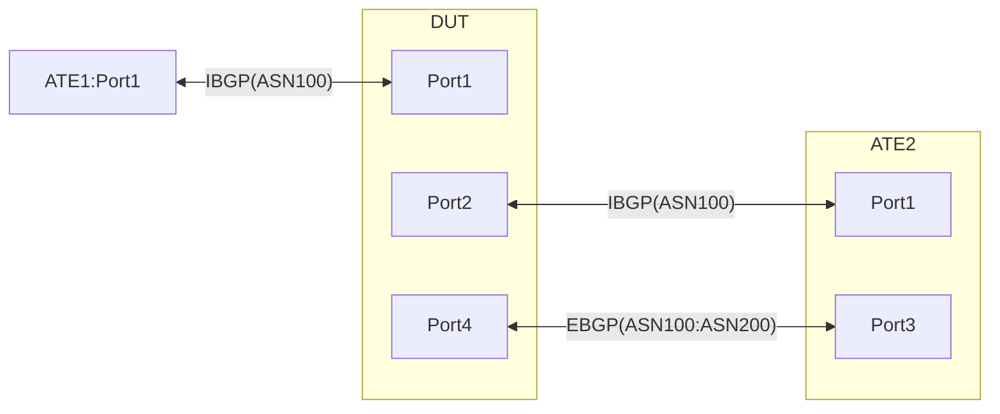

# RT-3.52 Multidimensional test for Static GUE Encap/Decap based on BGP path selection and selective DSCP marking


## Summary

The goal of this test is to:

1.  Test the implementation of Static GUE encap where the Tunnel endpoint is
    resolved over EBGP, while the Payload's destination is learned over IBGP.

2.  Confirm that before GUE encapsulation, the device correctly selects the path
    for the payload destination from multiple available IBGP routes. Path
    selection needs to follow the BGP best path algorithm rules, like giving
    preference to routes with a higher BGP Local Preference. Furthermore, it
    must successfully switch over to backup/alternative IBGP paths when the
    preferred path fails.

3.  Validate that encapsulated traffic has its TOS bits copied from the inner
    header to the outer header.

4.  The DUT will be configured to encapsulate traffic over multiple tunnels.
    It is expected to tunnel traffic towards the correct tunnel destination,
    based on the IBGP learned routes.


6.  The DUT will be configured to decapsulate traffic received over various
    tunnel destinations, and it is expected to accurately decapsulate traffic
    across all these received destinations.


7.  Confirm that the TTL value for the outer IP header created during GUE
    encapsulation can be explicitly configured.

8.  Confirm that when the DUT handles GUEv1 traffic from the reverse path, it
    successfully performs decapsulation. During this decapsulation process, the
    system must not transfer the DSCP and TTL bits from the outer header to the
    inner header. Instead, following decapsulation, the DUT should decrement the
    inner header's TTL by 1 before forwarding the packet

   
## Topology

### All IP addresses for the test:

| **Different IP addresses**                                                                                 | **Description**                                                                                                                                                                                                                                                                                                                           |
| :--------------------------------------------------------------------------------------------------------- | :---------------------------------------------------------------------------------------------------------------------------------------------------------------------------------------------------------------------------------------------------------------------------------------------------------------------------------------- |
| <br>`$ATE1PORT1_DUTPORT1_1.v4/31`<br>`$ATE1PORT1_DUTPORT1_1.v6/127`                                                            | Used for IS-IS adjacency ATE1_Port1<>DUT_Port1.                                                                                                                                                                                                                                                                                         |
| <br>`$ATE1PORT1_DUTPORT1_2.v4/31`<br>`$ATE1PORT1_DUTPORT1_2.v6/127`                                                              | Used on DUT_PORT1<>ATE1_PORT1 connection and IS-IS adjacency                                                                                                                                                                                                                                                                          |
| <br>`$ATE1_IBGP.v4/32`<br>`$ATE1_IBGP.v6/128`                                                              | Exchanged over IS-IS adjacency. Used to establish IBGP peering between ATE1 and DUT1                                                                                                                                                                                                                                                      |
| <br>`$ATE1_PORT1_INTERNET1.v4/24`<br>`$ATE1_PORT1_INTERNET2.v4/24`<br>`$ATE1_PORT1_INTERNET3.v4/24`<br>`$ATE1_PORT1_INTERNET4.v4/24`<br>`$ATE1_PORT1_INTERNET5.v4/24`<br>`$ATE1_PORT1_INTERNET1.v6/64`<br>`$ATE1_PORT1_INTERNET2.v6/64`<br>`$ATE1_PORT1_INTERNET3.v6/64`<br>`$ATE1_PORT1_INTERNET4.v6/64`<br>`$ATE1_PORT1_INTERNET5.v6/64` | <br>- `$ATE1_IBGP.v[46]` advertises these Internet learnt prefixes to `DUT_lo0.v[46]` over IBGP<br>- `$DUT_lo0.v[46]` advertises these further to `$ATE2_PORT1_IBGP.v[46]` and to  `$ $ATE2_C.IBGP.v6`                                                                                                                              |
| <br>`$ATE2PORT1_DUTPORT2_1.v4/31`<br>`$ATE2PORT1_DUTPORT2_1.v6/127`                                                            | <br>- Used for IS-IS adjacency ATE2:Port1<>DUT:Port2. IS-IS will then be used to exchange the IBGP peer addresses `$ $ATE2_C.IBGP.v6` and `$DUT_lo0.v[46]`.                                                                                                                                     |
| <br>`$ATE2PORT1_DUTPORT2_2.v4/31`<br>`$ATE2PORT1_DUTPORT2_2.v6/31`                                                              | Used on DUT_PORT2<>ATE2_PORT1 connection and IS-IS adjacency<br>                                                                                                                                                                                                                                                                    |
| <br>`$ATE2_PORT1.IBGP.v4/32`<br>`$ATE2_PORT1.IBGP.v6/128`                                                  | Regular IBGP peering between `$ATE2_PORT1.IBGP.v[46]` and DUT_lo0.v[46]                                                                                                                                                                                                                                                                |
| <br>`$ATE2_C.IBGP.v6/128`<br>`$ATE2_PPNH1.v6/128`                                                          | - For IBGP peering between `$ATE2_C.IBGP.v6` and `DUT_lo0.v6`<br> - Pseudo protocol next-hop for the IBGP routes advertised by `$ATE2_C.IBGP.v6` to the DUT                                                                                                                                                                                    |
| <br>`$ATE2_M.IBGP.v4/32`<br>`$ATE2_M.IBGP.v6/128`                                                          | For IBGP peering between `$ATE2_M.IBGP.v[4\|6]` and `DUT_lo0.v[4\|6]`                                                                                                                                                                                                                                                                               |
| <br>`$ATE2_PORT3.v4/31`<br>`$ATE2_PORT3.v6/127`                                                            | Point-to-Point connection used for EBGP peering between DUT_PORT4<>ATE2_PORT3                                                                                                                                                                                                                                                         |
| <br>`$ATE2PORT3_DUTPORT4_2.v4/31`<br>`$ATE2PORT3_DUTPORT4_2.v4/127`                                                              | Point-to-Point connection used for EBGP peering between DUT_PORT4<>ATE2_PORT3                                                                                                                                                                                                                                                         |
| <br>`$DUT_lo0.v4`<br>`$DUT_lo0.v6`                                                                         | Adertised over IS-IS and used for IBGP peering. Also used as IPoUDP tunnel source address                                                                                                                                                                                                                                                 |
| `$DUT_TE11.v4/32`                                                                                          | IPoUDP tunnel destination address on the DUT. This IP MUST receive traffic meant for single shard on the DUT                                                                                                                                                                                                       |
| `$DUT_TE10.v4/32`                                                                                          | IPoUDP tunnel destination address on the DUT. This IP MUST receive traffic meant for multiple shards on the DUT                                                                                                                                                                                                                                     |
| `$ATE2_INTERNAL_TE11.v4/32`                                                                                | IPoUDP tunnel destination address on the ATE2. This IP MUST receive traffic meant for single shard on the ATE                                                                                                                                                                                                                                     |
| `$ATE2_INTERNAL_TE10.v4/32`                                                                                | IPoUDP tunnel destination address on the DUT. This IP MUST receive traffic meant for mulitple shards on the ATE                                                                                                                                                                                                                                 |
| <br>`$ATE2_INTERNAL6.v4/24`<br>`$ATE2_INTERNAL6.v6/64`<br>`$ATE2_INTERNAL7.v4/24`<br>`$ATE2_INTERNAL7.v6/24`<br>`$ATE2_INTERNAL8.v4/24`<br>`$ATE2_INTERNAL8.v6/64`<br>`$ATE2_INTERNAL9.v4/24`<br>`$ATE2_INTERNAL9.v6/24`<br>`$ATE2_INTERNAL10.v4/24`<br>`$ATE2_INTERNAL10.v6/64` | <br>- Internal Public prefixes<br>- Advertised to the DUT over the IBGP peering between `ATE2_PORT1.IBGP.v[46]`<>`$DUT_lo0.v[46]` and `$ATE2_C.IBGP.v6`<>`$DUT_lo0.v6`<br>- Advertised further to `$ATE1_IBGP.v[46]` over the IBGP peering between `$ATE1_IBGP.v[46]`<>`DUT_lo0.v[46]` over their respective AFI peering |
                    


### Advertisements:

**IS-IS:**

| **Different IS-IS L2 adjacencies** | **Prefixes advertised**                                                                                                                                                                                     |
| :--------------------------------- | :---------------------------------------------------------------------------------------------------------------------------------------------------------------------------------------------------------- |
| `ATE1_Port1<>DUT_Port1`            | <br>- `ATE1_PORT1` --> `DUT_PORT1`:  `$ATE1_IBGP.v4`, `$ATE1_IBGP.v6`<br>- `DUT_PORT1` --> `ATE1_PORT1`: `$DUT_lo0.v4`, `$DUT_lo0.v6`                                                                 |
| `ATE2_Port1<>DUT_Port2`            | <br>- `ATE2_Port1` --> `DUT_Port2`: `$ATE2_PORT1.IBGP.v4/32`, `$ATE2_PORT1.IBGP.v6/128`, `$ATE2_C.IBGP.v6/128`, `$ATE2_M.IBGP.v6/128`<br>- `DUT_Port2` --> `ATE2_Port1`: `$DUT_lo0.v4`, `$DUT_lo0.v6` |

**BGP:**

| **Different peering**                | **BGP peering type** | **Prefixes advertised**                                                                                                                                                                                                                                                                                                                                                                                                                                                                         |
| :----------------------------------- | :------------------- | :---------------------------------------------------------------------------------------------------------------------------------------------------------------------------------------------------------------------------------------------------------------------------------------------------------------------------------------------------------------------------------------------------------------------------------------------------------------------------------------------- |
| `$ATE1_IBGP.v[46]<>$DUT_lo0.v[46]`   | IBGP                 | <br>- `$DUT_lo0.v[46]` is the route-reflector server and `$ATE1_IBGP.v[46]` is the route-reflector client<br>- `$ATE1_IBGP.v[46]` advertises prefixes `$ATE1_PORT1_INTERNET[1-5].v[46]` to `$DUT_lo0.v[46]` on their respective AFI peering<br>- `$DUT_lo0.v[46]` advertises `$ATE2_INTERNAL[6-10].v[46]` to `$ATE1_IBGP.v[46]` on their respective AFI peering<br>- MULTIPATH enabled on this peering                                                                                  |
| `$ATE2_IBGP.v[46]<>$DUT_lo0.v[46]`   | IBGP                 | <br>- `$ATE2_IBGP.v[46]` advertises `$ATE2_INTERNAL[6-10].v[46]`, `$ATE2_INTERNAL_TE10.v4/30`. and `$ATE2_INTERNAL_TE11.v4/30` to `DUT_lo0.v[46]` on their respective AFI peering<br>- `$DUT_lo0.v[46]` advertises `$ATE1_PORT1_INTERNET[1-5].v[46]`, `$DUT_TE10.v4/30`, `$DUT_TE11.v4/30`, `$DUT_TE10.v4/32` and `$DUT_TE11.v4/32` to `$ATE2_IBGP.v[46]`                                                                                                                                                                         |
| `$ATE2_C.IBGP.v6<>$DUT_lo0.v6`       | IBGP                 | <br>- `$ATE2_C.IBGP.v6` advertises `$ATE2_INTERNAL[6-10].v[46]` to `DUT_lo0.v6` with Next-hop as $ATE2_PPNH1.v6/128 and a Local-Pref of 200. **Please Note:** These prefixes are gradually advertised by `$ATE2_C.IBGP.v6` in different Sub tests.<br>`$ATE2_INTERNAL6.v[46]` in RT-3.52.2 to RT-3.52.9<br>`$ATE2_INTERNAL7.v[46]` in RT-3.52.3 to RT-3.52.9<br>`$ATE2_INTERNAL8.v[46]` in RT-3.52.4 to RT-3.52.9<br>`$ATE2_INTERNAL9.v[46]` in RT-3.52.5 to RT-3.52.9<br>`$ATE2_INTERNAL10.v[46]` in RT-3.52.6 to RT-3.52.9<br>- `$DUT_lo0.v6` advertises `$ATE1_PORT1_INTERNET[1-5].v[46]` to `$ATE2_C.IBGP.v6` |
| `$ATE2_M.IBGP.v[46]<>$DUT_lo0.v[46]` | IBGP                 | <br>- `DUT_lo0.v[46]` advertises, all its ECMP routes to `$ATE2_M.IBGP.v[46]` on the respective AFI peering.<br>- This peering will have ADD-Path for Multipath routes enabled.                                                                                                                                                                                                                                                                                                             |
| `$ATE2_Port3<>$DUT_Port4`            | EBGP                 | <br>- `ATE2_Port3` advertises `$ATE2_INTERNAL_TE10.v4/30` and `$ATE2_INTERNAL_TE11.v4/30` to `DUT_Port4`<br>- `DUT_Port4` advertises `$DUT_TE10.v4/32`, `$DUT_TE11.v4/32`, `$DUT_TE10.v4/30` and `$DUT_TE11.v4/30` to `ATE2_Port3`                                                                                                                                                                                                                                                                                                      |
| Peer ASN as ASN1 for following interfaces                               |                      | `$ATE1_IBGP.v[46]`, `$DUT_lo0.v[46]`, `$ATE2_IBGP.v[46]`, `$DUT_lo0.v[46]`, `$ATE2_C.IBGP.v6`, `$ATE2_M.IBGP.v[46]`, `$DUT_lo0.v[46]`, `$ATE2_Port3`                                                                                                                                                                                                                                                                                                                             |
| Peer ASN as ASN2 for following interfaces                                 |                      | `$DUT_Port2`                                                                                                                                                                                                                                                                                                                                                                                                                                                                                    |

**Different Flows used throughout the test:**

| Src_destination of flows | From_IP --> To_IP | DSCP | Tunnel endpoint used |
| ------------------------ | ------------------ | ---- | ------------------- |
| Flow-Set#1 from ATE1_Port1 --> ATE2_[Either Port1 or Port3 depending on the FIB entries of the DUT] | $ATE1_PORT1_INTERNET1.v4/24 --> $ATE2_INTERNAL6.v4/24 | BE1 | ATE2_INTERNAL_TE11.v4/32 |
|  | $ATE1_PORT1_INTERNET1.v6/24 --> $ATE2_INTERNAL6.v6/64 | BE1 | ATE2_INTERNAL_TE11.v4/32 |
|  | $ATE1_PORT1_INTERNET2.v4/24 --> $ATE2_INTERNAL7.v4/24 | AF1 | ATE2_INTERNAL_TE11.v4/32 |
|  | $ATE1_PORT1_INTERNET2.v6/24 --> $ATE2_INTERNAL7.v6/64 | AF1 | ATE2_INTERNAL_TE11.v4/32 |
|  | $ATE1_PORT1_INTERNET3.v4/24 --> $ATE2_INTERNAL8.v4/24 | AF2 | ATE2_INTERNAL_TE11.v4/32 |
|  | $ATE1_PORT1_INTERNET3.v6/64 --> $ATE2_INTERNAL8.v6/64 | AF2 | ATE2_INTERNAL_TE11.v4/32 |
| Flow-Set#2 from ATE1_Port1 --> ATE2_[Either Port1 or Port3 depending on the FIB entries of the DUT] | $ATE1_PORT1_INTERNET4.v4/64 --> $ATE2_INTERNAL9.v4/24 | AF3 | $ATE2_INTERNAL_TE10.v4/32 |
|  | $ATE1_PORT1_INTERNET4.v6/64 --> $ATE2_INTERNAL9.v6/64 | AF3 | $ATE2_INTERNAL_TE10.v4/32 |
|  | $ATE1_PORT1_INTERNET5.v4/64 --> $ATE2_INTERNAL10.v4/24 | AF4 | $ATE2_INTERNAL_TE10.v4/32 |
|  | $ATE1_PORT1_INTERNET5.v6/64 --> $ATE2_INTERNAL10.v6/64 | AF4 | $ATE2_INTERNAL_TE10.v4/32 |
| Flow-Set#3 from ATE2_Port3 --> ATE1_Port1 are GUE encaped with Tunnel destination as $DUT_TE11.v4/32 | $ATE2_INTERNAL6.v4/24 --> $ATE1_PORT1_INTERNET1.v4/24 | BE1 | $DUT_TE11.v4/30 |
|  | $ATE2_INTERNAL6.v6/64 --> $ATE1_PORT1_INTERNET1.v6/64 | BE1 | $DUT_TE11.v4/30 |
|  | $ATE2_INTERNAL7.v4/24 --> $ATE1_PORT1_INTERNET2.v4/24 | AF1 | $DUT_TE11.v4/30 |
|  | $ATE2_INTERNAL7.v6/64 --> $ATE1_PORT1_INTERNET2.v6/64 | AF1 | $DUT_TE11.v4/30 |
|  | $ATE2_INTERNAL8.v4/24 --> $ATE1_PORT1_INTERNET3.v4/24 | AF2 | $DUT_TE11.v4/30 |
|  | $ATE2_INTERNAL8.v6/64 --> $ATE1_PORT1_INTERNET3.v6/64 | AF2 | $DUT_TE11.v4/30 |
| Flow-Set#4 from ATE2_Port3 --> ATE1_Port1 are GUE encaped with Tunnel destination as $DUT_TE10.v4/32 | $ATE2_INTERNAL9.v4/24 --> $ATE1_PORT1_INTERNET4.v4/24 | AF3 | $DUT_TE10.v4/30 |
|  | $ATE2_INTERNAL9.v6/64 --> $ATE1_PORT1_INTERNET4.v6/64 | AF3 | $DUT_TE10.v4/30 |
|  | $ATE2_INTERNAL10.v4/24 -->  $ATE1_PORT1_INTERNET5.v4/24 | AF4 | $DUT_TE10.v4/30 |
|  | $ATE2_INTERNAL10.v6/64 -->  $ATE1_PORT1_INTERNET5.v6/64 | AF4 | $DUT_TE10.v4/30 |
| Flow-Set#5 from ATE2:Port1 to ATE1:Port1 are sent Unencaped | $ATE2_INTERNAL6.v4/24 --> $ATE1_PORT1_INTERNET1.v4/24 | BE1 | N/A |
|  | $ATE2_INTERNAL6.v6/64 --> $ATE1_PORT1_INTERNET1.v6/64 | BE1 |  |
|  | $ATE2_INTERNAL7.v4/24 --> $ATE1_PORT1_INTERNET2.v4/24 | AF1 |  |
|  | $ATE2_INTERNAL7.v6/64 --> $ATE1_PORT1_INTERNET2.v6/64 | AF1 |  |
|  | $ATE2_INTERNAL8.v4/24 --> $ATE1_PORT1_INTERNET3.v4/24 | AF2 |  |
|  | $ATE2_INTERNAL8.v6/64 --> $ATE1_PORT1_INTERNET3.v6/64 | AF2 |  |
|  | $ATE2_INTERNAL9.v4/24 --> $ATE1_PORT1_INTERNET4.v4/24 | AF3 |  |
|  | $ATE2_INTERNAL9.v6/64 --> $ATE1_PORT1_INTERNET4.v6/64 | AF3 |  |
|  | $ATE2_INTERNAL10.v4/24 -->  $ATE1_PORT1_INTERNET5.v4/24 | AF4 |  |
|  | $ATE2_INTERNAL10.v6/64 -->  $ATE1_PORT1_INTERNET5.v6/64 | AF4 |  |


### DUT Configuration:

In addition to the adjacencies and peering configurations described in the
tables above, the DUT requires the following configurations:

*   **IS-IS:**

    *   The DUT's loopback interface must be passive for IS-IS.

*   **BGP:**

    *   Define import and export route policies to match the advertisements for
        each BGP peering.
        
*   **Static GUE Encapsulation:**

    *   Configure static GUE encapsulation as follows:

        *   Define UDP ports to be used for IPv4oUDP and IPv6oUDP which is 6080.
        *   Define the Tunnel NHG configuration with these parameters:

            *   `ttl = 128`
            *   `tunnel-source = $DUT_lo0.v4`
            *   `tunnel-destination1 = $ATE2_INTERNAL_TE11.v4/32`.
            *   `tunnel-destination2 = $ATE2_INTERNAL_TE10.v4/32`.
            *   The DUT must have a static route pointing
                `"$ATE2_PPNH1.v6/128"` and `$ATE2_PPNH2.v6/128` to the NHG
                created above (below is an example of the static route). The IBGP peer
                $ATE2_C.IBGP.v6/128 is expected to advertise both IPv4 and IPv6
                prefixes with the Next-Hop as `"$ATE2_PPNH1.v6/128"` or
                `"$ATE2_PPNH2.v6/128"`
                ```
                static dst: ATE2_PPNH1.v6/128 next-hop: $ATE2_INTERNAL_TE11.v4/32
                static dst: ATE2_PPNH2.v6/128 next-hop: $ATE2_INTERNAL_TE10.v4/32
                ```
                

*   **GUE Decapsulation:**

    *   For a GUE decapsulation node, configure the following:

        *   UDP port 6080 (configurable) must be used for decapsulating IPv4 and
            IPv6 payload. The implementation MUST look at the first 4 bits of
            the UDP payload to determine the GUE version as well as the IP
            version of the payload to be either IPv4 or IPv6 as explained in the
            [IETF draft](https://datatracker.ietf.org/doc/html/draft-ietf-intarea-gue-09#section-4)
        *   The Decapsulation node must be configured for decapsulating traffic
            received for the range i.e $DUT_TE11.v4/30 and $DUT_TE10.v4/30 in
            place of the corresponding /32 addresses. 
        *   After decapsulation, the outer TTL and DSCP bits must not be copied
            to the inner header


### Following Health checks to be run Pre and Post every sub test
Use # Health-1.1: Generic Health Check. If errors identified then the test Must fail.

**RT-3.52.1: Baseline**

*   **Situation:**

    *   All IS-IS adjacencies, as well as all IBGP and EBGP peerings, are
        established.
    *   No prefixes are exchanged over the IBGP peering between
        `$ATE2_C.IBGP.v6` and `$DUT_lo0.v6`.

*   **Test Steps:**

    *   Execute all health checks mentioned above prior to running the tests.
    *   Configure the DUT for IS-IS adjacency, IBGP and EBGP peering, and
        GUE encapsulation. This includes setting up the necessary routing policies
        and static routes as described previously.
    *   Initiate Flow-Set #1 and Flow-Set #2
    *   Initiate Flow-Set #5
    *   Send 50000 packets per flow @1000pps

*   **Expectations:**

    *   Flow-Set #1 and Flow-Set #2 are expected to achieve 100% success (zero
        packet loss) and be routed over the connection between `DUT_Port2` <>
        `ATE2_Port1`.
    *   Flow-Set #5 must also achieve 100% success (zero
        packet loss), with flows routing through
        the connection between `ATE2_Port1` --> `DUT_Port2` --> `ATE1_Port1`.
    *   Execute post-test health checks and compare the results with the
        baseline. Verify that there are no drops, core dumps, or other issues.


**RT-3.52.2: BE1 Traffic Migrated from being routed over the DUT_Port2 -->
ATE2_Port1 path to DUT_Port4 --> ATE2_Port3 path**

*   **Situation:**

    *   The baseline test (RT-3.52.1) is running, with flows active in
        Flow-Set #1, Flow-Set #2, and Flow-Set #5
    *   The DUT receives `$ATE2_INTERNAL_TE11.v4/30` and
        `$ATE2_INTERNAL_TE10.v4/30` from `$ATE2_Port3`, while advertising
        `$DUT_TE11.v4/32`, `$DUT_TE10.v4/32`, `$DUT_TE11.v4/30` and
        `$DUT_TE10.v4/30` to `$ATE2_Port3` via EBGP

*   **Test Steps:**

    *   Execute the health checks described previously
    *   Configure the DUT according to the prior instructions
    *   The IBGP session between `$ATE2_C.IBGP.v6`and `$DUT_lo0.v6` should now
        advertise only `$ATE2_INTERNAL6.v[46]` with a local preference of 200
        and Pseudo Protocol Next-Hop as `$ATE2_PPNH1.v6/128`
    *   `$DUT_lo0.v6` advertises `$ATE1_PORT1_INTERNET[1-5].v[46]` to
        `$ATE2_C.IBGP.v6`, and a static route on the DUT points
        `$ATE2_PPNH1.v6/128` to `$ATE2_INTERNAL_TE11.v4/32`

*   **Expectations:**
  
    *   Routes to prefixes `$ATE2_INTERNAL6.v4/24` and `$ATE2_INTERNAL6.v6/64`,
        learned from `$ATE2_C.IBGP.v6/128`, should have a local preference of 200
        and be installed in the FIB. Other prefixes from ATE2 will continue to be
        learnt via the IBGP peering between `$ATE2_PORT1.IBGP.v[46]` and
        `$DUT_lo0.v[46]` with the default local preference of 100 and also be in the
        DUT's FIB. Traffic to these prefixes MUST be 100% successful (zero losses).
    *   Flows destined for `$ATE2_INTERNAL6.v4/24` and `$ATE2_INTERNAL6.v6/64`
        should be GUE-encapsulated with tunnel destination `$ATE2_INTERNAL_TE11.v4`
        and routed over the EBGP peering between `$ATE2_Port3` and `$DUT_Port4`, and
        these flows must be 100% successful (zero loss). Inshort, change in path due
        to higher local preference on the received routes from `$ATE2_C.IBGP.v6/128`
        should cause zero packet loss
    *   The outer header TTL should be 127 upon arrival at `ATE2_Port1` (before
        decapsulation)
    *   The outer header DSCP bits should be the same as the inner header DSCP bits
        when received at `ATE2_Port1` (before decapsulation).
    *   The DUT should accurately stream data regarding the number of packets/bytes
        encapsulated
    *   Unencapsulated flows from ATE2 to `ATE1_Port1` must have 100% success (Zero
        loss), routing via the IBGP peering between `$ATE2_IBGP.v[46]` and
        `$DUT_lo0.v[46]`
    *   Post-test health checks should be performed and compared against the
        baseline. Verify the absence of drops or core dumps. If any, the test Must
        fail


**RT-3.52.3: AF1-AF4 Traffic Migrated to DUT --> ATE2_Port3**

Follow the same steps as in RT-3.52.2 and gradually move one Traffic class at a
time in the following order. Note changes in RT-3.52.5 and RT-3.52.6

*   **RT-3.52.3: Migrate AF1 Flows:** Migrate routing of AF1 flows from
    `DUT_Port2` --> `ATE2_Port1` to `DUT_Port4` --> `ATE2_Port3`.

    *   BE1 and AF1 are now migrated

    *   **RT-3.52.4: Migrate AF2 Flows:** Migrate routing of AF2 flows from
        `DUT_Port2` --> `ATE2_Port1` to `DUT_Port4` --> `ATE2_Port3`.

        *   BE1-AF2 are now migrated

    *   **RT-3.52.5: Migrate AF3 Flows:** Migrate routing of AF3 flows from
        `DUT_Port2` --> `ATE2_Port1` to `DUT_Port4` --> `ATE2_Port3`.

        *   `$ATE2_C.IBGP.v6` will advertise `$ATE2_INTERNAL9.v4/24` and
            `$ATE2_INTERNAL9.v6/64` with next-hop as `$ATE2_PPNH2.v6/128`.
            Traffic towards `$ATE2_INTERNAL9.v[46]/24` will have tunnel
            destination `$ATE2_INTERNAL_TE10.v4/32`.
        *   BE1-AF3 are now migrated

    *   **RT-3.52.6: Migrate AF4 Flows:** Migrate routing of AF4 flows from
        `DUT_Port2` --> `ATE2_Port1` to `DUT_Port4` --> `ATE2_Port3`.

        *   `$ATE2_C.IBGP.v6` will advertise `$ATE2_INTERNAL10.v4/24` and
            `$ATE2_INTERNAL10.v6/64` with next-hop as `$ATE2_PPNH2.v6/128`
            Traffic towards `$ATE2_INTERNAL10.v[46]` will have tunnel
            destination `$ATE2_INTERNAL_TE10.v4/32`.
        *   BE1-AF4 are now migrated

*   **Expectations:**

    *   Same as RT-3.52.2 for each traffic class migrated except that
        AF3 and AF4 traffic are tunneled towards `$ATE2_INTERNAL_TE10.v4/32`.


        

**RT-3.52.7: DUT as a GUE Decap Node**

*   **Situation:**

    *   The test begins from the state established in RT-3.52.3, where all
        traffic from ATE1 to ATE2 is encapsulated by the DUT and routed via
        DUT_Port4 --> ATE2_Port3 path.

*   **Test Steps:**

    *   Perform all previously defined health checks as a baseline.
    *   Stop Flow-Set #5 and start Flow-Set #4, resulting in active flows for
        Flow-Set #1 through Flow-Set #4.

*   **Expectations:**

    *   Traffic from ATE1 to ATE2 should be GUE encapsulated with tunnel
        destinations `$ATE2_INTERNAL_TE11.v4/32` and
        `$ATE2_INTERNAL_TE10.v4/32` and routed out
        `$DUT_Port4<>$ATE2_Port3`.

    *   The DUT should provide accurate streaming data for the number of
        encapsulated packets/bytes.

    *   `ATE2_Port3` sends encapsulated flows (Flow-Set #3 and Flow-Set #4) to
        `ATE1_Port1` through the DUT.

        BE1 to AF2 flows are expected to have a tunnel destination of
        `$DUT_TE11.v4/32`, while AF3 and AF4 flows should have `$DUT_TE10.v4/32`
        as their tunnel destination.

        Traffic should reach the destination successfully.

    *   The DUT should accurately stream data on decapsulated packets/bytes.

    *   Post-test health checks should be performed and compared against the
        baseline. Verify the absence of drops or core dumps. If any, the test
        Must fail
        


**RT-3.52.8: Negative Scenario - EBGP Route for remote tunnel endpoints Removed
Inflight**

*   **Situation:**

    *   The test begins from the final state of RT-3.52.7 In this state, the DUT
        encapsulates BE1-AF2 traffic from ATE1 to ATE2 towards tunnel
        destination address `"$ATE2_INTERNAL_TE11.v4/32"`, and AF3-AF4 traffic
        is encapsulated towards `"$ATE2_INTERNAL_TE10.v4/32"` Similarly, BE1-AF2
        traffic from ATE2 to ATE1 is encapsulated with tunnel destination
        `"$DUT_TE11.v4/32"`, and AF3-AF4 traffic uses `"$DUT_TE10.v4/32"`
    *   ATE2 do not send any unencapsulated flows

*   **Test Steps:**

    *   Execute the previously defined health checks as a baseline
    *   Flow-Sets #1 through #4 should be active
    *   On `ATE2_Port3`, stop advertising the prefixes
        `"$ATE2_INTERNAL_TE11.v4/32"` and `"$ATE2_INTERNAL_TE10.v4/32"` to
        `DUT_Port4` over EBGP

*   **Expectations:**

    *   When `ATE2_Port3` withdraws the route advertisement on the EBGP peering
        with `DUT_Port4`:
        *   The tunnel endpoints `"$ATE2_INTERNAL_TE11.v4/32"` and
            `"$ATE2_INTERNAL_TE10.v4/32"`, learned via the IBGP peering between
            $ATE2_IBGP.v[46]<>$DUT_lo0.v[46], should be placed in the FIB.
        *   Traffic from ATE1 to ATE2 should then take the path `DUT_Port2` -->
            `ATE2_Port1` path after encapsulation on the DUT, with no traffic
            loss expected due to this change.
        *   The DUT should accurately stream encapsulated and decapsulated
            packet/byte data.
        *   Post-test health checks should be performed and compared against the
            baseline. Verify the absence of drops or core dumps. If any, the
            test Must fail


**RT-3.52.9: Negative Scenario - IBGP Route for Remote Tunnel Endpoints Removed
Inflight**

*   **Situation:**

    *   The test starts from the end state of RT-3.52.8
        Therefore, ATE1 to ATE2 traffic is routed via the `DUT_Port2` -->
        `ATE2_Port1` path after encapsulation. ATE2 --> ATE1 traffic is routed via the
        ATE2_Port3 --> DUT_Port4 path.
    *   Static routes for `$ATE2_PPNH1.v6/128` and `$ATE2_PPNH2.v6/128` are
        active because tunnel endpoints `"$ATE2_INTERNAL_TE11.v4/32"` and
        `"$ATE2_INTERNAL_TE10.v4/32"` are reachable via the IBGP peering between
        `$ATE2_IBGP.v[46]` and `$DUT_lo0.v[46]`
    *   Routes for `ATE2_INTERNAL[6-10].v[46]`, advertised by ATE2 over the IBGP
        peering `$ATE2_C.IBGP.v6<>$DUT_lo0.v6`, remain active on the DUT.

*   **Test Steps:**

    *   Configure `$ATE2_IBGP.v[46]` to stop advertising tunnel endpoints
        `"$ATE2_INTERNAL_TE11.v4/32"` and `"$ATE2_INTERNAL_TE10.v4/32"` to
        `$DUT_lo0.v[46]` over their IBGP peering

*   **Expectations:**

    *   Static routes for `$ATE2_PPNH1.v6/128` and `$ATE2_PPNH2.v6/128` must
        become invalid.
    *   Routes for `ATE2_INTERNAL[6-10].v[46]` advertised by ATE2 over the IBGP
        peering `$ATE2_C.IBGP.v6<>$DUT_lo0.v6` must become invalid.
    *   Routes for `ATE2_INTERNAL[6-10].v[46]` advertised by `$ATE2_IBGP.v[46]`
        over the IBGP peering `$ATE2_IBGP.v[46]<>$DUT_lo0.v[46]` with the
        default local preference of 100 must be placed in the FIB.
    *   Traffic from ATE1 to ATE2 towards `ATE2_INTERNAL[6-10].v[46]`
        destinations must not experience any drops and should be routed
        unencapsulated via the `ATE2_Port1<>DUT_Port2` path.
    *   Post-test health checks should be performed and compared against the
        baseline. Verify the absence of drops or core dumps. If any, the test
        Must fail


**RT-3.52.10: Establish IBGP Peering over EBGP**

*   **Test Steps:**

    *   Establish all IS-IS adjacencies. Ensure that prefix
        `$ATE2_C.IBGP.v6/128` is not advertised from `ATE2_Port1` to
        `DUT_Port2`, and prefixes `$DUT_lo0.v[46]` are not advertised from
        `DUT_Port2` to `ATE2_Port1`.
    *   Run the previously defined health checks.
    *   On their mutual EBGP session, `DUT_Port4` advertises `$DUT_lo0.v[46]`
        and `ATE2_Port3` advertises `$ATE2_C.IBGP.v6/128`, in addition to any
        existing exchanges. This establishes the IBGP session between
        `$DUT_lo0.v6/128` and `$ATE2_C.IBGP.v6/128` via the EBGP session between
        `DUT_Port4` and `ATE2_Port3`.
    *   Disable the connection between `DUT_Port2` and `ATE2_Port1`.
    *   Verify that `$ATE2_C.IBGP.v6/128` and `$DUT_lo0.v6/128` exchange the
        same prefixes as before, according to the table mentioned earlier over
        their IBGP session.
    *   Start all flows from Flow-Set #1 to Flow-Set #4.

*   **Expectations:**

    *   Ensure no packet drops occur after the IBGP transport migration.
    *   Packets should be sent encapsulated between `DUT:Port4` and
        `ATE2:Port3`.
    *   The DUT should stream accurate data on the number of encapsulated
        packets/bytes, consistent with the number of packets generated by ATE1
        towards ATE2.
    *   Post-test health checks should be performed and compared against the
        baseline. Verify the absence of drops or core dumps. If any, the test
        Must fail

## Canonical OpenConfig for GUEv1 Encapsulation configuration
```json
{
    "network-instances": {
        "network-instance": [
            {
                "name": "DEFAULT",
                "config": {
                    "name": "DEFAULT"
                },
                "protocols": {
                    "protocol": [
                        {
                            "identifier": STATIC,
                            "name": "DEFAULT",
                            "config": {
                                "identifier": STATIC,
                                "name": "DEFAULT",
                                "enabled": true
                            },
                            "static-routes": {
                                "static": [
                                    {
                                        "prefix": "destination_ip",
                                        "config": {
                                            "prefix": "destination_ip"
                                        },
                                        "next-hop-group": {
                                            "config": {
                                                "name": "gue_encap_v4_nhg"
                                            }
                                        }
                                    },
                                ]
                            }
                        }
                    ]
                },
                "static": {
                    "next-hop-groups": {
                        "net-hop-group": [
                            {
                                "name": "gue_encap_v4_nhg",
                                "config": {
                                    "name": "gue_encap_v4_nhg"
                                },
                                "next-hops": {
                                    "next-hop": [
                                        {
                                            "index": 1,
                                            "config": {
                                                "index": 1
                                            }
                                        },
                                    ]
                                }
                            }
                        ]
                    },
                    "next-hops": {
                        "next-hop": [
                            {
                                "index": 1,
                                "config": {
                                    "index": 1,
                                    "encap-headers": {
                                        "encap-header": [
                                            {
                                                "index": 1,
                                                "type": "UDPV4",
                                                "config": {
                                                    "dst-ip": "outer_ipv4_dst",
                                                    "src-ip": "outer_ipv4_src",
                                                    "dscp": "outer_dscp",
                                                    "ip-ttl": "outer_ip_ttl",
                                                    "dst-udp-port": "outer_dst_udp_port"
                                                }
                                            },
                                        ]
                                    }
                                }
                            },
                        ]
                    }
                }
            }
        ]
    }
}
```
## Canonical OpenConfig for GUEv1 Decapsulation configuration
```json
{
    "network-instances": {
        "network-instance": {
            "config": {
                "name": "DEFAULT"
            },
            "name": "DEFAULT",
            "policy-forwarding": {
                "policies": {
                    "policy": [
                        {
                            "config": {
                                "policy-id": "decap-policy"
                            },
                            "rules": {
                                "rule": [
                                    {
                                        "sequence-id": 1,
                                        "config": {
                                            "sequence-id": 1
                                        },
                                        "ipv4": {
                                            "config": {
                                                "destination-address-prefix-set": "dst_prefix",
                                                "protocol": "IP_UDP"
                                            }
                                        },
                                        "transport": {
                                            "config": {
                                                "destination-port": 6080
                                            }
                                        }
                                        "action": {
                                            "decapsulate-gue": true
                                        },
                                    },
                                ]
                            }
                        }
                    ]
                }
            }
        }
    }
}
```


## OpenConfig Path and RPC Coverage
```yaml
paths:

# define Encap details to be used for the UDP header part of the Next-hop config
# for the Next-hop-group
# Todo: Define a templatized approach for capturing src and dst udp ports, dscp
# and ttl. NOS is expected to dynamically determine the payload protocol type and
# attach the destination udp port.
/network-instances/network-instance/policy-forwarding/policies/policy/config/policy-id:
/network-instances/network-instance/policy-forwarding/policies/policy/rules/rule/config/ipv4/config/destination-address-prefix-set:
/network-instances/network-instance/policy-forwarding/policies/policy/rules/rule/config/ipv4/config/protocol:
/network-instances/network-instance/policy-forwarding/policies/policy/rules/rule/transport/config/destination-port:
/network-instances/network-instance/policy-forwarding/policies/policy/rules/rule/action/decapsulate-gue:

/network-instances/network-instance/protocols/protocol/config/identifier:
/network-instances/network-instance/protocols/protocol/config/identifier/name:
/network-instances/network-instance/protocols/protocol/static-routes/static/config/prefix:
/network-instances/network-instance/protocols/protocol/static-routes/static/next-hop-group/config/name:
/network-instances/network-instance/static-routes/static/next-hop-groups/next-hop-group/config/name:
/network-instances/network-instance/static-routes/static/next-hop-groups/next-hop-group/next-hops/next-hop/config/index:
/network-instances/network-instance/static-routes/static/next-hops/next-hop/config/index:
/network-instances/network-instance/static-routes/static/next-hops/next-hop/config/encap-headers/encap-header/config/dst-ip:
/network-instances/network-instance/static-routes/static/next-hops/next-hop/config/encap-headers/encap-header/config/src-ip:
/network-instances/network-instance/static-routes/static/next-hops/next-hop/config/encap-headers/encap-header/config/dscp:
/network-instances/network-instance/static-routes/static/next-hops/next-hop/config/encap-headers/encap-header/config/ttl:
/network-instances/network-instance/static-routes/static/next-hops/next-hop/config/encap-headers/encap-header/config/dst-udp-port:

/network-instances/network-instance/policy-forwarding/policies/policy/rules/rule/ipv4/config/source-address:
/network-instances/network-instance/policy-forwarding/policies/policy/rules/rule/ipv4/config/source-address-prefix-set:
/network-instances/network-instance/policy-forwarding/policies/policy/rules/rule/ipv4/config/destination-address-prefix-set:
/network-instances/network-instance/policy-forwarding/policies/policy/rules/rule/ipv4/config/destination-address:
/network-instances/network-instance/policy-forwarding/policies/policy/rules/rule/ipv4/config/dscp:

/network-instances/network-instance/policy-forwarding/policies/policy/rules/rule/ipv6/config/source-address:
/network-instances/network-instance/policy-forwarding/policies/policy/rules/rule/ipv6/config/source-address-prefix-set:
/network-instances/network-instance/policy-forwarding/policies/policy/rules/rule/ipv4/config/destination-address-prefix-set:
/network-instances/network-instance/policy-forwarding/policies/policy/rules/rule/ipv4/config/destination-address:
/network-instances/network-instance/policy-forwarding/policies/policy/rules/rule/ipv6/config/dscp:

rpcs:
  gnmi:
    gNMI.Set:
      union_replace: true
    gNMI.Subscribe:
      on_change: true
```

## Required DUT platform

* Specify the minimum DUT-type:
  * FFF - fixed form factor


