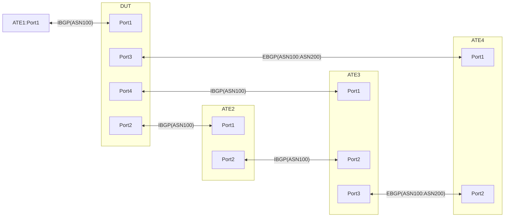

# RT-3.35 Static GUE Encap and BGP path selection

## Summary
This is to
1. Test implementation of Static GUE encap whereby Tunnel endopoint is resolved over EBGP while the Payload's destination is learnt over IBGP
2. Prior to being GUE encaped, the LPM lookup on the payload destination undergoes route selection between different IBGP learnt routes and selects the ones w/ higher Local preference. In the absence of which the backup routes are selected.
3. Encaped traffic also gets the TTL and the TOS bits copied over from the inner header to the outer header. The same are verified at the other end.

## Topology

