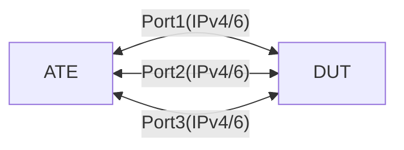

# PF-1.24: Add and remove interface bound to PBF

## Summary

For an interface that is bound to a PBF policy
*   Remove an interface bound to a policy
*   Add a new interface to the policy
*   Remove an interface from both a policy and the device

## Testbed type

* [`featureprofiles/topologies/atedut_4.testbed`](https://github.com/openconfig/featureprofiles/blob/main/topologies/atedut_4.testbed)

## Topology:



## Procedure

### Initial setup

*   Connect DUT port-1, 2, 3 to ATE port-1, 2, 3 respectively

*   Configure IPv4/IPv6 addresses on DUT and ATE ports as shown below

    *   DUT port-1 IPv6 address ```dp1-v6 = 2001:DB2::1/126```
    *   ATE port-1 IPv6 address ```ap1-v6 = 2001:DB2::2/126```
    *   DUT port-1 IPv4 address ```dp1-v4 = 192.168.100.1/30```
    *   ATE port-1 IPv4 address ```ap1-v4 = 192.168.100.2/30```

    *   DUT port-2 IPv6 address ```dp2-v6 = 2001:DB2::5/126```
    *   ATE port-2 IPv6 address ```ap2-v6 = 2001:DB2::6/126```
    *   DUT port-2 IPv4 address ```dp1-v4 = 192.168.100.5/30```
    *   ATE port-2 IPv4 address ```ap1-v4 = 192.168.100.6/30```

    *   DUT port-3 IPv6 address ```dp2-v6 = 2001:DB2::9/126```
    *   ATE port-3 IPv6 address ```ap2-v6 = 2001:DB2::a/126```
    *   DUT port-3 IPv4 address ```dp1-v4 = 192.168.100.9/30```
    *   ATE port-3 IPv4 address ```ap1-v4 = 192.168.100.10/30```

*   Create a vrf `VRF-100` on DUT ports 1 and assign the IP address.

*   Configure two IPv6 and two IPv4 static routes on DUT in VRF `VRF-100` towards ATE
    *   NOTE: It is not necessary for these networks to be configured on ATE. They are just used for traffic destinations
        *   Destination: `ipv6-net-a = 3008:DB8::/126` with next-hop `ap1-v6 = 2001:DB2::2/126` in vrf `VRF-100`
        *   Destination: `ipv6-net-b = 3009:DB9::/126` with next-hop `ap2-v6 = 2001:DB2::6/126` in vrf `VRF-100`
        *   Destination: `ipv4-net-a = 192.168.200.0/24` with next-hop `ap1-v4 = 192.168.100.2/30` in vrf `VRF-100`
        *   Destination: `ipv4-net-b = 192.168.201.0/24` with next-hop `ap1-v4 = 192.168.100.6/30` in vrf `VRF-100`
    *   NOTE: Default network instance should not have any static routes configured, above static routes should only be configured in `VRF-100`

*   Configure a forwarding policy type 'VRF_SELECTION_POLICY'
    *   Rule with sequence `10` to match:
        *   All IPv4 traffic that match source address '192.168.100.6/32' and '192.168.100.10/32' only should be allowed.
        *   All IPv6 traffic that match source address '2001:DB2::6/128' and '2001:DB2::a' only should be allowed.
        *   Set the action to match network instance `VRF-100`
    *   Apply the policy to DUT Port 2&3
        *   NOTE: Port 2 and 3 are in `default vrf`

### PF-1.24.1 - Remove an interface bound to VRF Selection Policy

*   Remove DUT Port2 from the VRF Selection Policy.
*   Start traffic from ATE port-3 towards
    *   `ipv6-net-a = 3008:DB8::/126`
    *   `ipv6-net-b = 3009:DB9::/126`
    *   `ipv4-net-a = 192.168.200.0/24`
    *   `ipv4-net-b = 192.168.201.0/24`
*   Validate the traffic is received on ATE Port1 only

### PF-1.24.2 - Add an interface bound to VRF Selection Policy

*   Apply the VRF selection policy to DUT Port2
*   Start traffic from ATE port-3 towards
    *   `ipv6-net-a = 3008:DB8::/126`
    *   `ipv6-net-b = 3009:DB9::/126`
    *   `ipv4-net-a = 192.168.200.0/24`
    *   `ipv4-net-b = 192.168.201.0/24`
*   Validate the traffic is received on ATE Port1 and Port2

### PF-1.24.3 - Remove an interface from both a policy and the device

*   Use gnmi batch replace to:
    *   Remove DUT Port2 from the VRF Selection policy as well as from the device
*   Start traffic from ATE port-3 towards
    *   `ipv6-net-a = 3008:DB8::/126`
    *   `ipv6-net-b = 3009:DB9::/126`
    *   `ipv4-net-a = 192.168.200.0/24`
    *   `ipv4-net-b = 192.168.201.0/24`
*   Validate the traffic is received on ATE Port1 only

### Canonical OC

```json
{
  "network-instances": {
    "network-instance": [
      {
        "config": {
          "name": "default"
        },
        "name": "default",
        "policy-forwarding": {
          "interfaces": {
            "interface": [
              {
                "config": {
                  "apply-forwarding-policy": "vrf100policy",
                  "interface-id": "eth3/3/1"
                },
                "interface-id": "eth3/3/1"
              }
            ]
          },
          "policies": {
            "policy": [
              {
                "config": {
                  "policy-id": "vrf100policy",
                  "type": "VRF_SELECTION_POLICY"
                },
                "policy-id": "vrf100policy",
                "rules": {
                  "rule": [
                    {
                      "action": {
                        "config": {
                          "network-instance": "vrf100"
                        }
                      },
                      "config": {
                        "sequence-id": 10
                      },
                      "sequence-id": 10
                    }
                  ]
                }
              }
            ]
          }
        }
      },
      {
        "config": {
          "name": "vrf100",
          "type": "L3VRF"
        },
        "name": "vrf100"
      }
    ]
  }
}
```

## OpenConfig Path and RPC Coverage

```yaml
paths:
  # forwarding-policy paths
  /network-instances/network-instance/policy-forwarding/policies/policy/config/policy-id:
  /network-instances/network-instance/policy-forwarding/policies/policy/config/type:
  /network-instances/network-instance/policy-forwarding/policies/policy/rules/rule/config/sequence-id:
  /network-instances/network-instance/policy-forwarding/policies/policy/rules/rule/ipv6/config/source-address:
  /network-instances/network-instance/policy-forwarding/policies/policy/rules/rule/ipv6/config/destination-address:
  /network-instances/network-instance/policy-forwarding/policies/policy/rules/rule/action/config/network-instance:
  # apply policy to the interface
  /network-instances/network-instance/policy-forwarding/interfaces/interface/config/apply-forwarding-policy:

rpcs:
  gnmi:
    gNMI.Set:
      replace: true
```

## Minimum DUT platform requirement

FFF
