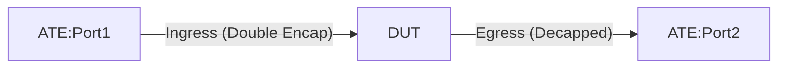

# PF-1.25: Double GUEv1 Decapsulation for Overlay Probing

## Summary

This test verifies the functionality of double decapsulation for Generic UDP Encapsulation traffic: `[Outer_IP_header][UDP][Middle_IP_header][UDP][Inner_IP_header][PAYLOAD]`.

The test validates that the DUT performs the following actions:
* Decapsulate the outer (UDPoIPv6) headers of GUE packets matching the configured decap criteria (destination IP range and UDP port).
* Decapsulate the middle (UDPoIPv6) headers of the resulting packet.
* Perform a Longest Prefix Match (LPM) lookup on the inner IP header and forward the packet towards the destination.
* Ensure the packet arrives at the destination as `[Inner_IP_header][PAYLOAD]`.
* Support these operations potentially via sequential VRF lookups or a single pipeline operation if supported by the vendor.
* Performance caveats are acceptable as this is for probing traffic.

## Procedure

### Test environment setup

* ATE Port 1 is connected to the DUT ingress port.
* ATE Port 2 is connected to the DUT egress port.



### ATE Configuration

* **ATE Port 1**: Generates double-GUE-encapsulated traffic.
* **ATE Port 2**: Receives decapped inner traffic.

| Flow Type | Header Layer | Source IP | Destination IP | UDP Port | DSCP | TTL |
| :--- | :--- | :--- | :--- | :--- | :--- | :--- |
| **Flow Type #1 (IPv6/IPv6/IPv4)** | Outer IP | ATE-P1-IP | DECAP-DST-OUTER | 6081 | 35 | 70 |
| | Middle IP | IPV6-MID-SRC | DECAP-DST-INNER | 6081 | 32 | 60 |
| | Inner IP | IPV6-SRC-HOST | IPV4-DST-HOST | N/A | 20 | 50 |
| **Flow Type #2 (IPv6/IPv6/IPv6)** | Outer IP | ATE-P1-IP | DECAP-DST-OUTER | 6081 | 35 | 70 |
| | Middle IP | IPV6-MID-SRC | DECAP-DST-INNER | 6081 | 32 | 60 |
| | Inner IP | IPV6-SRC-HOST | IPV6-DST-HOST | N/A | 20 | 50 |

### DUT Configuration

1. **Interfaces**: Configure DUT ports as singleton IP interfaces.
2. **GUE Decapsulation (Double)**:
    * Configure a policy to match packets destined to `DECAP-DST-OUTER` on UDP port `6081` and perform decapsulation.
    * Configure a secondary policy (or the same policy applied to a resulting VRF/pipeline stage) to match packets destined to `DECAP-DST-INNER` on UDP port `6081` and perform decapsulation.
    * Configure BGP for `IPV4-DST-HOST` and `IPV6-DST-HOST` towards ATE Port 2.
    * **Optional**: Configure a "Double Decap" VRF if the vendor implementation requires sequential decap across VRFs.

### Test Procedure

#### PF-1.25.1: Double GUE Decapsulation of IPv4 Traffic
* Push DUT configuration.
* Initiate **Flow Type #1** from ATE Port 1.
* **Verification**:
    * DUT decapsulates the outer header.
    * DUT decapsulates the middle header.
    * DUT performs LPM on the inner destination `IPV4-DST-HOST`.
    * ATE Port 2 receives the packet as `[Inner_IP][Payload]`.
    * Verify that the inner TTL is decremented by 1 (or as per forwarding logic) and inner DSCP is preserved.
    * No packet loss observed.

#### PF-1.25.2: Double GUE Decapsulation with IPv6 Inner Payload
* Configure Flow Type #2 with an IPv6 inner header.
* Initiate traffic.
* **Verification**:
    * DUT successfully decapsulates both GUE layers and forwards the inner IPv6 packet.

#### PF-1.25.3: Negative - Middle Header UDP Port Mismatch
* Initiate traffic where the outer header matches but the middle header has an unconfigured UDP port (e.g., 6085).
* **Verification**:
    * DUT may decapsulate the outer header but should drop the packet (or forward as-is if no other rules match) after failing to match the middle decap criteria.
    * 100% packet loss (or failed decap) on ATE Port 2.

## Canonical OC

*Note: As of this FNT draft, the OpenConfig model for sequential decapsulation may require applying policies across multiple network instances or sequence IDs.*

```json
{
  "network-instances": {
    "network-instance": [
      {
        "name": "DEFAULT",
        "policy-forwarding": {
          "policies": {
            "policy": [
              {
                "policy-id": "outer-decap-policy",
                "rules": {
                  "rule": [
                    {
                      "sequence-id": 1,
                      "ipv4": {
                        "config": {
                          "protocol": "IP_UDP",
                          "destination-address": "192.0.2.1/32"
                        }
                      },
                      "transport": {
                        "config": {
                          "destination-port": 6081
                        }
                      },
                      "action": {
                        "config": {
                          "decapsulate-gue": true,
                          "network-instance": "DECAP_VRF"
                        }
                      }
                    }
                  ]
                }
              }
            ]
          }
        }
      },
      {
        "name": "DECAP_VRF",
        "policy-forwarding": {
          "policies": {
            "policy": [
              {
                "policy-id": "inner-decap-policy",
                "rules": {
                  "rule": [
                    {
                      "sequence-id": 1,
                      "ipv4": {
                        "config": {
                          "protocol": "IP_UDP",
                          "destination-address": "192.0.2.2/32"
                        }
                      },
                      "transport": {
                        "config": {
                          "destination-port": 6081
                        }
                      },
                      "action": {
                        "config": {
                          "decapsulate-gue": true,
                          "network-instance": "DEFAULT"
                        }
                      }
                    }
                  ]
                }
              }
            ]
          }
        }
      }
    ]
  }
}
```

## OpenConfig Path and RPC Coverage

```yaml
paths:
  /network-instances/network-instance/policy-forwarding/policies/policy/rules/rule/ipv4/config/destination-address:
  /network-instances/network-instance/policy-forwarding/policies/policy/rules/rule/transport/config/destination-port:
  /network-instances/network-instance/policy-forwarding/policies/policy/rules/rule/action/config/decapsulate-gue:
  /network-instances/network-instance/policy-forwarding/policies/policy/rules/rule/action/config/network-instance:

rpcs:
  gnmi:
    gNMI.Set:
      union_replace: true
    gNMI.Subscribe:
      on_change: true
```

## Required DUT Platform

* FFF 
* MFF

