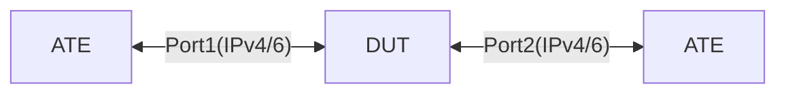

# PF-1.21: Configurable IPv6 flow labels corresponding to IPV6 tunnels

## Summary

IPv6 flow label corresponding to IPV6 tunnels
*   match a flow-label and encap GRE

## Testbed type

* [`featureprofiles/topologies/atedut_2.testbed`](https://github.com/openconfig/featureprofiles/blob/main/topologies/atedut_2.testbed)

## Topology:



## Procedure

### Initial setup

*   Connect DUT port-1, 2 to ATE port-1, 2 respectively

*   Configure IPv6 addresses on DUT and ATE ports as shown below

    *   DUT port-1 IPv6 address ```dp1-v6 = 2001:DB2::1/126```
    *   ATE port-1 IPv6 address ```ap1-v6 = 2001:DB2::2/126```

    *   DUT port-2 IPv6 address ```dp2-v6 = 2001:DB2::5/126```
    *   ATE port-2 IPv6 address ```ap2-v6 = 2001:DB2::6/126```

*   Configure static routes on DUT

    *   Two IPv6 static routes to IPv6 GRE encap destinations towards ATE Port 2
    *   NOTE: It is not necessary for these networks to be configured on ATE. They are only used for GRE encap on DUT
        *   Destination: `ipv6-net-a = 3008:DB8::/126`
        *   Destination: `ipv6-net-b = 3009:DB9::/126

### PF-1.21.1 - IPv6 flow-label match corrosponding to IPv6 tunnel

*   Configure a forwarding policy type 'PBR_POLICY'
    *   Rule with sequence `10` to match:
        *   IPv6 traffic from any src to dst `4008:DBA::2/126`
        *   IPv6 flow-label of `49512`
        *   Encapsulate to IPv6 GRE destination `ipv6-net-a = 3008:DB8::1/126`
    *   Rule with sequence `20` to match:
        *   IPv6 traffic from any src to dst `5008:DBA::2/126`
        *   IPv6 flow-label of `50512`
        *   Encapsulate to IPv6 GRE destination `ipv6-net-a = 3009:DB9::1/126`
*   Start traffic from ATE port-1 towards `4008:DBA::2/126` with flow-label of `49512`
*   Start traffic from ATE port-1 towards `5008:DBA::2/126` with flow-label of `50512`
    *   Validate the GRE trffic is received on ATE

## Canonical OC Configuration

### policy-forwarding

```json
{
  "openconfig-network-instance": {
    "network-instances": [
      {
        "policy-forwarding": {
          "policies": [
            {
              "config": {
                "policy-id": "flow-label-policy",
                "type": "PBR_POLICY"
              },
              "policy": "flow-label-policy",
              "rules": [
                {
                  "config": {
                    "sequence-id": 10,
                  },
                  "ipv6": {
                    "config": {
                      "source-address": "any"
                      "destination-address": "any"
                      "source-flow-label": 49512
                    }
                  },
                  "action": {
                    "encapsulate-gre": true
                   }
                }
                {
                  "config": {
                    "sequence-id": 20,
                  },
                  "ipv6": {
                    "config": {
                      "source-address": "any"
                      "destination-address": "any"
                      "source-flow-label": 50512
                    }
                  },
                  "action": {
                    "encapsulate-gre": true
                   }
                }
              ]
            }
          ]  
        }
      }
    ]
  }
}
```

## OpenConfig Path and RPC Coverage

```yaml
paths:
  # forwarding-policy paths
  /network-instances/network-instance/policy-forwarding/policies/policy/config/policy-id:
  /network-instances/network-instance/policy-forwarding/policies/policy/config/type:
  /network-instances/network-instance/policy-forwarding/policies/policy/rules/rule/config/sequence-id:
  /network-instances/network-instance/policy-forwarding/policies/policy/rules/rule/ipv6/config/source-address:
  /network-instances/network-instance/policy-forwarding/policies/policy/rules/rule/ipv6/config/destination-address:
  /network-instances/network-instance/policy-forwarding/policies/policy/rules/rule/ipv6/config/source-flow-label:
  /network-instances/network-instance/policy-forwarding/policies/policy/rules/rule/action/config/next-hop:
  # encap
  /network-instances/network-instance/policy-forwarding/policies/policy/rules/rule/action/encapsulate-gre/targets/target/config/id:
  /network-instances/network-instance/policy-forwarding/policies/policy/rules/rule/action/encapsulate-gre/targets/target/config/source:
  # destination or identifying-prefix can be used based on vendor implementation.
  /network-instances/network-instance/policy-forwarding/policies/policy/rules/rule/action/encapsulate-gre/targets/target/config/destination:
  /network-instances/network-instance/policy-forwarding/policies/policy/rules/rule/action/encapsulate-gre/config/identifying-prefix:
  # apply policy to the interface
  /network-instances/network-instance/policy-forwarding/interfaces/interface/config/apply-forwarding-policy:

rpcs:
  gnmi:
    gNMI.Set:
      replace: true

```

## Minimum DUT platform requirement

FFF

