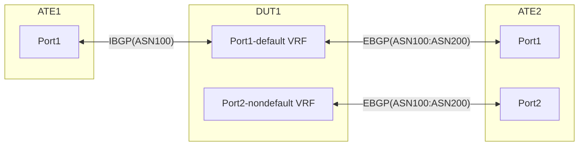

# PF-1.6: Policy based VRF selection for IPV4/IPV6

## Summary
This test ensures NOS is able to host multiple VRFs, and verify that VRF selection policy is working as intended.


## Test environment setup

### Topology
Create the following connections:

* Traffic Flow direction is from ATE1 --> ATE2

### Configuration generation of DUT and ATE

#### DUT Configuration
* Configure IBGP[ASN100] as described in topology between ATE1:Port1 and DUT1:Port1
* Configure EBGP[ASN200] between DUT1:Port1 and ATE2:Port1
* Configure EBGP[ASN200] between DUT1:Port2 and ATE2:Port2
* Port1 of DUT1 which maps to Default VRF instance, is connected to Port1 of ATE2
* Port2 of DUT1 which maps to the non-default VRF instance, is connected to Port2 of ATE2
* Configure route leaking from the default VRF and non-default VRF and vice versa.
* Configure a policy based traffic steering from default to Non Default VRF, this policy should be able to steer the traffic from Default VRF to non default VRF and vice versa based on the destination IPv4/IPv6 address.
* DUT has the following VRF selection policy initially
    * Statement1: traffic matching IPv4Prefix1/24, forwards the traffic through default vrf
    * Statement2: traffic matching IPv4Prefix2/24, forwards the traffic through default vrf
    * Statement3: traffic matching IPv6Prefix3/64, forwards the traffic through default vrf
    * Statement4: traffic matching IPv6Prefix4/64, forwards the traffic through default vrf
    * DUT must also leak all the routes from the Default VRF to the non-default VRF

#### ATE Configuration
* Configure IBGP[ASN100] on ATE1:Port1
* Configure EBGP[ASN200] on ATE2:Port1 & ATE2:Port2

### Configure ATE Route Advertisements & Traffic Flows as below:
#### ATE Route Advertisements:

  	ATE2:Port1 advertises following prefixes to DUT1:Port1 over EBGP
    - IPv4Prefix1/24
    - IPv4Prefix2/24
    - IPv6Prefix3/64
    - IPv6Prefix4/64

  	ATE2:Port2 advertieses following prefixes to DUT1:Port2 over EBGP
    - IPv4Prefix1/24
    - IPv4Prefix2/24
    - IPv6Prefix3/64
    - IPv6Prefix4/64

#### ATE traffic Flows:

	From ATE1:Port1 to ATE2 destination prefixes
    - IPv4Prefix1/24 at a rate of 100 packets/sec
    - IPv4Prefix2/24 at a rate of 100 packets/sec
    - IPv6Prefix3/64 at a rate of 100 packets/sec 
    - IPv6Prefix4/64 at a rate of 100 packets/sec


## Procedure
### PF-1.6.1: [Baseline] Default VRF for all flows with regular traffic profile

#### In this case DUT1:Port1 sends the regular traffic flows to ATE2:Port1.
  * ATE2:Port1 receives following IPv4 and IPv6 flows:
    * IPv4Prefix1/24
    * IPv4Prefix2/24
    * IPv6Prefix3/64
    * IPv6Prefix4/64

### PF-1.6.2: Traffic from ATE1 to ATE2, 1 Prefix migrated to Non-Default VRF using the VRF selection policy
  * ATE1:Port1 sends following IPv4 and IPv6 flows:
    * IPv4Prefix1/24
    * IPv4Prefix2/24
    * IPv6Prefix3/64
    * IPv6Prefix4/64
   
  * VRF selection policy on DUT1:Port1 changes as follows: 
    * Statement1: traffic matching IPv4Prefix1/24, Punt to non-default vrf by the policy
    * Statement2: traffic matching IPv4Prefix2/24, is forwarded through the default vrf
    * Statement3: traffic matching IPv6Prefix3/64, is forwarded through the default vrf
    * Statement4: traffic matching IPv6Prefix4/64, is forwarded through the default vrf


### PF-1.6.3: Traffic from ATE1 to ATE2, 2 Prefixes migrated to Non-Default VRF using the VRF selection policy
  * ATE1:Port1 sends following IPv4 and IPv6 flows:
    * IPv4Prefix1/24
    * IPv4Prefix2/24
    * IPv6Prefix3/64
    * IPv6Prefix4/64
   
  * VRF selection policy on DUT1:Port1 changes as follows: 
    * Statement1: traffic matching IPv4Prefix1/24, Punt to non-default vrf by the policy
    * Statement2: traffic matching IPv4Prefix2/24, Punt to non-default vrf by the policy
    * Statement3: traffic matching IPv6Prefix3/64, is forwarded through the default vrf
    * Statement4: traffic matching IPv6Prefix4/64, is forwarded through the default vrf

### PF-1.6.4: Traffic from ATE1 to ATE2, 3 Prefixes migrated to Non-Default VRF using the VRF selection policy
  * ATE1:Port1 sends following IPv4 and IPv6 flows:
    * IPv4Prefix1/24
    * IPv4Prefix2/24
    * IPv6Prefix3/64
    * IPv6Prefix4/64
   
  * VRF selection policy on DUT1:Port1 changes as follows: 
    * Statement1: traffic matching IPv4Prefix1/24, Punt to non-default vrf by the policy
    * Statement2: traffic matching IPv4Prefix2/24, Punt to non-default vrf by the policy
    * Statement3: traffic matching IPv6Prefix3/64, Punt to non-default vrf by the policy
    * Statement4: traffic matching IPv6Prefix4/64, is forwarded through the default vrf

### PF-1.6.5: Traffic from ATE1 to ATE2, 4 Prefixes migrated to Non-Default VRF using the VRF selection policy
  * ATE1:Port1 sends following IPv4 and IPv6 flows:
    * IPv4Prefix1/24
    * IPv4Prefix2/24
    * IPv6Prefix3/64
    * IPv6Prefix4/64
   
  * VRF selection policy on DUT1:Port1 changes as follows: 
    * Statement1: traffic matching IPv4Prefix1/24, Punt to non-default vrf by the policy
    * Statement2: traffic matching IPv4Prefix2/24, Punt to non-default vrf by the policy
    * Statement3: traffic matching IPv6Prefix3/64, Punt to non-default vrf by the policy
    * Statement4: traffic matching IPv6Prefix4/64, Punt to non-default vrf by the policy

## Canonical OpenConfig

```json
{
  "network-instances": {
    "network-instance": [
      {
        "name": "",
        "config": {
          "name": "",
          "type": "",
          "description": "",
          "router-id": "",
          "route-distinguisher": ""
        },
        "policy-forwarding": {
          "interfaces": {
            "interface": [
              {
                "config": {
                  "interface-id": "",
                  "apply-vrf-selection-policy": ""
                },
                "state": {
                  "apply-vrf-selection-policy": ""
                }
              }
            ]
          },
          "policies": {
            "policy": [
              {
                "rules": {
                  "rule": [
                    {
                      "state": {
                        "matched-pkts": 0,
                        "matched-octets": 0
                      },
                      "ipv4": {
                        "state": {
                          "dscp-set": []
                        }
                      },
                      "ipv6": {
                        "state": {
                          "dscp-set": []
                        }
                      }
                    }
                  ]
                }
              }
            ]
          }
        },
        "state": {}
      }
    ]
  }
}
```

## OpenConfig Path and RPC Coverage

```yaml
paths:
  /network-instances/network-instance/name:
  /network-instances/network-instance/config:
  /network-instances/network-instance/config/name:
  /network-instances/network-instance/config/type:
  /network-instances/network-instance/config/description:
  /network-instances/network-instance/config/router-id:
  /network-instances/network-instance/config/route-distinguisher:
  /network-instances/network-instance/policy-forwarding/interfaces/interface/configa:
  /network-instances/network-instance/policy-forwarding/interfaces/interface/config/interface-id:
  /network-instances/network-instance/policy-forwarding/interfaces/interface/config/apply-vrf-selection-policy:
  /network-instances/network-instance/state:
  /network-instances/network-instance/policy-forwarding/interfaces/interface/state/apply-vrf-selection-policy:
  /network-instances/network-instance/policy-forwarding/policies/policy/rules/rule/state/matched-pkts:
  /network-instances/network-instance/policy-forwarding/policies/policy/rules/rule/state/matched-octets:
  /network-instances/network-instance/policy-forwarding/policies/policy/rules/rule/ipv4/state/dscp-set:
  /network-instances/network-instance/policy-forwarding/policies/policy/rules/rule/ipv6/state/dscp-set:
rpcs:
  gnmi:
    gNMI.Set:
      union_replace: true
    gNMI.Subscribe:
      on_change: true
```
