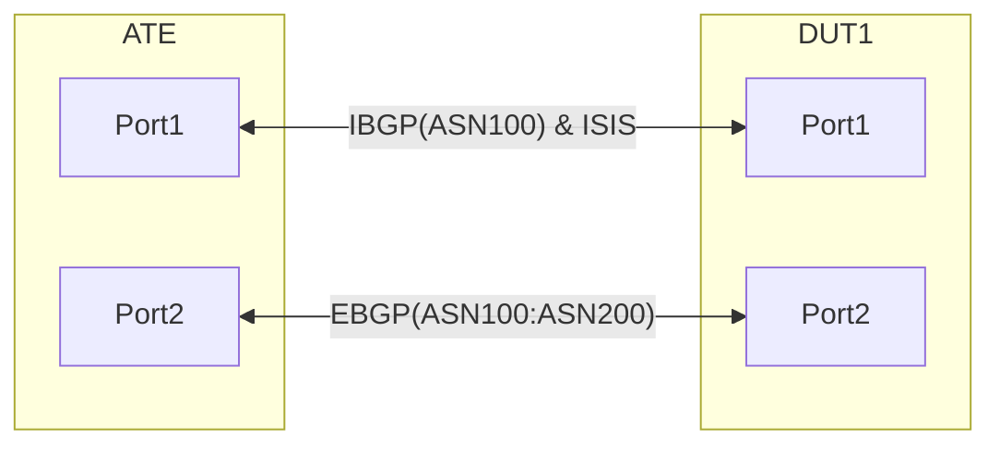

# PF-1.6: Policy forwarding of GUE tunnel traffic to default and non-default network-instance

## Summary
This test ensures NOS is able to host multiple VRFs, perform GUE tunnel traffic in the default VRF and also allows for gradual traffic migration from Default to Non-Default VRF using VRF selection policy.


## Test environment setup

### Topology
Create the following connections:


### Configuration generation of DUT and ATE

#### DUT Configuration
* Configure ISIS[Level2] and IBGP[ASN100] as described in topology between ATE:Port1 and DUT:Port1
* Configure EBGP[ASN200] between ATE:Port2 and DUT: Port2
* Configure route leaking from the default VRF and non-default VRF and vice versa.
* Configure a policy based traffic steering from default to Non Default VRF, this policy should be able to steer the traffic from Default VRF to non default VRF and vice versa based on the destination IP/IPV6 address.
* DUT has the following VRF selection policy initially
    * Statement1: traffic matching IPv4Prefix1/24 & IPv6Prefix1/64, Punt to default vrf
    * Statement2: traffic matching IPv4Prefix2/24 & IPv6Prefix2/64, Punt to default vrf
    * Statement3: traffic matching IPv4Prefix3/24 & IPv6Prefix3/64, Punt to default vrf
    * Statement4: traffic matching IPv4Prefix4/24 & IPv6Prefix4/64, Punt to default vrf
    * Statement5: traffic matching IPv4Prefix5/24 & IPv6Prefix5/64, Punt to default vrf
    * Statement6: traffic matching IPv4Prefix6/24 & IPv6Prefix6/64, Punt to default vrf
    * DUT must also leak all the routes from the Default VRF to the non-default VRF
    * DUT's IP sub-interfaces belong to Default VRF

#### ATE Configuration
* Configure ISIS[Level2]  & IBGP[ASN100] on ATE:Port1
* Configure EBGP[ASN200] on ATE:Port2
* Configure ATE Route Advertisements & Traffic Flows as below:

#### ATE Route Advertisements:

	ATE:Port1 advertises following prefixes over IBGP to DUT:Port1
		- IPv4Prefix1/24 IPv6Prefix1/64
		- IPv4Prefix2/24 IPv6Prefix2/64
		- IPv4Prefix3/24 IPv6Prefix3/64
		- IPv4Prefix4/24 IPv6Prefix4/64
		- IPv4Prefix5/24 IPv6Prefix5/64

	ATE:Port2 advertieses following prefixes to DUT:Port2 over EBGP
		- IPv4Prefix6/24 IPv6Prefix6/64
		- IPv4Prefix7/24 IPv6Prefix7/64
		- IPv4Prefix8/24 IPv6Prefix8/64
		- IPv4Prefix9/24 IPv6Prefix9/64
		- IPv4Prefix10/24 IPv6Prefix10/64

#### ATE traffic Flows:

	From ATE:Port1 to ATE:Port2
		- IPv4Prefix1/24 to IPv4Prefix6/24 at a rate of 100 packets/sec
		- IPv6Prefix1/64 to IPv6Prefix6/64 at a rate of 100 packets/sec

		- IPv4Prefix2/24 to IPv4Prefix7/24 at a rate of 100 packets/sec
		- IPv6Prefix2/64 to IPv6Prefix7/64 at a rate of 100 packets/sec

		- IPv4Prefix3/24 to IPv4Prefix8/24 at a rate of 100 packets/sec
		- IPv6Prefix3/64 to IPv6Prefix8/64 at a rate of 100 packets/sec

		- IPv4Prefix4/24 to IPv4Prefix9/24 at a rate of 100 packets/sec
		- IPv6Prefix4/64 to IPv6Prefix9/64 at a rate of 100 packets/sec

		- IPv4Prefix5/24 to IPv4Prefix10/24 at a rate of 100 packets/sec
		- IPv6Prefix5/64 to IPv6Prefix10/64 at a rate of 100 packets/sec

	Flows from ATE:Port2 to ATE:Port1
		- IPv4Prefix6/24 to IPv4Prefix1/24 at a rate of 100 packets/sec
		- IPv6Prefix6/64 to IPv6Prefix1/64 at a rate of 100 packets/sec

		- IPv4Prefix7/24 to IPv4Prefix2/24 at a rate of 100 packets/sec
		- IPv6Prefix7/64 to IPv6Prefix2/64 at a rate of 100 packets/sec

		- IPv4Prefix8/24 to IPv4Prefix3/24 at a rate of 100 packets/sec
		- IPv6Prefix8/64 to IPv6Prefix3/64 at a rate of 100 packets/sec

		- IPv4Prefix9/24 to IPv4Prefix4/24 at a rate of 100 packets/sec
		- IPv6Prefix9/64 to IPv6Prefix4/64 at a rate of 100 packets/sec

		- IPv4Prefix10/24 to IPv4Prefix5/24 at a rate of 100 packets/sec
		- IPv6Prefix10/64 to IPv6Prefix5/64 at a rate of 100 packets/sec


## Procedure
### PF-1.6.1: [Baseline] Default VRF for all flows with regular traffic profile

In this case ATE:Port2 simulates the regular flows as stated above.
  * ATE:Port2 sends following IPv4 and IPv6 flows:
    * IPv4Prefix6/24 to IPv4Prefix1/24 
    * IPv4Prefix7/24 to IPv4Prefix2/24
    * IPv4Prefix8/24 to IPv4Prefix3/24 
    * IPv4Prefix9/24 to IPv4Prefix4/24 
    * IPv4Prefix10/24 to IPv4Prefix5/24
    * IPv6Prefix6/64 to IPv6Prefix1/64 
    * IPv6Prefix7/64 to IPv6Prefix2/64
    * IPv6Prefix8/64 to IPv6Prefix3/64 
    * IPv6Prefix9/64 to IPv6Prefix4/64 
    * IPv6Prefix10/64 to IPv6Prefix5/64    

    * Expectations:
        * All traffic must be successful and there should be 0 packet loss. <br><br><br>
	* Need to verify the packets sent by sender tester is equal to the packets on receiving tester port and also should be equal to the sum of packets seen in default.

### PF-1.6.2: Traffic from ATE:Port2 to ATE:Port1 Prefix 1 migrated to Non-Default VRF using the VRF selection policy
  * ATE:Port2 sends following IPv4 and IPv6 flows:
    * IPv4Prefix6/24 to IPv4Prefix1/24 
    * IPv4Prefix7/24 to IPv4Prefix2/24
    * IPv4Prefix8/24 to IPv4Prefix3/24 
    * IPv4Prefix9/24 to IPv4Prefix4/24 
    * IPv4Prefix10/24 to IPv4Prefix5/24
    * IPv6Prefix6/64 to IPv6Prefix1/64 
    * IPv6Prefix7/64 to IPv6Prefix2/64
    * IPv6Prefix8/64 to IPv6Prefix3/64 
    * IPv6Prefix9/64 to IPv6Prefix4/64 
    * IPv6Prefix10/64 to IPv6Prefix5/64
   
  VRF selection policy on DUT:Port2 changes as follows: 
    * Statement1: traffic matching IPv4Prefix1/24 & IPv6Prefix1/64, Punt to non-default vrf
    * Statement2: traffic matching IPv4Prefix2/24 & IPv6Prefix2/64, Punt to default vrf
    * Statement3: traffic matching IPv4Prefix3/24 & IPv6Prefix3/64, Punt to default vrf
    * Statement4: traffic matching IPv4Prefix4/24 & IPv6Prefix4/64, Punt to default vrf
    * Statement5: traffic matching IPv4Prefix5/24 & IPv6Prefix5/64, Punt to default vrf
    * Statement6: traffic matching IPv4Prefix6/24 & IPv6Prefix6/64, Punt to default vrf

  * Expectations:
    * To validate the prefixes advertised by ATE:Port1 are received on ATE:Port2 and vice versa. 
    * Traffic for Prefix 1 received from ATE:Port2 once punted to non-defailt VRF by the VRF selection policy, must be received by ATE:Port1
    * Traffic sent by ATE:Port2 must be routed to ATE:Port1 via the DEFAULT VRF in the DUT.
    * Need to verify the packets sent by sender tester is equal to the packets on receiving tester port and also should be equal to the sum of packets seen in default & non default VRF.
    * The DSCP markings to be verified on the sent vs received packets.
    * There should be 0 packet loss. <br><br><br>

**PF-1.6.3 to PF-1.6.7: Traffic from ATE:Port2 to ATE:Port1 migrated to Non-Default VRF using the VRF selection policy.**
Follow the steps in PF-1.6.2 above to gradually move different traffic flows from the Default VRF to the Non-Defailt in the following sequence:

  * PF-1.6.3 Prefix 1-2 Traffic from ATE:Port2 to ATE:Port1 migrated to Non-Default VRF using the VRF selection policy.

  * Modify the DUT generated config to change vrf selecion policy Statement2 to traffic matching IPv4Prefix2/24 & IPv6Prefix2/64, Punt to Non-default vrf Use gnmi.Set REPLACE to push the config to the DUT

    VRF selection policy on DUT:Port2 changes as follows:
    * Statement1: traffic matching IPv4Prefix1/24 & IPv6Prefix1/64, Punt to Non-default vrf
    * Statement2: traffic matching IPv4Prefix2/24 & IPv6Prefix2/64, Punt to Non-default vrf
    * Statement3: traffic matching IPv4Prefix3/24 & IPv6Prefix3/64, Punt to default vrf
    * Statement4: traffic matching IPv4Prefix4/24 & IPv6Prefix4/64, Punt to default vrf
    * Statement5: traffic matching IPv4Prefix5/24 & IPv6Prefix5/64, Punt to default vrf
    * Statement6: traffic matching IPv4Prefix6/24 & IPv6Prefix6/64, Punt to default vrf<br><br>
    
  * PF-1.6.4 Prefix 1-3  Traffic from ATE:Port2 to ATE:Port1 migrated to Non-Default VRF using the VRF selection policy.

  * Modify the DUT generated config to change vrf selecion policy Statement3 to traffic matching IPv4Prefix3/24 & IPv6Prefix3/64, Punt to Non-default vrf Use gnmi.Set REPLACE to push the config to the DUT

    VRF selection policy on DUT:Port2 changes as follows:
    * Statement1: traffic matching IPv4Prefix1/24 & IPv6Prefix1/64, Punt to Non-default vrf
    * Statement2: traffic matching IPv4Prefix2/24 & IPv6Prefix2/64, Punt to Non-default vrf
    * Statement3: traffic matching IPv4Prefix3/24 & IPv6Prefix3/64, Punt to Non-default vrf
    * Statement4: traffic matching IPv4Prefix4/24 & IPv6Prefix4/64, Punt to default vrf
    * Statement5: traffic matching IPv4Prefix5/24 & IPv6Prefix5/64, Punt to default vrf
    * Statement6: traffic matching IPv4Prefix6/24 & IPv6Prefix6/64, Punt to default vrf<br><br>
    
  * PF-1.6.5 Prefix 1-4  Traffic from ATE:Port2 to ATE:Port1 migrated to Non-Default VRF using the VRF selection policy.

  * Modify the DUT generated config to change vrf selecion policy Statement4 to traffic matching IPv4Prefix4/24 & IPv6Prefix4/64, Punt to Non-default vrf Use gnmi.Set REPLACE to push the config to the DUT

    VRF selection policy on DUT:Port2 changes as follows:
    * Statement1: traffic matching IPv4Prefix1/24 & IPv6Prefix1/64, Punt to Non-default vrf
    * Statement2: traffic matching IPv4Prefix2/24 & IPv6Prefix2/64, Punt to Non-default vrf
    * Statement3: traffic matching IPv4Prefix3/24 & IPv6Prefix3/64, Punt to Non-default vrf
    * Statement4: traffic matching IPv4Prefix4/24 & IPv6Prefix4/64, Punt to Non-default vrf
    * Statement5: traffic matching IPv4Prefix5/24 & IPv6Prefix5/64, Punt to default vrf
    * Statement6: traffic matching IPv4Prefix6/24 & IPv6Prefix6/64, Punt to default vrf<br><br>
    
  * PF-1.6.6 Prefix 1-5 Traffic from ATE:Port2 to ATE:Port1 migrated to Non-Default VRF using the VRF selection policy.

  * Modify the DUT generated config to change vrf selecion policy Statement5 to traffic matching IPv4Prefix5/24 & IPv6Prefix5/64, Punt to Non-default vrf Use gnmi.Set REPLACE to push the config to the DUT
  
    VRF selection policy on DUT:Port2 changes as follows:
    * Statement1: traffic matching IPv4Prefix1/24 & IPv6Prefix1/64, Punt to Non-default vrf
    * Statement2: traffic matching IPv4Prefix2/24 & IPv6Prefix2/64, Punt to Non-default vrf
    * Statement3: traffic matching IPv4Prefix3/24 & IPv6Prefix3/64, Punt to Non-default vrf
    * Statement4: traffic matching IPv4Prefix4/24 & IPv6Prefix4/64, Punt to Non-default vrf
    * Statement5: traffic matching IPv4Prefix5/24 & IPv6Prefix5/64, Punt to Non-default vrf
    * Statement6: traffic matching IPv4Prefix6/24 & IPv6Prefix6/64, Punt to default vrf<br><br>
    
  * PF-1.6.7 Prefix 1-6 Traffic from ATE:Port2 to ATE:Port1 migrated to Non-Default VRF using the VRF selection policy.
 
  * Modify the DUT generated config to change vrf selecion policy Statement6 to traffic matching IPv4Prefix6/24 & IPv6Prefix6/64, Punt to Non-default vrf Use gnmi.Set REPLACE to push the config to the DUT
    
    VRF selection policy on DUT:Port2 changes as follows:
    * Statement1: traffic matching IPv4Prefix1/24 & IPv6Prefix1/64, Punt to Non-default vrf
    * Statement2: traffic matching IPv4Prefix2/24 & IPv6Prefix2/64, Punt to Non-default vrf
    * Statement3: traffic matching IPv4Prefix3/24 & IPv6Prefix3/64, Punt to Non-default vrf
    * Statement4: traffic matching IPv4Prefix4/24 & IPv6Prefix4/64, Punt to Non-default vrf
    * Statement5: traffic matching IPv4Prefix5/24 & IPv6Prefix5/64, Punt to Non-default vrf
    * Statement6: traffic matching IPv4Prefix6/24 & IPv6Prefix6/64, Punt to Non-default vrf<br><br>
  * Expectations are the same for traffic routed via the Default and the Non-Default VRFs on the DUT.
  * The sent and receive packets should match.
  * The DSCP markings to be verified on the sent vs received packets.
  * Need to verify the packets sent by sender tester is equal to the packets on receiving tester port and also should be equal to the sum of packets seen in default & non default VRF.


## OpenConfig Path and RPC Coverage

```yaml
rpcs:
  gnmi:
    gNMI.Set:
    /network-instances/network-instance/name
    /network-instances/network-instance/config
    /network-instances/network-instance/config/name
    /network-instances/network-instance/config/type
    /network-instances/network-instance/config/description
    /network-instances/network-instance/config/router-id
    /network-instances/network-instance/config/route-distinguisher
    /network-instances/network-instance/policy-forwarding/interfaces/interface/config
    /network-instances/network-instance/policy-forwarding/interfaces/interface/config/interface-id
    /network-instances/network-instance/policy-forwarding/interfaces/interface/config/apply-vrf-selection-policy

    
    gNMI.Get:

    /network-instances/network-instance/state
    /network-instances/network-instance/policy-forwarding/interfaces/interface/state/apply-vrf-selection-policy
    /network-instances/network-instance/policy-forwarding/policies/policy/rules/rule/state/matched-pkts
    /network-instances/network-instance/policy-forwarding/policies/policy/rules/rule/state/matched-octets
    /network-instances/network-instance/policy-forwarding/policies/policy/rules/rule/ipv4/state/dscp-set
    /network-instances/network-instance/policy-forwarding/policies/policy/rules/rule/ipv6/state/dscp-set
    gNMI.Subscribe:
```
