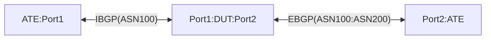

# PF-2.3: Multiple VRFs and GUE DECAP in Default VRF

## Summary
This test ensures NOS is able to host multiple VRFs and at the same time perform GUE tunnel DECAP in the default VRF

## Procedure
Test environment setup

### Topology
Create the following connections:


## Implementation Details

### Baseline DUT configuration
  - DUT has 2 VRFs, Default and Non-Default.
  - DUT:Port1 and DUT:Port2 are in the Default VRF.
  - BGP sessions between ATE:Port1 <> DUT:Port1 and ATE:PORT2 <> DUT:PORT2 are in Default VRF.
  - Ensure leaking routes from the default to the non-default VRFs so prefixes learnt over IBGP and EBGP are available in the tables of both VRFs.There are no other routes learned into non-Default VRF.
  - Ensure IPv4Prefix12/28 is configured on the Loopback0 interface of DUT which is also in the Default VRF
  - Loopback0:IPv4Prefix12/28 is used as target address for GUE decapsulation on DUT
  - Ensure the DUT has accurate QOS classifier configured on DUT:PORT1 and and DUT:PORT2 ports, with DSCP and traffic-class mapping called out in section "Traffic-Class to DSCP mapping".

### Traffic-Class to DSCP mapping

| **Traffic-Class**  | **DSCP** | 
| :------- 	| :---------- 	| 
| **be1** 	| 000000	|
| **af1** 	| 001000	| 
| **af2** 	| 010000	|
| **af3**	| 011000	|
| **af4** 	| 100000	| 

### Baseline ATE configuration
  - DUT has 2 VRFs, Default and Non-Default(say B2_VRF).
  - Establish BGP sessions as shown in the DUT configuration section
  - ATE1 advertises routes shown in "ATE Route Advertisements" section
  - ATE2 advertises routes shown in "ATE Route Advertisements" section
  - Configure ATE with Flow-types mentioned in "Packet types and Flow-types" 

### ATE Route Advertisements:

| **Source ATE Nodes** | **Advertisement Type** | **Prefixes**  | **Via BGP Sessions**                   |  **Notes**        | 
| -------------- | ---------------------- | ------------------  | ---------------------------------------|  -----------------|
| ATE1           | IBGP                   | IPv4prefix1-5/24   | IPv4 DUT <--> ATE1                     |  |
| ATE1           | IBGP                   | IPv6prefix1-5/64   | IPv6 DUT <--> ATE1                     |  |
| ATE2           | EBGP                   | IPv4prefix6-10/24   | IPv4 DUT <--> ATE2                     |  |
| ATE2           | EBGP                   | IPv6prefix6-10/64   | IPv6 DUT <--> ATE2                     |  |
| DUT           | EBGP                   | IPv4Prefix12/28   | IPv4 DUT <--> ATE2                     	| DUT-DECAP-Address  |


#### Packet types and Flow-types

| Flow-type | Packet#  | Layer       | Protocol          | Source Address      | Destination Address | Source Port         | Destination Port          |  DSCP    		| Notes                                      |
| :-------   | :------- | :---------- | :---------------- | :------------------ | :------------------ | :------------------ | :------------------------ | :------------------|:------------------------------------------ |
| **1to6v4_encapped**| **1** | **Overall** | **Payload o IPv4\|UDP o IPv4\|UDP(GUE v1)** |                     |                     |                     |                  	|                                |
|          	   |	| Inner       | IPv4\|UDP         | IPv4Prefix1/24       | IPv4Prefix6/24        | 14    		| 15                  | 	BE1	| Src Port: Any unassigned UDP port; Dst Port: Any App/unassigned UDP port |
|          	   |	| Outer       | IPv4\|UDP(GUE v1) | ATE1-port IPv4 addr | DUT-DECAP-Address   | 5996 		 | 6080               |		BE1	| Src Port: Any unassigned UDP port; GUE v1 encapsulation    |
| **2to7v4_encapped** | **2** | **Overall** | **Payload o IPv4\|UDP o IPv4\|UDP(GUE v1)** |                     |                     |                     |                  	|                                |
|       |   | Inner       | IPv4\|UDP         | IPv4Prefix2/24       | IPv4Prefix7/24        | 14    		| 15                  | 	AF1	| Src Port: Any unassigned UDP port; Dst Port: Any App/unassigned UDP port |
|       |  | Outer       | IPv4\|UDP(GUE v1) | ATE1-port IPv4 addr | DUT-DECAP-Address   | 5996 		 | 6080               |		AF1	| Src Port: Any unassigned UDP port; GUE v1 encapsulation    |
| **3to8v4_encapped** | **3** | **Overall** | **Payload o IPv4\|UDP o IPv4\|UDP(GUE v1)** |                     |                     |                     |                  	|                                |
|       |   | Inner       | IPv4\|UDP         | IPv4Prefix3/24       | IPv4Prefix8/24      | 14    		| 15                  | 	AF2	| Src Port: Any unassigned UDP port; Dst Port: Any App/unassigned UDP port |
|       |  | Outer       | IPv4\|UDP(GUE v1) | ATE1-port IPv4 addr | DUT-DECAP-Address   | 5996 		 | 6080               |		AF2	| Src Port: Any unassigned UDP port; GUE v1 encapsulation    |
| **4to9v4_encapped** | **4** | **Overall** | **Payload o IPv4\|UDP o IPv4\|UDP(GUE v1)** |                     |                     |                     |                  	|                                |
|       |   | Inner       | IPv4\|UDP         | IPv4Prefix4/24       | IPv4Prefix9/24      | 14    		| 15                  | 	AF3	| Src Port: Any unassigned UDP port; Dst Port: Any App/unassigned UDP port |
|       |   | Outer       | IPv4\|UDP(GUE v1) | ATE1-port IPv4 addr | DUT-DECAP-Address   | 5996 		 | 6080               |		AF3	| Src Port: Any unassigned UDP port; GUE v1 encapsulation    |
| **5to10v4_encapped** |**5** | **Overall** | **Payload o IPv4\|UDP o IPv4\|UDP(GUE v1)** |                     |                     |                     |                  	|                                |
|       |   | Inner       | IPv4\|UDP         | IPv4Prefix5/24       | IPv4Prefix10/24      | 14    		| 15                  | 	AF4	| Src Port: Any unassigned UDP port; Dst Port: Any App/unassigned UDP port |
|       |   | Outer       | IPv4\|UDP(GUE v1) | ATE1-port IPv4 addr | DUT-DECAP-Address   | 5996 		 | 6080               |		AF4	| Src Port: Any unassigned UDP port; GUE v1 encapsulation    |
| **1to6v6_encapped** |**6** | **Overall** | **Payload o IPv6\|UDP o IPv4\|UDP(GUE v1)** |                     |                     |                     |                                                  |
|       |   | Inner       | IPv6\|UDP         | IPv6Prefix1/24        | IPv6Prefix6/24       | 14    		| 15                  |  	BE1	| Src Port: Any unassigned UDP port; Dst Port: Any App/unassigned UDP port |
|       |   | Outer       | IPv4\|UDP(GUE v1) | ATE1-port IPv4 addr | DUT-DECAP-Address   | 5996  		| 6080                |		BE1	| Src Port: Any unassigned UDP port; Dst Port: Any App/unassigned UDP port |
| **2to7v6_encapped** | **7** | **Overall** | **Payload o IPv6\|UDP o IPv4\|UDP(GUE v1)** |                     |                     |                     |                  	|                                |
|       |   | Inner       | IPv6\|UDP         | IPv6Prefix2/24       | IPv6Prefix7/24        | 14    		| 15                  | 	AF1	| Src Port: Any unassigned UDP port; Dst Port: Any App/unassigned UDP port |
|       |   | Outer       | IPv4\|UDP(GUE v1) | ATE1-port IPv4 addr | DUT-DECAP-Address   | 5996 		 | 6080               |		AF1	| Src Port: Any unassigned UDP port; GUE v1 encapsulation    |
| **3to8v6_encapped** | **8** | **Overall** | **Payload o IPv6\|UDP o IPv4\|UDP(GUE v1)** |                     |                     |                     |                  	|                                |
|       |   | Inner       | IPv6\|UDP         | IPv6Prefix3/24       | IPv6Prefix8/24      | 14    		| 15                  | 	AF2	| Src Port: Any unassigned UDP port; Dst Port: Any App/unassigned UDP port |
|       |   | Outer       | IPv4\|UDP(GUE v1) | ATE1-port IPv4 addr | DUT-DECAP-Address   | 5996 		 | 6080               |		AF2	| Src Port: Any unassigned UDP port; GUE v1 encapsulation    |
| **4to9v6_encapped** | **9** | **Overall** | **Payload o IPv6\|UDP o IPv4\|UDP(GUE v1)** |                     |                     |                     |                  	|                                |
|       |   | Inner       | IPv6\|UDP         | IPv6Prefix4/24       | IPv6Prefix9/24      | 14    		| 15                  | 	AF3	| Src Port: Any unassigned UDP port; Dst Port: Any App/unassigned UDP port |
|       |   | Outer       | IPv4\|UDP(GUE v1) | ATE1-port IPv4 addr | DUT-DECAP-Address   | 5996 		 | 6080               |		AF3	| Src Port: Any unassigned UDP port; GUE v1 encapsulation    |
| **5to10v6_encapped** | **10** | **Overall** | **Payload o IPv6\|UDP o IPv4\|UDP(GUE v1)** |                     |                     |                    |                  	|                                |
|       |   | Inner       | IPv6\|UDP         | IPv6Prefix5/24       | IPv6Prefix10/24      | 14    		| 15                  | 	AF4	| Src Port: Any unassigned UDP port; Dst Port: Any App/unassigned UDP port |
|       |   | Outer       | IPv4\|UDP(GUE v1) | ATE1-port IPv4 addr | DUT-DECAP-Address   | 5996 		 | 6080               |		AF4	| Src Port: Any unassigned UDP port; GUE v1 encapsulation    |
| **1to6v4** | **11** | **Overall** | **Payload o IPv4\|UDP** |                     |                     |                    |                   |                               |
|       |   | Payload header | IPv4\|UDP          | IPv4Prefix1/24       | IPv4Prefix6/24     | 14    		  | 15                | 	BE1     | Src Port: Any unassigned UDP port; Dst Port: Any App/unassigned UDP port |
| **2to7v4** | **12** | **Overall** | **Payload o IPv4\|UDP** |                     |                     |                    |                   |                               |
|       |   | Payload header | IPv4\|UDP          | IPv4Prefix2/24       | IPv4Prefix7/24     | 14    		| 15                  | 	AF1     | Src Port: Any unassigned UDP port; Dst Port: Any App/unassigned UDP port |
| **3to8v4** | **13** | **Overall** | **Payload o IPv4\|UDP** |                     |                     |                    |                   |                               |
|       |   | Payload header | IPv4\|UDP          | IPv4Prefix3/24       | IPv4Prefix8/24     | 14    		| 15                  | 	AF2     | Src Port: Any unassigned UDP port; Dst Port: Any App/unassigned UDP port |
| **4to9v4** | **14** | **Overall** | **Payload o IPv4\|UDP** |                     |                     |                    |                   |                               |
|       |   | Payload header | IPv4\|UDP          | IPv4Prefix4/24       | IPv4Prefix9/24     | 14    		| 15                  | 	AF3     | Src Port: Any unassigned UDP port; Dst Port: Any App/unassigned UDP port |
| **5to10v4** | **15** | **Overall** | **Payload o IPv4\|UDP** |                     |                     |                    |                   |                               |
|       |   | Payload header | IPv4\|UDP          | IPv4Prefix5/24       | IPv4Prefix10/24     | 14    		| 15                  | 	AF4     | Src Port: Any unassigned UDP port; Dst Port: Any App/unassigned UDP port |
| **1to6v6** |  **16** | **Overall** | **Payload o IPv6\|UDP** |                     |                     |                    |                   |                               |
|       |   | Payload header | IPv4\|UDP         | IPv6Prefix1/24       | IPv6Prefix6/24     | 14    		| 15                  | 	BE1     | Src Port: Any unassigned UDP port; Dst Port: Any App/unassigned UDP port |
| **2to7v6** | **17** | **Overall** | **Payload o IPv6\|UDP** |                     |                     |                     |                  |                 |       |
|       |   |  Payload header | IPv6\|UDP         | IPv6Prefix2/24      | IPv6Prefix7/24      | 14    		| 15                  |		AF1     | Src Port: Any unassigned UDP port; Dst Port: Any App/unassigned UDP port |
| **3to8v6** | **18** | **Overall** | **Payload o IPv6\|UDP** |                     |                     |                    |                   |                               |
|       |   | Payload header | IPv4\|UDP         | IPv6Prefix3/24       | IPv6Prefix8/24     | 14    		| 15                  | 	AF2     | Src Port: Any unassigned UDP port; Dst Port: Any App/unassigned UDP port |
| **4to9v6** | **19** | **Overall** | **Payload o IPv6\|UDP** |                     |                     |                     |                  |                 |       |
|       |   |  Payload header | IPv6\|UDP         | IPv6Prefix4/24      | IPv6Prefix9/24      | 14    		| 15                  |		AF3     | Src Port: Any unassigned UDP port; Dst Port: Any App/unassigned UDP port |
| **5to10v6** | **20** | **Overall** | **Payload o IPv6\|UDP** |                     |                     |                     |                  |                 |       |
|       |   |  Payload header | IPv6\|UDP         | IPv6Prefix5/24      | IPv6Prefix10/24      | 14    		| 15                  |		AF4     | Src Port: Any unassigned UDP port; Dst Port: Any App/unassigned UDP port |

## Procedure

### PF-2.3.1: [Baseline] Traffic flow between ATE:Port1 and ATE:Port2 via DUT's Default VRF
  * Start above flow-type 1to6v4 - 5to10v4 and 1to6v6 - 5to10v6 between ATE:Port1 and ATE:Port2.
  * Ensure no packet loss is observed <br><br><br>
    
### PF-2.3.2: BE1 traffic from ATE:Port1 to ATE:Port2 simulated to be GUE Encaped and sent to the DUT's Default VRF by ATE:Port2
  * ATE:Port1 sends flow-type 1to6v4_encapped and 1to6v6_encapped
  * DUT will perform the decapsulation in Default VRF 
  * ATE:Port1 continues to send the following IPv4 and IPv6 flows
    * 2to7v4 - 5to10v4
    * 2to7v4 - 5to10v6
  * DUT receives the tunneled traffic for flow-type 1to6v4_encapped and 1to6v6_encapped, decaps it, does a LPM lookup on the destination prefix (IPv4Prefix6 and IPv6Prefix6) and routes it to ATE:Port2 via DUT:Port2
  * All the traffic flows MUST show no packet loss.
  * Streamed data on the number of packets decaped by the Tunnel endpoint "IPv4Prefix12" must match the number of tunnel encaped packets sent by ATE:Port1 for 1to6v4_encapped and 1to6v6_encapped flows .<br><br><br>
  
### PF-2.3.3: BE1 and AF1 traffic from ATE:Port1 to ATE:Port2 simulated to be GUE Encaped and sent to the DUT's Default VRF by ATE:Port2
  * ATE:Port1 sends flow-types 1to6v4_encapped - 2to7v4_encapped, 1to6v6_encapped - 2to7v6_encapped
  * ATE:Port1 continues to send the following IPv4 and IPv6 flows
    * 3to8v4 - 5to10v4
    * 3to8v4 - 5to10v6
  * DUT will perform the decapsulation in Default VRF 
  * DUT receives the tunneled traffic for flow-type 1to6v4_encapped - 2to74_encapped, 1to6v6_encapped - 2to7v6_encapped, decaps it, does a LPM lookup on the destination prefix (IPv4Prefix6, IPv4Prefix7, IPv6Prefix6, IPv6Prefix7) and routes it to ATE:Port2 via DUT:Port2
  * All the traffic flows MUST show no packet loss.
  * Streamed data on the number of packets decaped by the Tunnel endpoint "IPv4Prefix12" must match the number of tunnel encaped packets sent by ATE:Port1 for 1to6v4_encapped - 2to7v4_encapped, 1to6v6_encapped - 2to7v6_encapped flows .<br><br><br>

  
### PF-2.3.4: BE1, AF1 and AF2 traffic from ATE:Port1 to ATE:Port2 simulated to be GUE Encaped and sent to the DUT's Default VRF by ATE:Port2
  * ATE:Port1 sends flow-types 1to6v4_encapped - 3to8v4_encapped, 1to6v6_encapped - 3to8v6_encapped
  * ATE:Port1 continues to send the following IPv4 and IPv6 flows
    * 4to9v4 - 5to10v4
    * 4to9v4 - 5to10v6
  * DUT will perform the decapsulation in Default VRF 
  * DUT receives the tunneled traffic for flow-types 1to6v4_encapped - 3to8v4_encapped, 1to6v6_encapped - 3to8v6_encapped, decaps it, does a LPM lookup on the destination prefix (IPv4Prefix6 - IPv4Prefix8, IPv6Prefix6 - IPv6Prefix8) and routes it to ATE:Port2 via DUT:Port2
  * All the traffic flows MUST show no packet loss.
  * Streamed data on the number of packets decaped by the Tunnel endpoint "IPv4Prefix12" must match the number of tunnel encaped packets sent by ATE:Port1 for 1to6v4_encapped - 3to8v4_encapped, 1to6v6_encapped - 3to8v6_encapped .<br><br><br>

### PF-2.3.5: BE1, AF1, AF2 and AF3 traffic from ATE:Port1 to ATE:Port2 simulated to be GUE Encaped and sent to the DUT's Default VRF by ATE:Port2
  * ATE:Port1 sends flow-types 1to6v4_encapped - 4to9v4_encapped, 1to6v6_encapped - 4to9v6_encapped
  * ATE:Port1 continues to send the following IPv4 and IPv6 flows
    * 5to10v4
    * 5to10v6
  * DUT will perform the decapsulation in Default VRF 
  * DUT receives the tunneled traffic for flow-types 1to6v4_encapped - 4to9v4_encapped, 1to6v6_encapped - 4to9v6_encapped, decaps it, does a LPM lookup on the destination prefix (IPv4Prefix6 - IPv4Prefix9, IPv6Prefix6 - IPv6Prefix9) and routes it to ATE:Port2 via DUT:Port2
  * All the traffic flows MUST show no packet loss.
  * Streamed data on the number of packets decaped by the Tunnel endpoint "IPv4Prefix12" must match the number of tunnel encaped packets sent by ATE:Port1 for 1to6v4_encapped - 4to9v4_encapped, 1to6v6_encapped - 4to9v6_encapped .<br><br><br>

### PF-2.3.6: BE1, AF1, AF2, AF3 and AF4 traffic from ATE:Port1 to ATE:Port2 simulated to be GUE Encaped and sent to the DUT's Default VRF by ATE:Port2
  * ATE:Port1 sends flow-types 1to6v4_encapped - 5to10v4_encapped, 1to6v6_encapped - 5to10v6_encapped
  * DUT will perform the decapsulation in Default VRF 
  * DUT receives the tunneled traffic for flow-types 1to6v4_encapped - 5to10v4_encapped, 1to6v6_encapped - 5to10v6_encapped, decaps it, does a LPM lookup on the destination prefix (IPv4Prefix6 - IPv4Prefix10, IPv6Prefix6 - IPv6Prefix10) and routes it to ATE:Port2 via DUT:Port2
  * All the traffic flows MUST show no packet loss.
  * Streamed data on the number of packets decaped by the Tunnel endpoint "IPv4Prefix12" must match the number of tunnel encaped packets sent by ATE:Port1 for 1to6v4_encapped - 5to10v4_encapped, 1to6v6_encapped - 5to10v6_encapped .<br><br><br>


## Canonical OC
TODO: decap policy to be updated by https://github.com/openconfig/public/pull/1288

```json
{
  "defined-sets": {
    "ipv4-prefix-sets": {
      "ipv4-prefix-set": [
        {
          "config": {
            "name": "dst_prefix",
            "prefix": [
              "192.168.1.1/32"
            ]
          },
          "name": "dst_prefix"
        }
      ]
    }
  },
  "network-instances": {
    "network-instance": [
      {
        "config": {
          "name": "B2_VRF"
        },
        "inter-instance-policies": {
          "apply-policy": {
            "config": {
              "import-policy": [
                "BGP_EXPORT_B2_VRF"
              ]
            }
          }
        },
        "name": "B2_VRF"
      },
      {
        "config": {
          "name": "DEFAULT"
        },
        "inter-instance-policies": {
          "apply-policy": {
            "config": {
              "export-policy": [
                "BGP_EXPORT_B2_VRF"
              ]
            }
          }
        },
        "name": "DEFAULT",
        "policy-forwarding": {
          "policies": {
            "policy": [
              {
                "config": {
                  "policy-id": "decap-policy"
                },
                "policy-id": "decap-policy",
                "rules": {
                  "rule": [
                    {
                      "action": {
                        "config": {
                          "decapsulate-gue": true
                        }
                      },
                      "config": {
                        "sequence-id": 1
                      },
                      "ipv4": {
                        "config": {
                          "destination-address-prefix-set": "dst_prefix",
                          "protocol": "IP_UDP"
                        }
                      },
                      "sequence-id": 1,
                      "transport": {
                        "config": {
                          "destination-port": 6080
                        }
                      }
                    }
                  ]
                }
              }
            ]
          }
        }
      }
    ]
  },
  "routing-policy": {
    "defined-sets": {
      "prefix-sets": {
        "prefix-set": [
          {
            "config": {
              "name": "IPv4Prefixes_IBGP"
            },
            "name": "IPv4Prefixes_IBGP",
            "prefixes": {
              "prefix": [
                {
                  "config": {
                    "ip-prefix": "0.0.0.0/0",
                    "masklength-range": "24..24"
                  },
                  "ip-prefix": "0.0.0.0/0",
                  "masklength-range": "24..24"
                }
              ]
            }
          },
          {
            "config": {
              "name": "IPv6Prefixes_IBGP"
            },
            "name": "IPv6Prefixes_IBGP",
            "prefixes": {
              "prefix": [
                {
                  "config": {
                    "ip-prefix": "0000:0000:0000:0000:0000:0000:0000:0000/0",
                    "masklength-range": "64..64"
                  },
                  "ip-prefix": "0000:0000:0000:0000:0000:0000:0000:0000/0",
                  "masklength-range": "64..64"
                }
              ]
            }
          }
        ]
      }
    },
    "policy-definitions": {
      "policy-definition": [
        {
          "config": {
            "name": "BGP_EXPORT_B2_VRF"
          },
          "name": "BGP_EXPORT_B2_VRF",
          "statements": {
            "statement": [
              {
                "actions": {
                  "config": {
                    "policy-result": "ACCEPT_ROUTE"
                  }
                },
                "conditions": {
                  "match-prefix-set": {
                    "config": {
                      "prefix-set": "IPv4Prefixes_IBGP"
                    }
                  }
                },
                "config": {
                  "name": "IPv4Prefix_IBGP_EXPORT"
                },
                "name": "IPv4Prefix_IBGP_EXPORT"
              },
              {
                "conditions": {
                  "match-prefix-set": {
                    "config": {
                      "prefix-set": "IPv6Prefixes_IBGP"
                    }
                  }
                },
                "config": {
                  "name": "IPv6Prefix_IBGP_EXPORT"
                },
                "name": "IPv6Prefix_IBGP_EXPORT"
              }
            ]
          }
        }
      ]
    }
  }
}
```

## OpenConfig Path and RPC Coverage

```yaml
paths:

/network-instances/network-instance/policy-forwarding/policies/policy/config/policy-id:
/network-instances/network-instance/policy-forwarding/policies/policy/rules/rule/config/ipv4/config/destination-address-prefix-set:
/network-instances/network-instance/policy-forwarding/policies/policy/rules/rule/config/ipv4/config/protocol:
/network-instances/network-instance/policy-forwarding/policies/policy/rules/rule/transport/config/destination-port:
/network-instances/network-instance/policy-forwarding/policies/policy/rules/rule/action/config/decapsulate-gue:
/network-instances/network-instance/inter-instance-policies/apply-policy/config/export-policy:
/network-instances/network-instance/inter-instance-policies/apply-policy/config/import-policy:
/routing-policy/policy-definitions/policy-definition/config/name:
/routing-policy/policy-definitions/policy-definition/statements/statement/config/name:
/routing-policy/policy-definitions/policy-definition/statements/statement/name/actions/policy-result:
/routing-policy/policy-definitions/policy-definition/statements/statement/conditions/bgp-conditions/match-community-set/config/community-set:
/routing-policy/policy-definitions/policy-definition/statements/statement/conditions/bgp-conditions/match-community-set/config/match-set-options:
/routing-policy/policy-definitions/policy-definition/statements/statement/actions/config/policy-result:
/routing-policy/policy-definitions/policy-definition/statements/statement/conditions/match-prefix-set/config/prefix-set:
/routing-policy/defined-sets/prefix-sets/prefix-set/prefixes/prefix/config/masklength-range:
/routing-policy/defined-sets/prefix-sets/prefix-set/prefixes/prefix/config/ip-prefix:
/routing-policy/defined-sets/prefix-sets/prefix-set/config/masklength-range:
/routing-policy/defined-sets/prefix-sets/prefix-set/config/ip-prefix:
/routing-policy/defined-sets/prefix-sets/prefix-set/config/prefix-set-name:

# telemetry
/interfaces/interface/state/counters/out-pkts:
/interfaces/interface/state/counters/out-unicast-pkts:
/components/component/integrated-circuit/pipeline-counters/control-plane-traffic/state/dropped-bytes-aggregate:
/components/component/integrated-circuit/pipeline-counters/control-plane-traffic/state/dropped-aggregate:

rpcs:
  gnmi:
    gNMI.Set:
      union_replace: true
      replace: true
    gNMI.Subscribe:
      on_change: true
```
## Required DUT platform
* Specify the minimum DUT-type:
  * FFF - fixed form factor
