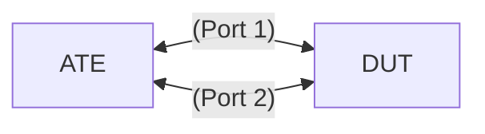

# DP-2.6: Police traffic on input matching all packets using 2 rate, 3 color marker with classifier

## Summary

Use IP address and mac-address from topology shared below. Static Routes can be used for this.
Configure an ingress scheduler to police traffic using a 2 rate, 3 color policer and attach the scheduler to the interface with classifier.
Lack of match conditions will cause all packets to be matched. 
Send traffic to validate the policer.

## Topology

* [`featureprofiles/topologies/atedut_2.testbed`](https://github.com/openconfig/featureprofiles/blob/main/topologies/atedut_2.testbed)

## Test setup



## Procedure

### Testbed setup - Generate configuration for ATE and DUT

#### Source & Destination Port for traffic

* ATE (Port1) --- IP Connectivity --- DUT (Dut1),  DUT (Dut2) --- IP Connectivity --- ATE (Port2)
* Use below to configure traffic with following source and destination.

  * Dut1 = Attributes {
		Desc:    "Dut1",
		MAC:     "02:01:00:00:00:01",
		IPv4:    "200.0.0.1/24",
		IPv6:    "2001:f:d:e::1/126",
	}
  * atePort1 = Attributes{
		Desc:    "atePort1",
		MAC:     "02:01:00:00:00:02",
		IPv4:    "200.0.0.2/24",
		IPv6:    "2001:f:d:e::2/126",
	}
  * Dut2 = Attributes{
		Desc:    "Dut2",
		MAC:     "02:00:01:01:01:01",
		IPv4:    "100.0.0.1/24",
		IPv6:    "2001:c:d:e::1/126",
	}
  * atePort2 = Attributes{
		Desc:    "atePort2",
		MAC:     "02:00:01:01:01:02",
		IPv4:    "100.0.0.2/24",
		IPv6:    "2001:c:d:e::2/126",
	}

* Create static route from atePort1 to atePort2.

### SetUp

* Generate config for scheduler polices with an input rate 2Gbps limit and a classifier.
* Apply them to DUT interface . Dut1 is LAG in provided setup.
* Use gnmi.Replace to push the config to the DUT.

### Canonical OC for DUT configuration

The configuration required for the 2R3C policer with classifier is included below:

```json
{
  "qos": {
    "classifiers": {
      #
      # The specification for the classifier to be applied to an interface.
      # The classifier is applied to IPv4 packets.
      #
      "classifier": [
        {
          "config": {
            "name": "group_A_2Gb",
            "type": "IPV4"
          },
          "name": "group_A_2Gb",
          #
          # The terms that are present in the classifier.
          # If no condition is provided in term , then everything will be considered as matched.
          #
          "terms": {
            "term": [
              {
                # As condition container is absent from term , so no match criteria for 
                # term in the classifier, so it should be interpreted as match all condition.
                "actions": {
                  "config": {
                    #
                    # Packets matching this term (i.e., is class-default
                    # as specified below) are grouped into the 'TRAFFIC_CLASS_3'
                    # forwarding-group.
                    #
                    "target-group": "TRAFFIC_CLASS_3"
                  }
                },
                "config": {
                  "id": "class-default"
                },
                "id": "class-default"
              }
            ]
          }
        }
      ]
    },
    #
    # The definition of the forwarding groups. Each forwarding
    # group has a name, and an output queue.
    #
    "forwarding-groups": {
      "forwarding-group": [
        {
          "config": {
            "name": "TRAFFIC_CLASS_3",
            "output-queue": "QUEUE_3"
          },
          "name": "TRAFFIC_CLASS_3"
        }
      ]
    },
    #
    # A forwarding-group is mapped to an output queue (i.e. is QUEUE_3)
    #
    "queues": {
      "queue": [
        {
          "config": {
            "name": "QUEUE_1"
          },
          "name": "QUEUE_1"
        },
        {
          "config": {
            "name": "QUEUE_2"
          },
          "name": "QUEUE_2"
        },
        {
          "config": {
            "name": "QUEUE_3"
          },
          "name": "QUEUE_3"
        }
      ]
    },
    #
    # A single scheduler policy can be applied per interface.
    #
    "scheduler-policies": {
        "scheduler-policy": [
          {
            "config": {
              "name": "group_A_2Gb"
            },
            "name": "group_A_2Gb",
            "schedulers": {
              "scheduler": [
                {
                  "config": {
                    "sequence": 1,
                    "type": "TWO_RATE_THREE_COLOR_with_CLASSIFIER"
                  },
                  "inputs": [
                    {
                      "input": "my input policer 2Gb",
                      "config": {
                        "id": "my input policer 2Gb",
                        "input-type": "QUEUE",
                        "queue": "QUEUE_3"
                      }
                    }
                  ],
                  "two-rate-three-color": {
                    "config": {
                      "cir": "1000000000",
                      "pir": "2000000000",
                      "bc": 100000,
                      "be": 100000,
                      "queuing-behavior": "POLICE"
                    },
                    "exceed-action": {
                      "config": {
                        "drop": false
                      }
                    },
                    "violate-action": {
                      "config": {
                        "drop": true
                      }
                    }
                  }
                }
              ]
            }
          }
        ]
      },
    #
    # For configuration, the interfaces container specifies the
    # binding between the specified classifiers,schedulers and
    # an interface.
    # Interfaces input are mapped to the desired scheduler and classifier.
    #
    "interfaces": {
      "interface": [
        {
          "interface-id": "Dut1",
          "config": {
            "interface-id": "Dut1"
          },
          #
          # An input classifier is applied to the interface by
          # referencing the classifier name within the /qos/interfaces
          # list.
          #
          "input": {
            "classifers": {
              "classifier": [
                {
                  "config": {
                    "name": "group_A_2Gb",
                    "type": "IPV4"
                  },
                  "type": "IPV4"
                }
              ]
            },
            "scheduler-policy": {
              "config": {
                "name": "group_A_2Gb"
              }
            }
          }
        }
      ]
    }
  }
}
```

### DP-2.6.1 Test traffic

* Send traffic
  * Send flow traffic from atePort1 to DUT towards atePort2 at 1.5Gbps (note cir is 1Gbps & pir is 2Gbps).
  * Validate qos counters on dut1 of DUT .
    * Validate DUT qos interface scheduler counters count packets as conforming-pkts, conforming-octets, exceeding-pkts & exceeding-octets.
  * Validate packets are received by atePort2.
    * Validate at OTG that 0 packets are lost on flow.
  * Increase traffic on flow to atePort2 to 4Gbps
    * Validate that flow to atePort2 experiences ~50% packet loss (+/- 1%)
    * Validate packet loss count as violating-pkts & violating-octets.


#### OpenConfig Path and RPC Coverage

```yaml
paths:
  # qos scheduler-policies config
  /qos/scheduler-policies/scheduler-policy/config/name:
  /qos/scheduler-policies/scheduler-policy/schedulers/scheduler/config/type:
  /qos/scheduler-policies/scheduler-policy/schedulers/scheduler/two-rate-three-color/config/cir:
  /qos/scheduler-policies/scheduler-policy/schedulers/scheduler/two-rate-three-color/config/cir-pct:
  /qos/scheduler-policies/scheduler-policy/schedulers/scheduler/two-rate-three-color/config/pir:
  /qos/scheduler-policies/scheduler-policy/schedulers/scheduler/two-rate-three-color/config/pir-pct:
  /qos/scheduler-policies/scheduler-policy/schedulers/scheduler/two-rate-three-color/config/bc:
  /qos/scheduler-policies/scheduler-policy/schedulers/scheduler/two-rate-three-color/config/be:
  /qos/scheduler-policies/scheduler-policy/schedulers/scheduler/two-rate-three-color/conform-action/config/set-dscp:
  /qos/scheduler-policies/scheduler-policy/schedulers/scheduler/two-rate-three-color/conform-action/config/set-dot1p:
  /qos/scheduler-policies/scheduler-policy/schedulers/scheduler/two-rate-three-color/conform-action/config/set-mpls-tc:
  /qos/scheduler-policies/scheduler-policy/schedulers/scheduler/two-rate-three-color/exceed-action/config/set-dscp:
  /qos/scheduler-policies/scheduler-policy/schedulers/scheduler/two-rate-three-color/exceed-action/config/set-dot1p:
  /qos/scheduler-policies/scheduler-policy/schedulers/scheduler/two-rate-three-color/exceed-action/config/set-mpls-tc:
  /qos/scheduler-policies/scheduler-policy/schedulers/scheduler/two-rate-three-color/exceed-action/config/drop:
  /qos/scheduler-policies/scheduler-policy/schedulers/scheduler/two-rate-three-color/violate-action/config/set-dscp:
  /qos/scheduler-policies/scheduler-policy/schedulers/scheduler/two-rate-three-color/violate-action/config/set-dot1p:
  /qos/scheduler-policies/scheduler-policy/schedulers/scheduler/two-rate-three-color/violate-action/config/set-mpls-tc:
  /qos/scheduler-policies/scheduler-policy/schedulers/scheduler/two-rate-three-color/violate-action/config/drop:

  # qos classifier config path
  /qos/classifiers/classifier/config/name:	
  /qos/classifiers/classifier/config/type:
  /qos/classifiers/classifier/terms/term/config/id:
  /qos/classifiers/classifier/terms/term/actions/config/target-group:

  # qos forwarding-group config path
  /qos/forwarding-groups/forwarding-group/config/name:
  /qos/forwarding-groups/forwarding-group/config/output-queue:

  # qos queue config path
  /qos/queues/queue/config/name:
  /qos/queues/queue/config/queue-id:


  # qos interfaces config
  /qos/interfaces/interface/config/interface-id:
  /qos/interfaces/interface/input/scheduler-policy/config/name:
  /qos/interfaces/interface/input/classifiers/classifier/config/name:
  /qos/interfaces/interface/input/classifiers/classifier/config/type:

  # qos interface scheduler state path
  /qos/interfaces/interface/input/scheduler-policy/schedulers/scheduler/state/conforming-pkts:
  /qos/interfaces/interface/input/scheduler-policy/schedulers/scheduler/state/conforming-octets:
  /qos/interfaces/interface/input/scheduler-policy/schedulers/scheduler/state/exceeding-pkts:
  /qos/interfaces/interface/input/scheduler-policy/schedulers/scheduler/state/exceeding-octets:
  /qos/interfaces/interface/input/scheduler-policy/schedulers/scheduler/state/violating-pkts:
  /qos/interfaces/interface/input/scheduler-policy/schedulers/scheduler/state/violating-octets:

  # qos interface classifier state path
  /qos/interfaces/interface/input/classifiers/classifier/terms/term/state/matched-packets:
  /qos/interfaces/interface/input/classifiers/classifier/terms/term/state/matched-octets:

rpcs:
  gnmi:
    gNMI.Set:
      union_replace: true
      replace: true
    gNMI.Subscribe:
      on_change: true
```

## Required DUT platform

* FFF
