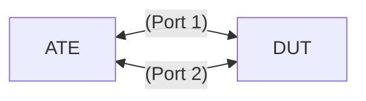

# DP-2.5 Police traffic on input matching all packets using 2 rate, 3 color marker

## Summary

Use the gRIBI applied ip entries from TE-18.1 gRIBI. 
Configure an ingress scheduler to police traffic using a 2 rate, 3 color policer and attach the scheduler to the interface without a classifier.
Lack of match conditions will cause all packets to be matched. 
Send traffic to validate the policer.

## Topology

* [`featureprofiles/topologies/atedut_2.testbed`](https://github.com/openconfig/featureprofiles/blob/main/topologies/atedut_2.testbed)

## Test setup



## Procedure

### DP-2.5.1 Generate and push configuration

* Generate config for 2 scheduler polices with an input rate limit.
* Apply scheduler to DUT subinterface with vlan.
* Use gnmi.Replace to push the config to the DUT.

```json
{
  "openconfig-qos": {
    "scheduler-policies": [
      {
        "scheduler-policy": null,
        "config": {
          "name": "limit_2Gb"
        },
        "schedulers": [
          {
            "scheduler": null,
            "config": {
              "sequence": 1,
              "type": "TWO_RATE_THREE_COLOR"
            },
            "inputs": [
              {
                "input": "my input policer 2Gb",
                "config": {
                  "id": "my input policer 2Gb",
                  "input-type": "QUEUE",
                  "queue": "dummy_input_queue_A"
                }
              }
            ],
            "two-rate-three-color": {
              "config": {
                "cir": 1000000000,
                "pir": 2000000000,
                "bc": 100000,
                "be": 100000,
                "queuing-behavior": "POLICE"
              },
              "exceed-action": {
                "config": {
                  "drop": false
                }
              },
              "violate-action": {
                "config": {
                  "drop": true
                }
              }
            }
          }
        ]
      },
      {
        "scheduler-policy": null,
        "config": {
          "name": "limit_4Gb"
        },
        "schedulers": [
          {
            "scheduler": null,
            "config": {
              "sequence": 1,
              "type": "TWO_RATE_THREE_COLOR"
            },
            "inputs": [
              {
                "input": "my input policer 4Gb",
                "config": {
                  "id": "my input policer 4Gb",
                  "input-type": "QUEUE",
                  "queue": "dummy_input_queue_B"
                }
              }
            ],
            "two-rate-three-color": {
              "config": {
                "cir": 2000000000,
                "pir": 4000000000,
                "bc": 100000,
                "be": 100000,
                "queuing-behavior": "POLICE"
              },
              "exceed-action": {
                "config": {
                  "drop": false
                }
              },
              "violate-action": {
                "config": {
                  "drop": true
                }
              }
            }
          }
        ]
      },
    ],
    #
    # Interfaces input are mapped to the desired scheduler.
    "interfaces": [
      {
        "interface": null,
        "config": {
          "interface-id": "PortChannel1.100"
        },
        "input": {
          "scheduler-policy": {
            "config": {
              "name": "limit_group_A_2Gb"
            }
          }
        }
      },
      {
        "interface": null,
        "config": {
          "interface-id": "PortChannel1.200"
        },
        "input": {
          "scheduler-policy": {
            "config": {
              "name": "limit_group_B_4Gb"
            }
          }
        }
      }
    ]
  }
}
```

### DP-2.5.2 Test traffic

* Send traffic
  * Send flow A traffic from ATE port 1 to DUT for dest_A at 1.5Gbps (note cir is 1Gbps & pir is 2Gbps).
  * Send flow B traffic from ATE port 1 to DUT for dest_B at 3Gbps (note cir is 2Gbps & pir is 4Gbps).
  * Validate qos counters per DUT.
  * Validate qos counters by ATE port.
  * Validate packets are received by ATE port 2.
    * Validate DUT qos interface scheduler counters count packets as conforming-pkts, conforming-octets, exceeding-pkts & exceeding-octets.
    * Validate at OTG that 0 packets are lost on flow A and flow B
  * When the outer packet is IPv6, the flow-label should be inspected on the ATE.
    * If the inner packet is IPv4, the outer IPv6 flow label should be computed based on the IPv4 5 tuple src,dst address and ports, plus protocol.
    * If the inner packet is IPv6, the inner flow label should be copied to the outer packet.
    * To validate the flow label, use the ATE to verify that the packets for 
      * flow A all have the same flow label
      * flow B have the same flow label
      * flow A and B labels do not match
  * Increase traffic on flow A to dest_A to 4Gbps
    * Validate that flow A to dest_A experiences ~50% packet loss (+/- 1%)
    * Validate packet loss count as violating-pkts & violating-octets.


#### OpenConfig Path and RPC Coverage

```yaml
paths:
  # qos scheduler config
  /qos/scheduler-policies/scheduler-policy/config/name:
  /qos/scheduler-policies/scheduler-policy/schedulers/scheduler/config/type:
  /qos/scheduler-policies/scheduler-policy/schedulers/scheduler/two-rate-three-color/config/cir:
  /qos/scheduler-policies/scheduler-policy/schedulers/scheduler/two-rate-three-color/config/cir-pct:
  /qos/scheduler-policies/scheduler-policy/schedulers/scheduler/two-rate-three-color/config/pir:
  /qos/scheduler-policies/scheduler-policy/schedulers/scheduler/two-rate-three-color/config/pir-pct:
  /qos/scheduler-policies/scheduler-policy/schedulers/scheduler/two-rate-three-color/config/bc:
  /qos/scheduler-policies/scheduler-policy/schedulers/scheduler/two-rate-three-color/config/be:
  /qos/scheduler-policies/scheduler-policy/schedulers/scheduler/two-rate-three-color/conform-action/config/set-dscp:
  /qos/scheduler-policies/scheduler-policy/schedulers/scheduler/two-rate-three-color/conform-action/config/set-dot1p:	
  /qos/scheduler-policies/scheduler-policy/schedulers/scheduler/two-rate-three-color/conform-action/config/set-mpls-tc:
  /qos/scheduler-policies/scheduler-policy/schedulers/scheduler/two-rate-three-color/exceed-action/config/set-dscp:
  /qos/scheduler-policies/scheduler-policy/schedulers/scheduler/two-rate-three-color/exceed-action/config/set-dot1p:
  /qos/scheduler-policies/scheduler-policy/schedulers/scheduler/two-rate-three-color/exceed-action/config/set-mpls-tc:
  /qos/scheduler-policies/scheduler-policy/schedulers/scheduler/two-rate-three-color/exceed-action/config/drop:
  /qos/scheduler-policies/scheduler-policy/schedulers/scheduler/two-rate-three-color/violate-action/config/set-dscp:
  /qos/scheduler-policies/scheduler-policy/schedulers/scheduler/two-rate-three-color/violate-action/config/set-dot1p:
  /qos/scheduler-policies/scheduler-policy/schedulers/scheduler/two-rate-three-color/violate-action/config/set-mpls-tc:
  /qos/scheduler-policies/scheduler-policy/schedulers/scheduler/two-rate-three-color/violate-action/config/drop:

  # qos interfaces config
  /qos/interfaces/interface/config/interface-id:
  /qos/interfaces/interface/input/scheduler-policy/config/name:

  # qos interface scheduler counters
  /qos/interfaces/interface/input/scheduler-policy/schedulers/scheduler/state/conforming-pkts:
  /qos/interfaces/interface/input/scheduler-policy/schedulers/scheduler/state/conforming-octets:
  /qos/interfaces/interface/input/scheduler-policy/schedulers/scheduler/state/exceeding-pkts:
  /qos/interfaces/interface/input/scheduler-policy/schedulers/scheduler/state/exceeding-octets:
  /qos/interfaces/interface/input/scheduler-policy/schedulers/scheduler/state/violating-pkts:
  /qos/interfaces/interface/input/scheduler-policy/schedulers/scheduler/state/violating-octets:

rpcs:
  gnmi:
    gNMI.Set:
      union_replace: true
      replace: true
    gNMI.Subscribe:
      on_change: true
```

## Required DUT platform

* FFF