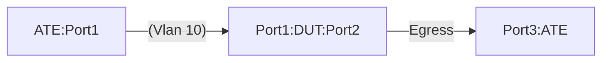

# RELAY-1: DHCP Relay functionality

# Summary

This is to validate the DHCP relay functionality on a DUT.  The test validates the following actions -

* DUT receives the IPv4/IPv6 DHCP discovery message over an individual or a LAG port and it will forward the request to the DHCP helper address.
* DUT forwards DHCP exchange messages between the DHCP Client and DHCP server.
* The DHCP client receives a DHCP address.

# Testbed Type

* [`featureprofiles/topologies/atedut_4.testbed`](https://github.com/openconfig/featureprofiles/blob/main/topologies/atedut_4.testbed)
  
# Procedure

# Test environment setup



```
                                                    ---------
                                                    |       |
    [ ATE:Port1, ATE:Port2 ] ==== LAG  (VLAN 10)=== |  DUT  |----Egress---[ ATE:Port3 ]
                                                    |       |
                                                    |       |
                                                    ---------
```

* Connect ports DUT:Ports[1-3] to ports ATE:Ports[1-3]
* Simulate a scenario of having a DHCP server is behind ATE:Port[3] 
* DUT:Port[3] IPv4 address = 10.10.10.0/31
* DUT:Port[3] IPv6 address = 2001:f:a::0/127
  
# Configuration

* Configure VLAN 10 on DUT.
    * Have DUT:Port[1] and DUT:Port[2] be a part of vlan 10
    * VLAN10 interface IPv4 address: 10.10.11.1/27
    * VLAN10 interface IPv6 address: 2001:f:b::1/64
    * Configure IPv4 and IPv6 helper address under VLAN10 interface.
        * IPv4 helper address - 10.10.0.67
        * IPv6 dhcp relay destination address : 2001:f:c::67 
* Configure IPv4 default route on the DUT pointing to ATE:Port[3] IPv4 address.
* Configure IPv6 default route on the  DUT pointing to ATE:Port[3] IPv6 address.


# Test - 1 DHCP request on an individual port

* Have ATE:Port[1] as an individual port and act as a DHCP client.
* Send IPv4 and IPv6 DHCP request (Discover message) from ATE:Port[1].

**Verify that:**

* The DUT:Port[1] receives the DHCP request and forwards it to the helper IPv4 and IPv6 addresses respectively.
* The ATE:Port[1] can successfully obtain an IPv4 address that is a part of the subnet 10.10.11.0/27 with the default gateway set to 10.10.11.1.
* The ATE:Port[1] can successfully obtain an IPv6 address that is a part of the subnet 2001:f:b::/64 with the default gateway set to 2001:f:b::1.


# Test - 2 DHCP request on a lag port

* DUT:Port[1] and DUT:Port[2] are configured as a LACP LAG (LAG1) port to ATE:Port[1] and ATE:Port[2] respectively.
* Send IPv4 and IPv6 DHCP request (Discover message) from ATE:Port[1].

**Verify that:**

* The DUT:Port[1] receives the DHCP request and forwards it to the helper IPv4 and IPv6 addresses respectively.
* The ATE:Port[1] can successfully obtain an IPv4 address that is a part of the subnet 10.10.11.0/27 with the default gateway set to 10.10.11.1.
* The ATE:Port[1] can successfully obtain an IPv6 address that is a part of the subnet 2001:f:b::/64 with the default gateway set to 2001:f:b::1.
 
#### Canonical OC

```json
{
  "openconfig-relay-agent:relay-agent": {
    "dhcp": {
      "interfaces": {
        "interface": [
          {
            "id": "Vlan10",
            "config": {
              "id": "Vlan10"
            },
            "ipv4": {
              "config": {
                "helper-address": [
                  "10.10.0.67"
                ]
              }
            },
            "ipv6": {
              "config": {
                "helper-address": [
                  "2001:f:c::67"
                ]
              }
            }
          }
        ]
      }
    }
  }
}
```

## OpenConfig Path and RPC Coverage

```yaml
paths:

  ## Config Paths ##

/vlans/vlan/config/name: 
/vlans/vlan/config/status: 
/interfaces/interface[name=Ethernet1]/config/description: 
/interfaces/interface[name=Ethernet1]/ethernet/switched-vlan/config/interface-mode: 
/interfaces/interface[name=Ethernet1]/ethernet/switched-vlan/config/access-vlan:
/interfaces/interface[name=Ethernet3]/config/description:
/interfaces/interface/subinterfaces/subinterface/ipv4/addresses/address/config/ip: 
/interfaces/interface/subinterfaces/subinterface[index=0]/ipv4/addresses/address/config/prefix-length: 
/interfaces/interface/subinterfaces/subinterface/ipv6/addresses/address/config/ip: 
/interfaces/interface/subinterfaces/subinterface/ipv6/addresses/address/config/prefix-length:
/interfaces/interface[name=Vlan10]/config/type:
/interfaces/interface[name=Vlan10]/config/mtu:
/interfaces/interface[name=Vlan10]/subinterfaces/subinterface/ipv4/addresses/address/config/ip:
/interfaces/interface[name=Vlan10]/subinterfaces/subinterface/ipv4/addresses/address/config/prefix-length:
/interfaces/interface[name=Vlan10]/subinterfaces/subinterface/ipv6/addresses/address/config/ip: 
/interfaces/interface[name=Vlan10]/subinterfaces/subinterface/ipv6/addresses/address/config/prefix-length:
/relay-agent/dhcp/interfaces/interface[id=Vlan10]/config/id:
/relay-agent/dhcp/interfaces/interface[id=Vlan10]/ipv4/config/helper-address:
/relay-agent/dhcp/interfaces/interface[id=Vlan10]/ipv6/config/helper-address:
/network-instances/network-instance/protocols/protocol/static-routes/static/config/prefix:
/network-instances/network-instance/protocols/protocol/static-routes/static/next-hops/next-hop/config/next-hop:
/network-instances/network-instance/protocols/protocol/static-routes/static/config/prefix:
/network-instances/network-instance/protocols/protocol/static-routes/static/next-hops/next-hop/config/next-hop:

## State Paths ##

/vlans/vlan/state/name:
/vlans/vlan/state/status:
/interfaces/interface/state/description:
/interfaces/interface/ethernet/switched-vlan/state/interface-mode:
/interfaces/interface/ethernet/switched-vlan/state/access-vlan:
/interfaces/interface/subinterfaces/subinterface[index=0]/ipv4/addresses/address/state/ip:
/interfaces/interface/subinterfaces/subinterface[index=0]/ipv4/addresses/address/state/prefix-length:
/interfaces/interface/subinterfaces/subinterface[index=0]/ipv6/addresses/address/state/ip:
/interfaces/interface/subinterfaces/subinterface[index=0]/ipv6/addresses/address/state/prefix-length:
/interfaces/interface/state/type:
/interfaces/interface/state/mtu:
/interfaces/interface/subinterfaces/subinterface/ipv4/addresses/address/state/ip:
/interfaces/interface/subinterfaces/subinterface/ipv4/addresses/address/state/prefix-length:
/interfaces/interface/subinterfaces/subinterface/ipv6/addresses/address/state/ip:
/interfaces/interface/subinterfaces/subinterface/ipv6/addresses/address/state/prefix-length:
/relay-agent/dhcp/interfaces/interface/ipv4/state/helper-address:
/relay-agent/dhcp/interfaces/interface/ipv6/state/helper-address:
/network-instances/network-instance/protocols/protocol/static-routes/static/state/prefix:
/network-instances/network-instance/protocols/protocol/static-routes/static/next-hops/next-hop/state/next-hop:
/network-instances/network-instance/protocols/protocol/static-routes/static/state/prefix:
/network-instances/network-instance/protocols/protocol/static-routes/static/next-hops/next-hop/state/next-hop:

rpcs:
  gnmi:
    gNMI.Set:
      union_replace: true
      replace: true
    gNMI.Subscribe:
      on_change: true

```

## Required DUT platform

* Specify the minimum DUT-type:
  * FFF - Fixed Form Factor
