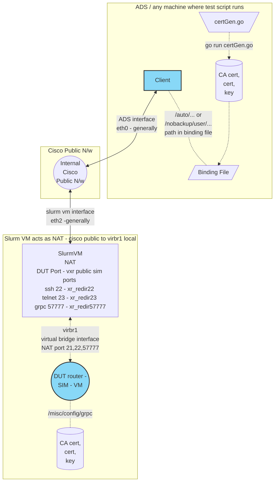

# Setting up TLS Mutual certificate authentication

For TLS Mutual mode we need to generate the certificate and copy it to DUT. The same certificate will be used by client and Router(DUT) for authentication.

### Prerequisites

1. Basic understanding of pyvxr SIM, topo file, binding/testbed files
2. Featureprofile repo code
3. A working go environment setup

### Topology

#### SIM Topology

This is a not a physical hardware, just a simulated router. hence the name SIM

SIM DUT is a virtual router devices which are spun up as virtual machines (VMs) on the VXR backend and virtually wired together.

We use the common `slurm-vm` pool for creating the DUT



#### DUT Router configuration

- GRPC Configuration

Ensure you have `tls-mutual` and `certificate-authentication` configured on the DUT.
This can be included in the base configuration as well

```text
grpc
 port 57777
 tls-mutual
 gnmi
 !
 p4rt
 !
 gribi
 !
 certificate-authentication
!
```

- Enable aaa

Enable `aaa` accounting and map the username to spiffe-id any
explain why?

```text
aaa accounting commands default start-stop local
aaa map-to username <cafyauto> spiffe-id any`
```

Note:
    The username can be any string, but commonly used are `cafyauto` or `cisco`.
    This username that we have confiured here has to be used in `Go` certification generation script below

#### Note
Replace `$REPO_PATH` with your featureprofile repo path

#### Generate certificate and key

Edit the $REPO_PATH/featureprofiles/internal/cisco/security/cert/certGen.go file

1. Modify the line with correct IP (ForSIM use Slurm VM public IP) and SPIFFE ID

```go
 certTemp, err := certUtil.PopulateCertTemplate("cisco", []string{"cisco"}, []net.IP{ net.IPv4(172, 26, 228, 36) }, "cafyauto", 100)
```

**Arguments of PopulateCertTemplate**
1st Argument: cname (`cisco`)??
2nd Argument: domain names (`cisco`)??
3rd Argument: IP address of Slurm VM public IP
4th Argument: SPIFFE ID - use `cafyauto`
5th Argument: certificate Expire time in days

From featureprofile repo root

```shell
cd $REPO_PATH/featureprofiles/internal/cisco/security/cert/
go run certGen.go
```

This go script will take the CA certificate from `$REPO_PATH/featureprofiles/feature/security/gnsi/authz/tests/authz/testdata/ca.cert.pem`
and generate two files (one certificate and one private key)

```bash
$REPO_PATH/featureprofiles/internal/cisco/security/cert/keys/clients/test.cert.pem
$REPO_PATH/featureprofiles/internal/cisco/security/cert/keys/clients/test.key.pem
```

## Update binding file

For TLS Mutual connection we have to update binding file accordingly

In Binding file update the options section of `dut` with `trust_bundle_file` , `cert_file` and `key_file`.
Configure the `mutual_tls` flag is set as `true`
Configure the `skip_verify` flag is set as `false`

```text
dut: {
...
  options: {
      username: "cisco"
      password: "cisco123"
      skip_verify: false
      mutual_tls: true
      trust_bundle_file: "$REPO_PATH/featureprofiles/feature/security/gnsi/authz/tests/authz/testdata/ca.cert.pem"
      cert_file: "$REPO_PATH/featureprofiles/internal/cisco/security/cert/keys/clients/test.cert.pem"
      key_file: "$REPO_PATH/featureprofiles/internal/cisco/security/cert/keys/clients/test.key.pem"
  }
...
}
```

## Upload to router

Remove the `ems.pem`, `ems.key` and `ca.cert` files from the `/misc/config/grpc` directory of router RP. Tip: you can get into guestshell linux prompt by using `run` command and use linux commands to remove those files

In Router guestshell,

```
rm /misc/config/grpc/ems.pem
rm /misc/config/grpc/ems.key
rm /misc/config/grpc/ca.cert
```

**Copy the generated cert/key to the router:**

1. `test.cert.pem` certificate to router as `/misc/config/grpc/ems.pem`
2. `test.key.pem` certificate to router as `/misc/config/grpc/ems.key`

```
scp -P <PORT> $REPO_PATH/featureprofiles/internal/cisco/security/cert/keys/clients/test.cert.pem cisco@<ip>:/misc/config/grpc/ems.pem
scp -P <PORT> $REPO_PATH/featureprofiles/internal/cisco/security/cert/keys/clients/test.key.pem cisco@<ip>:/misc/config/grpc/ems.key
```

**Copy the CA Certificates** 
Copy the CA `ca.cert.pem` certificate to router as `ca.cert`

`scp -P <PORT> $REPO_PATH/featureprofiles/feature/security/gnsi/authz/tests/authz/testdata/ca.cert.pem cisco@<ip>:/misc/config/grpc/ca.cert`

## Upload Policy to router

In router create a file named allow_all.json in /tmp folder (use guestshell to create or copy)

`vim /tmp/allow_all.json`

```json
{
  "name": "allow all",
  "allow_rules": [{
    "name": "admin-access",
    "source": {
      "principals": [
        "cisco","cafyauto"
      ]
    },
    "request": {
      "paths": [
        "*"
      ]
    }
  }]
}
```

Just load the policy

```ios
gnsi load service authorization policy /tmp/allow_all.json
```

Verify the policy: This should show the policy that we loaded.

```text
show gnsi service authorization policy
```

This policy gives full admin acess to the usernames `cisco` and `cafyauto`. If you are dealing with a diffrent username name update it accordingly.


#### Now all set

we can run the `go test` using the updated binding file with `tls-mutual` certificate authorization.
