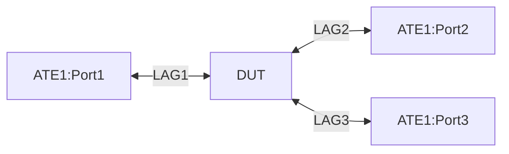

# RT-1.65: Static Route to Other Network-Instance

##Summary
This test verifies the functionality of static routes configured to redirect packets to a subsequent destination lookup in another network-instance(s). 
After a successful Longest Prefix Match (LPM) in the current network-instance, the device should perform another LPM lookup using the destination address, but within the specified target network-instance(s). 
This feature enables inter-network-instance routing via static routes.

## Testbed type
[TESTBED_DUT_ATE_4 LINKS](https://github.com/openconfig/featureprofiles/blob/main/topologies/atedut_4.testbed)

## Topology:



## Procedure

### Test environment setup
 * Connect DUT port-1, port-2, port-3 and port-4 to ATE port-1, port-2, port-3 and port-4 respectively
 * Configure IPv4/IPv6 addresses on DUT and ATE the interfaces

## RT-1.65.1: Default static route (v4, v6) in non-default network-instance pointing to a default network-instance
* Configure DUT and ATE
  - Configure and assosiate ATE1:Port1 <-> LAG1 to `default` network-instance and ATE1:Port2 <-> LAG2 to non-default network-instance `vrf1`
  - Configure ipv4 and ipv6 address at ATE:Port1 and DUT: ipv4-network = '203.0.113.0/24' and ipv6-network = '2001:db8:128:128::/64'
  - Configure ipv4 and ipv6 address at ATE:Port2 and DUT: ipv4-network = '204.0.113.0/24' and ipv6-network = '2002:db8:128:128::/64'
  - Configure ipv4 and ipv6 `default` static route in non-default network-instance (vrf1) with next-network-instance = `default`
* Traffic Test:
  - Start the ipv4 and ipv6 traffic from ATE1:port1 to ATE1:port2
  - Monitor traffic for 60 seconds
* Config cleanup
  - Remove the test config
* Test Validation
  - Configuration should be successfully applied on DUT and ATE
  - No traffic loss should be observed.
  - Config cleanup should be successful

## RT-1.65.2: Default static route (v4, v6) in default network-instance pointing to a non-default network-instance
* Configure DUT and ATE
  - Configure and assosiate ATE1:Port1 <-> LAG1 to `vrf1` network-instance and ATE1:Port2 <-> LAG2 to non-default network-instance `vrf2`
  - Configure ipv4 and ipv6 address at ATE:Port1 and DUT: ipv4-network = '203.0.113.0/24' and ipv6-network = '2001:db8:128:128::/64'
  - Configure ipv4 and ipv6 address at ATE:Port2 and DUT: ipv4-network = '204.0.113.0/24' and ipv6-network = '2002:db8:128:128::/64'
  - Configure ipv4 and ipv6 `default` static route in non-default network-instance (vrf1) with next-network-instance = `vrf2`
* Traffic Test:
  - Start the ipv4 and ipv6 traffic from ATE1:port1 to ATE1:port2
  - Monitor traffic for 60 seconds
* Config cleanup
  - Remove the test config
* Test Validation
  - Configuration should be successfully applied on DUT and ATE
  - No traffic loss should be observed.
  - Config cleanup should be successful

## RT-1.65.3: More specific static route (v4, v6) in non-default network-instance pointing to a non-default network-instance
* Configure DUT and ATE
  - Configure and assosiate ATE1:Port1 <-> LAG1 to `vrf1` network-instance and ATE1:Port2 <-> LAG2 to non-default network-instance `vrf2`
  - Configure ipv4 and ipv6 address at ATE:Port1 and DUT: ipv4-network = '203.0.113.0/24' and ipv6-network = '2001:db8:128:128::/64'
  - Configure ipv4 and ipv6 address at ATE:Port2 and DUT: ipv4-network = '204.0.113.0/24' and ipv6-network = '2002:db8:128:128::/64'
  - Configure ipv4 and ipv6 static route towards '204.0.113.0/24' and '2002:db8:128:128::/64' in non-default network-instance (vrf1) with next-network-instance = `vrf2`
* Traffic Test:
  - Start the ipv4 and ipv6 traffic from ATE1:port1 to ATE1:port2
  - Monitor traffic for 60 seconds
* Config cleanup
  - Remove the test config
* Test Validation
  - Configuration should be successfully applied on DUT and ATE
  - No traffic loss should be observed.
  - Config cleanup should be successful

## RT-1.65.4: More specific static route (v4, v6) in non-default network-instance pointing to a default network-instance
* Configure DUT and ATE
  - Configure and assosiate ATE1:Port1 <-> LAG1 to `default` network-instance and ATE1:Port2 <-> LAG2 to non-default network-instance `vrf1`
  - Configure ipv4 and ipv6 address at ATE:Port1 and DUT: ipv4-network = '203.0.113.0/24' and ipv6-network = '2001:db8:128:128::/64'
  - Configure ipv4 and ipv6 address at ATE:Port2 and DUT: ipv4-network = '204.0.113.0/24' and ipv6-network = '2002:db8:128:128::/64'
  - Configure ipv4 and ipv6 static route towards '203.0.113.0/24' and '2001:db8:128:128::/64' in non-default network-instance (vrf1) with next-network-instance = `default`
* Traffic Test:
  - Start the ipv4 and ipv6 traffic from ATE1:port1 to ATE1:port2
  - Monitor traffic for 60 seconds
* Config cleanup
  - Remove the test config
* Test Validation
  - Configuration should be successfully applied on DUT and ATE
  - No traffic loss should be observed.
  - Config cleanup should be successful

## RT-1.65.5: Default static route (v4, v6) in non-default network-instance pointing to multiple non-default network-instances
* Configure DUT and ATE
  - Configure and assosiate ATE1:Port1 <-> LAG1 to `vrf1` network-instance, ATE1:Port2 <-> LAG2 to non-default network-instance `vrf2` and ATE1:Port3 <-> LAG3 to non-default network-instance `vrf3`
  - Configure ipv4 and ipv6 address at ATE:Port1 and DUT: ipv4-network = '203.0.113.0/24' and ipv6-network = '2001:db8:128:128::/64'
  - Configure ipv4 and ipv6 address at ATE:Port2 and DUT: ipv4-network = '204.0.113.0/24' and ipv6-network = '2002:db8:128:128::/64'
  - Configure ipv4 and ipv6 address at ATE:Port3 and DUT: ipv4-network = '205.0.113.0/24' and ipv6-network = '2003:db8:128:128::/64'
  - Configure ipv4 and ipv6 `default` static route in non-default network-instance (vrf1) with next-network-instance = `vrf2` and next-network-instance = `vrf3` for ECMP
* Traffic Test:
  - Start the ipv4 and ipv6 traffic from ATE1:port1 to ATE1:port2 and ATE1:port3
  - Monitor traffic for 60 seconds
* Config cleanup
  - Remove the test config
* Test Validation
  - Configuration should be successfully applied on DUT and ATE
  - Traffic should be equally received on Port2 and Port3. No traffic loss should be observed.
  - Config cleanup should be successful

### Config paths

### Telemetry Parameter Coverage
```yaml
{
  "network-instances": {
    "network-instance": [
      {
        "name": "vrf1",
        "protocols": {
          "protocol": [
            {
              "identifier": "STATIC",
              "name": "STATIC",
              "static-routes": {
                "static": [
                  {
                    "prefix": "0.0.0.0/0",
                    "config": {
                      "prefix": "0.0.0.0/0"
                    },
                    "next-hops": {
                      "next-hop": [
                        {
                          "index": "0",
                          "config": {
                            "index": "0",
                            "next-network-instance": "default"
                          }
                        }
                      ]
                    }
                  },
                   {
                    "prefix": "0::0/0",
                    "config": {
                      "prefix": "0::0/0"
                    },
                    "next-hops": {
                      "next-hop": [
                        {
                          "index": "0",
                          "config": {
                            "index": "0",
                            "next-network-instance": "default"
                          }
                        }
                      ]
                    }
                  }
                ]
              }
            }
          ]
        }
      }
    ]
  }
}

rpcs:
  gnmi:
    gNMI.Subscribe:
    gNMI.Set:
``` 
## Required DUT platform
*   FFF
