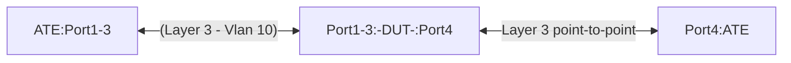

# RT-1.67: IPv4 and IPv6 Static Route using Vlan Interface


## Summary

This  is to validate the Static Routes with next-hop using Vlan interface functionality on a DUT.  The test validates the following actions -

* DUT can forward IPv4/IPV6 flows over the vlan interface.
* DUT receives the IPv4/IPv6 traffic that matches the programmed Static Routes.
* The next-hop of the route is pointing to a vlan interface recursively. 
* DUT forwards the IPv4/IPv6  traffic over the vlan interface.

## Testbed Type

* [`featureprofiles/topologies/atedut_4.testbed`](https://github.com/openconfig/featureprofiles/blob/main/topologies/atedut_4.testbed)

## Procedure


### Test environment setup



* Connect ports DUT:Ports[1-4] to ports ATE:Ports[1-4]
* DUT:Port[4] IPv4 address = 198.51.100.0/31
* DUT:Port[4] IPv6 address = 2001:db8:1::/127
* ATE:Port[4] IPv4 address = 198.51.100.1/31
* ATE:Port[4] IPv6 address = 2001:db8:1::1/127


#### Configuration


* Configure VLAN 10 on DUT.
    * Have DUT:Port[1], DUT:Port[2], and DUT:Port[3] be a part of vlan 10
    * VLAN10 interface IPv4 address: 198.51.100.128/25
    * VLAN10 interface IPv6 address:2001:db8:2::/48
    * Have the following IPv4 and IPv6 address on the ATE ports:
        *  ATE:Port[1]:IPv4 address 198.51.100.161/28 / 2001:db8:2:1::/64
        *  ATE:Port[2]:IPv4 address 198.51.100.193/28 / 2001:db8:2:2::/64
        *  ATE:Port[3]:IPv4 address 198.51.100.225/28 / 2001:db8:2:3::/64
    * Configure IPv4 and IPv6 static routes recursively pointing to the VLAN10 interface
       *  Example:
           * 198.51.100.160/28 ---> 198.51.100.161
              * 198.51.100.160/31 ---> vlan10 
           * 2001:db8:2:1::/64  ---> 2001:db8:2:1::
              * 2001:db8:2:1::/127 ---> vlan10 

### RT-1.67.1 Validate Layer 3 Forwarding over VLAN interface

* Step 1 - Send IPv4 / IPv6 traffic flows between ATE:Port[1] and ATE:Port[4]
* Step 2 - Send IPv4 / IPv6 traffic flows between ATE:Port[2] and ATE:Port[4]
* Step 3 - Send IPv4 / IPv6 traffic flows between ATE:Port[3] and ATE:Port[4]

**Verify that:**

* The DUT:Port[1], DUT:Port[2], and DUT:Port[3] receive the traffic for the flows and forward traffic out over DUT:Port[4]

### RT-1.67.2 Validate IP forwarding over static route 

* Send three different IPv4 traffic flows from ATE:Port[4] to destinations 
    * 198.51.100.160/28 
    * 198.51.100.192/28 
    * 198.51.100.224/28 
* Send three different IPv6 traffic flows from ATE:Port[4] to destinations 
    * 2001:db8:2:1::/64
    * 2001:db8:2:2::/64
    * 2001:db8:2:3::/64

**Verify that:**

* Vaidate the static routes forv198.51.100.160/28, 198.51.100.192/28, 198.51.100.224/28  are pointing to a vlan 10.
* The DUT:Port[4] receives the traffic for the flows and forward traffic out over VLAN interfaces.
    * 198.51.100.160/28 & 2001:db8:2:1::/64 going towards DUT:Port[1] ⇔ ATE:Port[1]
    * 198.51.100.160/28 & 2001:db8:2:2::/64 going towards DUT:Port[2] ⇔ ATE:Port[2]
    * 198.51.100.160/28 & 2001:db8:2:3::/64 going towards DUT:Port[3] ⇔ ATE:Port[3]

#### Canonical OC

```json
{
  "openconfig-network-instance:protocols": {
    "protocol": [
      {
        "identifier": "openconfig-policy-types:STATIC",
        "name": "default",
        "config": {
          "identifier": "openconfig-policy-types:STATIC",
          "name": "default"
        },
        "static-routes": {
          "static": [
            {
              "prefix": "198.51.100.160/28",
              "config": {
                "prefix": "198.51.100.160/28"
              },
              "next-hops": {
                "next-hop": [
                  {
                    "index": "0",
                    "config": {
                      "index": "0",
                      "next-hop": "198.51.100.161"
                    }
                  }
                ]
              }
            },
            {
              "prefix": "198.51.100.160/31",
              "config": {
                "prefix": "198.51.100.160/31"
              },
              "next-hops": {
                "next-hop": [
                  {
                    "index": "0",
                    "config": {
                      "index": "0"
                    },
                    "interface-ref": {
                      "config": {
                        "interface": "Vlan10"
                      }
                    }
                  }
                ]
              }
            },
            {
              "prefix": "2001:db8:2:1::/64",
              "config": {
                "prefix": "2001:db8:2:1::/64"
              },
              "next-hops": {
                "next-hop": [
                  {
                    "index": "0",
                    "config": {
                      "index": "0",
                      "next-hop": "2001:db8:2:1::"
                    }
                  }
                ]
              }
            },
            {
              "prefix": "2001:db8:2:1::/127",
              "config": {
                "prefix": "2001:db8:2:1::/127"
              },
              "next-hops": {
                "next-hop": [
                  {
                    "index": "0",
                    "config": {
                      "index": "0"
                    },
                    "interface-ref": {
                      "config": {
                        "interface": "Vlan10"
                      }
                    }
                  }
                ]
              }
            }
          ]
        }
      }
    ]
  }
}
```

## OpenConfig Path and RPC Coverage

```yaml
paths:

  ## Config Paths ##

/interfaces/interface/config/description: 
/interfaces/interface/ethernet/switched-vlan/config/interface-mode: 
/interfaces/interface/ethernet/switched-vlan/config/access-vlan:
/interfaces/interface/subinterfaces/subinterface/ipv4/addresses/address/config/ip:
/interfaces/interface/subinterfaces/subinterface/ipv4/addresses/address/config/prefix-length:
/interfaces/interface/subinterfaces/subinterface/ipv6/addresses/address/config/ip: 
/interfaces/interface/subinterfaces/subinterface/ipv6/addresses/address/config/prefix-length:
/network-instances/network-instance/protocols/protocol/static-routes/static/config/prefix:
/network-instances/network-instance/protocols/protocol/static-routes/static/next-hops/next-hop/config/next-hop:


## State Paths ##

/interfaces/interface/state/description:
/interfaces/interface/ethernet/switched-vlan/state/interface-mode:
/interfaces/interface/ethernet/switched-vlan/state/access-vlan:
/interfaces/interface/subinterfaces/subinterface/ipv4/addresses/address/state/ip:
/interfaces/interface/subinterfaces/subinterface/ipv4/addresses/address/state/prefix-length:
/interfaces/interface/subinterfaces/subinterface/ipv6/addresses/address/state/ip:
/interfaces/interface/subinterfaces/subinterface/ipv6/addresses/address/state/prefix-length:
/network-instances/network-instance/protocols/protocol/static-routes/static/state/prefix:
/network-instances/network-instance/protocols/protocol/static-routes/static/next-hops/next-hop/state/next-hop:

rpcs:
  gnmi:
    gNMI.Set:
      union_replace: true
      replace: true
    gNMI.Subscribe:
      on_change: true

```

## Required DUT platform

* Specify the minimum DUT-type:
  * FFF - Fixed Form Factor
