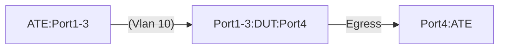

# Static Route using Vlan Interface


# Summary

This  is to validate the Static Routes with next-hop using Vlan interface functionality on a DUT.  The test validates the following actions -

* DUT can forward IPv4/IPV6 flows over the vlan interface.
* DUT receives the IPv4/IPv6 traffic that matches the programmed Static Routes.
* The next-hop of the route is pointing to a vlan interface recursively. 
* DUT forwards the IPv4/IPv6  traffic over the vlan interface.

# Testbed Type

* [`featureprofiles/topologies/atedut_4.testbed`](https://github.com/openconfig/featureprofiles/blob/main/topologies/atedut_4.testbed)

# Procedure


# Test environment setup



* Connect ports DUT:Ports[1-4] to ports ATE:Ports[1-4]
* DUT:Port[4] IPv4 address = 10.10.10.0/31
* DUT:Port[4] IPv6 address = 2001:f:a::0/127


# Configuration


* Configure VLAN 10 on DUT.
    * Have DUT:Port[1], DUT:Port[2], and DUT:Port[3] be a part of vlan 10
    * VLAN10 interface IPv4 address: 10.11.0.1/16
    * VLAN10 interface IPv6 address: 2001:a:b::1/48
    * Have the following IPv4 and IPv6 address on the ATE ports:
        *  ATE:Port[1]:IPv4 address 10.11.1.0/16 / 2001:a:b:1::0/48
        *  ATE:Port[2]:IPv4 address 10.11.2.0/16 / 2001:a:b:2::0/48
        *  ATE:Port[3]:IPv4 address 10.11.3.0/16 / 2001:a:b:3::0/48
    * Configure IPv4 and IPv6 static routes recursively pointing to the VLAN10 interface


# Test - 1 Validate Layer 3 Forwarding over VLAN interface

* Send IPv4 / IPv6 traffic flows from ATE:Port[1] to destination 10.10.10.1 and 2001:f:a::1
* Send IPv4 / IPv6 traffic flows from ATE:Port[2] to destination 10.10.10.1 and 2001:f:a::1
* Send IPv4 / IPv6 traffic flows from ATE:Port[3] to destination 10.10.10.1 and 2001:f:a::1

**Verify that:**

* The DUT:Port[1], DUT:Port[1], and DUT:Port[3] receive the traffic for the flows and forward traffic out over DUT:Port[4]

# Test - 2 Validate IP forwarding over static route 

* Send three different IPv4 traffic flows from ATE:Port[3] to destinations 
    * 10.11.1.0/24
    * 10.11.2.0/24
    * 10.11.3.0/24
* Send three different IPv6 traffic flows from ATE:Port[3] to destinations 
    * 2001:a:b:1::0/64
    * 2001:a:b:2::0/64
    * 2001:a:b:3::0/64

**Verify that:**

* The DUT:Port[4] receives the traffic for the flows and forward traffic out over VLAN interfaces.
    * 10.11.1.0/24 & 2001:a:b:1::0/64 going towards DUT:Port[1] ⇔ ATE:Port[1]
    * 10.11.2.0/24 & 2001:a:b:2::0/64 going towards DUT:Port[2] ⇔ ATE:Port[2]
    * 10.11.3.0/24 & 2001:a:b:3::0/64 going towards DUT:Port[3] ⇔ ATE:Port[3]

#### Canonical OC

```json
{
  "openconfig-network-instance:network-instances": {
    "network-instance": [
      {
        "name": "default",
        "config": {
          "name": "default"
        },
        "protocols": {
          "protocol": [
            {
              "identifier": "STATIC",
              "name": "static",
              "config": {
                "identifier": "STATIC",
                "name": "static"
              },
              "static-routes": {
                "static": [
                  {
                    "prefix": "10.11.1.0/24",
                    "config": { "prefix": "10.11.1.0/24" },
                    "next-hops": {
                      "next-hop": [ { "index": "10.11.1.0", "config": { "index": "10.11.1.0", "next-hop": "10.11.1.0" } } ]
                    }
                  },
                  {
                    "prefix": "10.11.1.0/31",
                    "config": { "prefix": "10.11.1.0/31" },
                    "next-hops": {
                      "next-hop": [ { "index": "Vlan10", "config": { "index": "Vlan10", "next-hop": "Vlan10" } } ]
                    }
                  },
                  {
                    "prefix": "10.11.2.0/24",
                    "config": { "prefix": "10.11.2.0/24" },
                    "next-hops": {
                      "next-hop": [ { "index": "10.11.2.0", "config": { "index": "10.11.2.0", "next-hop": "10.11.2.0" } } ]
                    }
                  },
                  {
                    "prefix": "10.11.2.0/31",
                    "config": { "prefix": "10.11.2.0/31" },
                    "next-hops": {
                      "next-hop": [ { "index": "Vlan10", "config": { "index": "Vlan10", "next-hop": "Vlan10" } } ]
                    }
                  },
                  {
                    "prefix": "10.11.3.0/24",
                    "config": { "prefix": "10.11.3.0/24" },
                    "next-hops": {
                      "next-hop": [ { "index": "10.11.3.0", "config": { "index": "10.11.3.0", "next-hop": "10.11.3.0" } } ]
                    }
                  },
                  {
                    "prefix": "10.11.3.0/31",
                    "config": { "prefix": "10.11.3.0/31" },
                    "next-hops": {
                      "next-hop": [ { "index": "Vlan10", "config": { "index": "Vlan10", "next-hop": "Vlan10" } } ]
                    }
                  },
                  {
                    "prefix": "2001:a:b:1::/64",
                    "config": { "prefix": "2001:a:b:1::/64" },
                    "next-hops": {
                      "next-hop": [ { "index": "2001:a:b:1::", "config": { "index": "2001:a:b:1::", "next-hop": "2001:a:b:1::" } } ]
                    }
                  },
                  {
                    "prefix": "2001:a:b:1::/127",
                    "config": { "prefix": "2001:a:b:1::/127" },
                    "next-hops": {
                      "next-hop": [ { "index": "Vlan10", "config": { "index": "Vlan10", "next-hop": "Vlan10" } } ]
                    }
                  },
                  {
                    "prefix": "2001:a:b:2::/64",
                    "config": { "prefix": "2001:a:b:2::/64" },
                    "next-hops": {
                      "next-hop": [ { "index": "2001:a:b:2::", "config": { "index": "2001:a:b:2::", "next-hop": "2001:a:b:2::" } } ]
                    }
                  },
                  {
                    "prefix": "2001:a:b:2::/127",
                    "config": { "prefix": "2001:a:b:2::/127" },
                    "next-hops": {
                      "next-hop": [ { "index": "Vlan10", "config": { "index": "Vlan10", "next-hop": "Vlan10" } } ]
                    }
                  },
                  {
                    "prefix": "2001:a:b:3::/64",
                    "config": { "prefix": "2001:a:b:3::/64" },
                    "next-hops": {
                      "next-hop": [ { "index": "2001:a:b:3::", "config": { "index": "2001:a:b:3::", "next-hop": "2001:a:b:3::" } } ]
                    }
                  },
                  {
                    "prefix": "2001:a:b:3::/127",
                    "config": { "prefix": "2001:a:b:3::/127" },
                    "next-hops": {
                      "next-hop": [ { "index": "Vlan10", "config": { "index": "Vlan10", "next-hop": "Vlan10" } } ]
                    }
                  }
                ]
              }
            }
          ]
        }
      }
    ]
  }
}
```

## OpenConfig Path and RPC Coverage

```yaml
paths:

  ## Config Paths ##

/interfaces/interface/config/description: 
/interfaces/interface/ethernet/switched-vlan/config/interface-mode: 
/interfaces/interface/ethernet/switched-vlan/config/access-vlan:
/interfaces/interface/subinterfaces/subinterface/ipv4/addresses/address/config/ip:
/interfaces/interface/subinterfaces/subinterface/ipv4/addresses/address/config/prefix-length:
/interfaces/interface/subinterfaces/subinterface/ipv6/addresses/address/config/ip: 
/interfaces/interface/subinterfaces/subinterface/ipv6/addresses/address/config/prefix-length:
/vlans/vlan/config/name:
/vlans/vlan/config/status:
/interfaces/interface/config/type:
/interfaces/interface/config/mtu:
/interfaces/interface/subinterfaces/subinterface/ipv4/addresses/address/config/ip:
/interfaces/interface/subinterfaces/subinterface/ipv4/addresses/address/config/prefix-length:
/interfaces/interface/subinterfaces/subinterface/ipv6/addresses/address/config/ip:
/interfaces/interface/subinterfaces/subinterface/ipv6/addresses/address/config/prefix-length:
/network-instances/network-instance/protocols/protocol/static-routes/static/config/prefix:
/network-instances/network-instance/protocols/protocol/static-routes/static/next-hops/next-hop/config/next-hop:
/network-instances/network-instance/protocols/protocol/static-routes/static/config/prefix:
/network-instances/network-instance[name=default]/protocols/protocol/static-routes/static/next-hops/next-hop/config/next-hop: 

## State Paths ##

/interfaces/interface/state/description:
/interfaces/interface/ethernet/switched-vlan/state/interface-mode:
/interfaces/interface/ethernet/switched-vlan/state/access-vlan:
/interfaces/interface/subinterfaces/subinterface/ipv4/addresses/address/state/ip:
/interfaces/interface/subinterfaces/subinterface/ipv4/addresses/address/state/prefix-length:
/interfaces/interface/subinterfaces/subinterface/ipv6/addresses/address/state/ip:
/interfaces/interface/subinterfaces/subinterface/ipv6/addresses/address/state/prefix-length:
/vlans/vlan/state/name:
/vlans/vlan/state/status:
/interfaces/interface/state/type:
/interfaces/interface/state/mtu:
/interfaces/interface/subinterfaces/subinterface/ipv4/addresses/address/state/ip:
/interfaces/interface/subinterfaces/subinterface/ipv4/addresses/address/state/prefix-length:
/interfaces/interface/subinterfaces/subinterface/ipv6/addresses/address/state/ip:
/interfaces/interface/subinterfaces/subinterface/ipv6/addresses/address/state/prefix-length:
/network-instances/network-instance/protocols/protocol/static-routes/static/state/prefix:
/network-instances/network-instance/protocols/protocol/static-routes/static/next-hops/next-hop/state/next-hop:
/network-instances/network-instance/protocols/protocol/static-routes/static/state/prefix:
/network-instances/network-instance[name=default]/protocols/protocol/static-routes/static/next-hops/next-hop/state/next-hop:

rpcs:
  gnmi:
    gNMI.Set:
      union_replace: true
      replace: true
    gNMI.Subscribe:
      on_change: true

```

## Required DUT platform

* Specify the minimum DUT-type:
  * FFF - Fixed Form Factor
