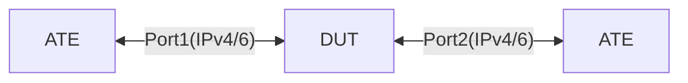

# SYS-1.1: Test default COPP policy thresholds for Arista

## Summary

***NOTE:*** 

We will not configure any CoPP policies or thresholds on the DUT. We will solely rely on the vendor default and pre-applied CoPP policies and thresholds \
[TODO] Utilize standardized OC models as they become available

*   Ensure that the default CoPP protects the control plane from excessive traffic and prioritizes critical control plane packets
*   Verify that the default CoPP queues function correctly and handle packet drops as expected

* [`featureprofiles/topologies/atedut_2.testbed`](https://github.com/openconfig/featureprofiles/blob/main/topologies/atedut_2.testbed)

## Topology:



## Procedure

### Initial setup

*   Connect DUT port-1, 2 to ATE port-1, 2 respectively
*   Configure IPv4 and IPv6 addresses on DUT and ATE ports as shown below (using OC)

    *   DUT port-1 IPv4 address ```dp1-v4 = 192.168.1.1/30```
    *   ATE port-1 IPv4 address ```ap1-v4 = 192.168.1.2/30```

    *   DUT port-2 IPv4 address ```dp2-v4 = 192.168.1.5/30```
    *   ATE port-2 IPv4 address ```ap2-v4 = 192.168.1.6/30```

    *   DUT port-1 IPv6 address ```dp1-v6 = 2001:DB8::1/126```
    *   ATE port-1 IPv6 address ```ap1-v6 = 2001:DB8::2/126```

    *   DUT port-2 IPv6 address ```dp2-v6 = 2001:DB8::5/126```
    *   ATE port-2 IPv6 address ```ap2-v6 = 2001:DB8::6/126```


### SYS-1.1.1 - Test CoPP for BGP Traffic

*   Configure BGP between ATE Port-1 and DUT port-1
*   Generate BGP traffic (update/keepalive) from ATE port-1 within the system defined thresholds
*   Generate BGP traffic (update/keepalive) from ATE port-1 exceeding the system defined thresholds
* Monitor CoPP telemetry for the BGP traffic class using the best available method to verify that:
    *   ***[TODO]*** **gNMI/OC:** Query standardized OC CoPP state model and use OC path via gNMI
        *   `/components/component/integrated-circuit/pipeline-counters/control-plane-traffic/vendor/..`
    *   Packets exceeding the threshold are dropped for each queue
    *   Packets within the threshold are not dropped
    *   BGP Session may be impacted when exceeding system defined thresholds
    *   Log the CPU utilization to ensure it remains < 100% under traffic stress
        *   `/system/cpus/cpu/state/total/instant`

### SYS-1.1.2 - Test L3 destination missing and Longest Prefix Match (LPM) overflow counters

*   Generate traffic from ATE port-1 for 1000 destinations with the IP addresses using `172.16.0.0/16` range
*   The route for these destinations will/should not be present on DUT
*   Generate traffic within the system defined thresholds and exceeding them
* Monitor CoPP telemetry for the L3 Destinatin Miss or LPM overflow traffic class using the best available method to verify that:
    *   ***[TODO]*** **gNMI/OC:** Query standardized OC CoPP state model and use OC path via gNMI
        *   `/components/component/integrated-circuit/pipeline-counters/control-plane-traffic/vendor/..`
    *   Packets exceeding the threshold are dropped for each queue
    *   Packets within the threshold are not dropped
    *   Log the CPU utilization to ensure it remains < 100% under traffic stress
        *   `/system/cpus/cpu/state/total/instant`

### SYS-1.1.3 - Test System L2 Unicast thresholds

*   Generate traffic from ATE port-1 destined towards switch’s system mac address
*   Generate traffic within and exceeding the system defined thresholds
* Monitor CoPP telemetry for System destined L2 Unicast traffic class using the best available method to verify that:
    *   ***[TODO]*** **gNMI/OC:** Query standardized OC CoPP state model and use OC path via gNMI
        *   `/components/component/integrated-circuit/pipeline-counters/control-plane-traffic/vendor/..`
    *   Packets exceeding the threshold are dropped for each queue
    *   Packets within the threshold are not dropped
    *   Log the CPU utilization to ensure it remains < 100% under traffic stress
        *   `/system/cpus/cpu/state/total/instant`

### SYS-1.1.4 - Test System IP Unicast

*   Configure a loopback250 interface on the DUT with IP address `10.10.10.10/32`
*   Generate IPv4 unicast traffic to the loopback250's IP Address
*   Generate traffic within and exceeding the system defined thresholds
* Monitor CoPP telemetry for the system destined IP Unicast traffic class using the best available method to verify that:
    *   ***[TODO]*** **gNMI/OC:** Query standardized OC CoPP state model and use OC path via gNMI
        *   `/components/component/integrated-circuit/pipeline-counters/control-plane-traffic/vendor/..`
    *   Packets exceeding the threshold are dropped for each queue
    *   Packets within the threshold are not dropped
    *   Log the CPU utilization to ensure it remains < 100% under traffic stress
        *   `/system/cpus/cpu/state/total/instant`

### SYS-1.1.5 - Test L2 Broadcast

*   Generate traffic from ATE port-1 to DUT and destined to `FF:FF:FF:FF:FF:FF` broadcast mac address
*   Generate traffic within and exceeding the system defined thresholds
* Monitor CoPP telemetry for the L2 Broadcast traffic class using the best available method to verify that:
    *   ***[TODO]*** **gNMI/OC:** Query standardized OC CoPP state model and use OC path via gNMI
        *   `/components/component/integrated-circuit/pipeline-counters/control-plane-traffic/vendor/..`
    *   Packets exceeding the threshold are dropped for each queue
    *   Packets within the threshold are not dropped
    *   Log the CPU utilization to ensure it remains < 100% under traffic stress
        *   `/system/cpus/cpu/state/total/instant`

### SYS-1.1.6 - Test LACP thresholds

*   Generate random LACP Data Units (LACPDUs) from ATE port-1 to DUT
*   Generate traffic within and exceeding the system defined thresholds
* Monitor CoPP telemetry for LACP traffic using the best available method to verify that:
    *   ***[TODO]*** **gNMI/OC:** Query standardized OC CoPP state model and use OC path via gNMI
        *   `/components/component/integrated-circuit/pipeline-counters/control-plane-traffic/vendor/..`
    *   Packets exceeding the threshold are dropped for each queue
    *   Packets within the threshold are not dropped
    *   Log the CPU utilization to ensure it remains < 100% under traffic stress
        *   `/system/cpus/cpu/state/total/instant`

### SYS-1.1.7 - Test LDP Thresholds

*   Configure LDP session between ATE port-1 and DUT port-1
*   Generate LDP traffic within and exceeding the system defined thresholds
* Monitor CoPP telemetry for LDP traffic using the best available method to verify that:
    *   ***[TODO]*** **gNMI/OC:** Query standardized OC CoPP state model and use OC path via gNMI
        *   `/components/component/integrated-circuit/pipeline-counters/control-plane-traffic/vendor/..`
    *   Packets exceeding the threshold are dropped for each queue
    *   Packets within the threshold are not dropped
    *   LDP session remains up throughout the test
    *   Log the CPU utilization to ensure it remains < 100% under traffic stress
        *   `/system/cpus/cpu/state/total/instant`

### SYS-1.1.8 - Test System LLDP

*   Enable LLDP on DUT port-1
*   Generate LLDP packets from ATE port-1 to DUT port-1 within and exceeding the system defined thresholds
* Monitor CoPP telemetry for LLDP traffic using the best available method to verify that:
    *   ***[TODO]*** **gNMI/OC:** Query standardized OC CoPP state model and use OC path via gNMI
        *   `/components/component/integrated-circuit/pipeline-counters/control-plane-traffic/vendor/..`
    *   Packets exceeding the threshold are dropped for each queue
    *   Packets within the threshold are not dropped
    *   Log the CPU utilization to ensure it remains < 100% under traffic stress
        *   `/system/cpus/cpu/state/total/instant`

## Canonical OC

***NOTE:*** When the goal evolves to testing configurable CoPP, this section would ideally contain the (future) standardized OC CoPP config model

```json
{}
```

## OpenConfig Path and RPC Coverage

```yaml
paths:
  # Interface IP Address
  /interfaces/interface/subinterfaces/subinterface/ipv4/addresses/address/config/ip:
  /interfaces/interface/subinterfaces/subinterface/ipv4/addresses/address/config/prefix-length:
  /interfaces/interface/subinterfaces/subinterface/ipv6/addresses/address/config/ip:
  /interfaces/interface/subinterfaces/subinterface/ipv6/addresses/address/config/prefix-length:
  # LLDP:
  /lldp/interfaces/interface/config/name:
  /lldp/interfaces/interface/config/enabled:
  # LDP:
  /network-instances/network-instance/mpls/signaling-protocols/ldp/global/config/lsr-id:
  /network-instances/network-instance/mpls/signaling-protocols/ldp/interface-attributes/interfaces/interface/config/interface-id:

rpcs:
  gnmi:
    gNMI.Set:
```

## Minimum DUT platform requirement

*   FFF