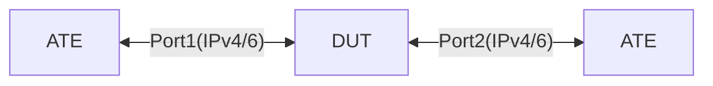

# SYS-1.1: Test default COPP policy thresholds for Arista

## Summary

***NOTE:*** This test is a CLI test until necessary YANG/OC is developed and it is applicable to Arista `7280DR3AK-36` only

*   Ensure that the default CoPP protects the control plane from excessive traffic and prioritizes critical control plane packets
*   Verify that the default CoPP queues function correctly and handle packet drops as expected
*   Default policy thresholds have been verified using CLI: `show policy-map type copp copp-system-policy` on `7280DR3AK-36`

* [`featureprofiles/topologies/atedut_2.testbed`](https://github.com/openconfig/featureprofiles/blob/main/topologies/atedut_2.testbed)

## Topology:



## Procedure

### Initial setup

*   Connect DUT port-1, 2 to ATE port-1, 2 respectively
*   Configure IPv4 and IPv6 addresses on DUT and ATE ports as shown below

    *   DUT port-1 IPv4 address ```dp1-v4 = 192.168.1.1/30```
    *   ATE port-1 IPv4 address ```ap1-v4 = 192.168.1.2/30```

    *   DUT port-2 IPv4 address ```dp2-v4 = 192.168.1.5/30```
    *   ATE port-2 IPv4 address ```ap2-v4 = 192.168.1.6/30```

    *   DUT port-1 IPv6 address ```dp1-v6 = 2001:DB8::1/126```
    *   ATE port-1 IPv6 address ```ap1-v6 = 2001:DB8::2/126```

    *   DUT port-2 IPv6 address ```dp2-v6 = 2001:DB8::5/126```
    *   ATE port-2 IPv6 address ```ap2-v6 = 2001:DB8::6/126```


### SYS-1.1.1 - Test CoppSystemBgp

*   Use the default CoPP with defined thresholds for the queue:
    *   CoppSystemBgp
        * shape : 25000 kbps
        * bandwidth : 1500 kbps
*   Configure BGP between ATE Port-1 and DUT port-1
*   Generate BGP traffic (update/keepalive) from ATE port-1 within the system defined thresholds
*   Generate BGP traffic (update/keepalive) from ATE port-1 exceeding the system defined thresholds
*   Monitor the CoPP counters queue output (show cpu counters queue summary) to verify that:
    *   Packets exceeding the threshold are dropped for each queue
    *   Packets within the threshold are not dropped
    *   BGP Session remains stable throughout the test
    *   Analyze the CPU utilization to ensure it remains stable under traffic stress

### SYS-1.1.2 - Test CoppSystemL3DstMiss

*   Use the default CoPP with defined thresholds for the queue:
    *   CoppSystemL3DstMiss
        * shape : 2500 kbps
        * bandwidth : 250 kbps
    *   CoppSystemL3LpmOver
        * shape : 1000 kbps
        * bandwidth : 200 kbps
*   Note: `CoppSystemL3DstMiss` for destinations missing in FIB and `CoppSystemL3LpmOver` for route lookup in software
*   Generate traffic from ATE port-1 for destination IP addresses using `172.16.0.0/16` range
*   The route for these destinations will/should not be present on DUT
*   Generate traffic within the system defined thresholds and exceeding them
*   Monitor the CoPP counters queue output (show cpu counters queue summary) to verify that:
    *   Packets exceeding the threshold are dropped for each queue
    *   Packets within the threshold are not dropped
    *   Analyze the CPU utilization to ensure it remains stable under traffic stress

### SYS-1.1.3 - Test CoppSystemL2Ucast

*   Use the default CoPP with defined thresholds for the queue:
    *   CoppSystemL2Ucast
        * shape : 250000 kbps
        * bandwidth : 1500 kbps
*   Generate traffic from ATE port-1 destined towards switch’s system mac address
*   Generate traffic within and exceeding the system defined thresholds
*   Monitor the CoPP counters queue output (show cpu counters queue summary) to verify that:
    *   Packets exceeding the threshold are dropped for each queue
    *   Packets within the threshold are not dropped
    *   Analyze the CPU utilization to ensure it remains stable under traffic stress

### SYS-1.1.4 - Test CoppSystemIpUcast

*   Use the default CoPP with defined thresholds for different queue:
    *   CoppSystemIpUcast
        * shape : 250000 kbps
        * bandwidth : 1500 kbps
*   Configure a loopback250 interface on the DUT with IP address `10.10.10.10/32`
*   Generate IPv4 unicast traffic to the loopback250's IP Address
*   Generate traffic within and exceeding the system defined thresholds
*   Monitor the CoPP counters queue output (show cpu counters queue summary) to verify that:
    *   Packets exceeding the threshold are dropped for each queue
    *   Packets within the threshold are not dropped
    *   Analyze the CPU utilization to ensure it remains stable under traffic stress

### SYS-1.1.5 - Test CoppSystemL2Bcast

*   Use the default CoPP with defined thresholds for different queue:
    *   CoppSystemL2Bcast
        * shape : 25000 kbps
        * bandwidth : 1500 kbps
*   Generate traffic from ATE port-1 to DUT and destined to `FF:FF:FF:FF:FF:FF` broadcast mac address
*   Generate traffic within and exceeding the system defined thresholds
*   Monitor the CoPP counters queue output (show cpu counters queue summary) to verify that:
    *   Packets exceeding the threshold are dropped for each queue
    *   Packets within the threshold are not dropped
    *   Analyze the CPU utilization to ensure it remains stable under traffic stress

### SYS-1.1.6 - Test CoppSystemLacp

*   Use the default CoPP with defined thresholds for different queue:
    *   CoppSystemLacp
        * shape : 25000 kbps
        * bandwidth : 1500 kbps
*   Generate random LACP Data Units (LACPDUs) from ATE port-1 to DUT
*   Generate traffic within and exceeding the system defined thresholds
*   Monitor the CoPP counters queue output (show cpu counters queue summary) to verify that:
    *   Packets exceeding the threshold are dropped for each queue
    *   Packets within the threshold are not dropped
    *   Analyze the CPU utilization to ensure it remains stable under traffic stress

### SYS-1.1.7 - Test CoppSystemLdp

*   Use the default CoPP with defined thresholds for different queue:
    *   CoppSystemLdp
        * shape : 250000 kbps
        * bandwidth : 1500 kbps
*   Configure LDP session between ATE port-1 and DUT port-1
*   Generate LDP traffic within and exceeding the system defined thresholds
*   Monitor the CoPP counters queue output (show cpu counters queue summary) to verify that:
    *   Packets exceeding the threshold are dropped for each queue
    *   Packets within the threshold are not dropped
    *   LDP session remains up throughout the test
    *   Analyze the CPU utilization to ensure it remains stable under traffic stress

### SYS-1.1.8 - Test CoppSystemLldp

*   Use the default CoPP with defined thresholds for different queue:
    *   CoppSystemLldp
        * shape : 25000 kbps
        * bandwidth : 1500 kbps
*   Enable LLDP on DUT port-1
*   Generate LLDP packets from ATE port-1 to DUT port-1 within and exceeding the system defined thresholds
*   Monitor the CoPP counters queue output (show cpu counters queue summary) to verify that:
    *   Packets exceeding the threshold are dropped for each queue
    *   Packets within the threshold are not dropped
    *   Analyze the CPU utilization to ensure it remains stable under traffic stress

## Canonical OC Configuration

```json
Not applicable
```

## OpenConfig Path and RPC Coverage

```yaml
paths:
  # Interface IP Address
  /interfaces/interface/subinterfaces/subinterface/ipv4/addresses/address/config/ip:
  /interfaces/interface/subinterfaces/subinterface/ipv4/addresses/address/config/prefix-length:
  /interfaces/interface/subinterfaces/subinterface/ipv6/addresses/address/config/ip:
  /interfaces/interface/subinterfaces/subinterface/ipv6/addresses/address/config/prefix-length:
  # LLDP:
  /lldp/interfaces/interface/config/name:
  /lldp/interfaces/interface/config/enabled:
  # LDP:
  /network-instances/network-instance/mpls/signaling-protocols/ldp/global/config/lsr-id:
  /network-instances/network-instance/mpls/signaling-protocols/ldp/interface-attributes/interfaces/interface/config/interface-id:

rpcs:
  gnmi:
    gNMI.Set:
```

## Minimum DUT platform requirement

FFF

