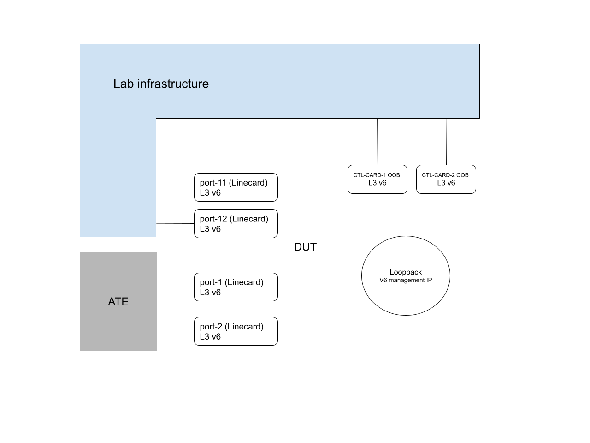

# Test plan

## Summary

Test a non default VRF as a VRF for managing the DUT.

## Lab infrastructure

This test plan requires that the DUT is managed by the lab infrastructure in the following way:

*   All DUT OOB interfaces are L3 with IPv6 addresses connected to lab infrastructure.
*   Two DUT ports (say **port-11** and **port-12**) are L3 with IPv6 addresses connected to lab infrastructure.
*   The DUT can be managed at an IPv6 address hosted by a loopback interface, and **via port-11, port-12 or OBB ports**. The loopback interface should host only one IPv6 address. (so that later the test can extract that IPv6 address and move it to another specified loopback interface in a management VRF).
*   DUT port-1 and port-2 (L3, no vlan) are with IPv6 addresses and are connected to ATE port-1 and port-2, so that the test can exercise/validate some routing protocols (e.g. BGP) without touching lab env infrastructure.
*   Username used by the test can only be authenticated via TACACS of the lab infra.
*   If the DUT has multiple CONTROLLER CARD, one single OOB IP should be assigned.

## Test input args

*   `mgmt_vrf_name`: name of the management VRF the test should use. If the lab infrastructure is already using a non default VRF to manage the device, we recommend to specify the name here so that the test reuses the VRF to avoid unnecessary interruptions.
*   `lab_infra_loopback_name`: before the test starts, this is the name of the loopback interface that hosts the IPv6 management IP. During the test, we will extract the IPv6 management IP from the specified interface, and  put it under a loopback subinterface 100 (say lo0.100) in the management VRF.
*   `inband_interfaces`: before the tests start, this is a list of linecard interfaces that the lab infrastructure uses to manage the device. During the test, we will ensure it’s in the management VRF.

## Baseline setup

*   It is strongly recommended to do the following configs in one gNMI SetRequest to minimize the chances of getting the device in an isolated/unmanageable state. **Note**: the management connection might disconnect in this step. However, reconnection should happen successfully within 3min. **Note**: though OC is preferred, it’s ok to configure the following in vendor CLI:
    *   Configure the following interfaces are in the `mgmt_vrf_name`VRF:
        *   lo0.100, which is configured with only the IPv6 management IP that’s extracted from `lab_infra_loopback_name`. No IPv4 address is configured under lo0.100.
        *   Port-1, port-2, port-11, port-12 and OOB interfaces.
    *   Configure the following services to listen on the lo0.100 management IP, with [IANA assigned ports](https://www.iana.org/assignments/service-names-port-numbers/service-names-port-numbers.xhtml). If a service has no assigned port yet, it should be provided via a test input arguments.
        *   gRIBI
        *   gNOI
        *   gNMI
        *   P4RT
    *   Configure the following services with the expectation that lo0.100 IP will be used for communication.
        *   sFLOW
        *   Syslog
        *   TACACS services.
        *   SSH services.
        *   Specify the target name server.
        *   Specify the target NTP server.
    *   Configure two `::/0` static routes configured in the management VRF, with default route preference and next hops being the adjacent IP of port-11 and port-12. This will be the primary channel for management traffic. In prod, this will be BGP routes. However, we don’t have to enforce this on the lab infrastructure.
    *   Configure a `::/0` static route configured in the management VRF with route preference 220 going via OOB interface. This will be the backup channel for management traffic.
*   Configure a v6 eBGP between DUT port-1 and ATE port-1.
*   Configure a v6 eBGP between DUT port-2 and ATE port-2.
*   Configure ATE to advertise a prefix (say, [2001:DB8:0::/64](https://github.com/openconfig/featureprofiles/blob/main/CONTRIBUTING.md#ipv6)) to DUT.

## Tests

### Test-1, routing protocol validation

Via gNMI, validate that:

*   The configured 2 BGP sessions are up and receive the advertised `2001:DB8:0::/64/126` route on DUT.
*   The `::/0` static route is of the expected route preference value.

### Test-2, service available via linecard interfaces

1.  Via gNMI, shutdown all OOB ports so that port-11 and port-12 are the only ingress ports to manage the device. This step itself validates the gNMI service availability.
2.  Issue a gRIBI Flush() and expect a successful response.
3.  Issue a gNOI Ping() test to ping itself and expect a successful response.
4.  Issue a P4RT `MasterArbitrationUpdate` with random `device_id`, and expect a `StreamMessageResponse` response (no need to check the correctness).
5.  sFLOW will be tested in its own feature profile test.
6.  Use Ondatra raw API to run CLI command to refresh the time via NTP.  This also validates that the SSH is working.
7.  Use Ondatra raw API to run CLI command to lookup google.com.
8.  Syslog should be tested in its own feature profile test.
9.  Unshut OOB ports

### Test-3, service available after CONTROLLER CARD switchover

1.  Via gNMI, shutdown all OOB ports so that port-11 and port-12 are the only ingress ports to manage the device.
2.  Use gNOI command to switch over the CONTROLLER CARD. It is expected that this step probably will disconnect/disrupt existing services.
3.  Make sure all services are still accessible within 60s, by repeating service validation steps in scenario#2.
4.  Unshut OOB ports.

### Test-4, service available via OOB ports

1.  Shutdown port-11 and port-12. This ensures that the device can only be managed at the same loopback interface but via the OOB ports. This step itself validates the gNMI service availability.
2.  Issue a gRIBI Flush() and expect a successful response.
3.  Issue a gNOI Ping() test to ping itself and expect a successful response.
4.  Issue a P4RT `MasterArbitrationUpdate` with random `device_id`, and expect a `StreamMessageResponse` response (no need to check the correctness).
5.  Use Ondatra raw API to run CLI command on the DUT (e.g. show version). This validates that the SSH is working.
6.  Unshut port-11 and port-12.
