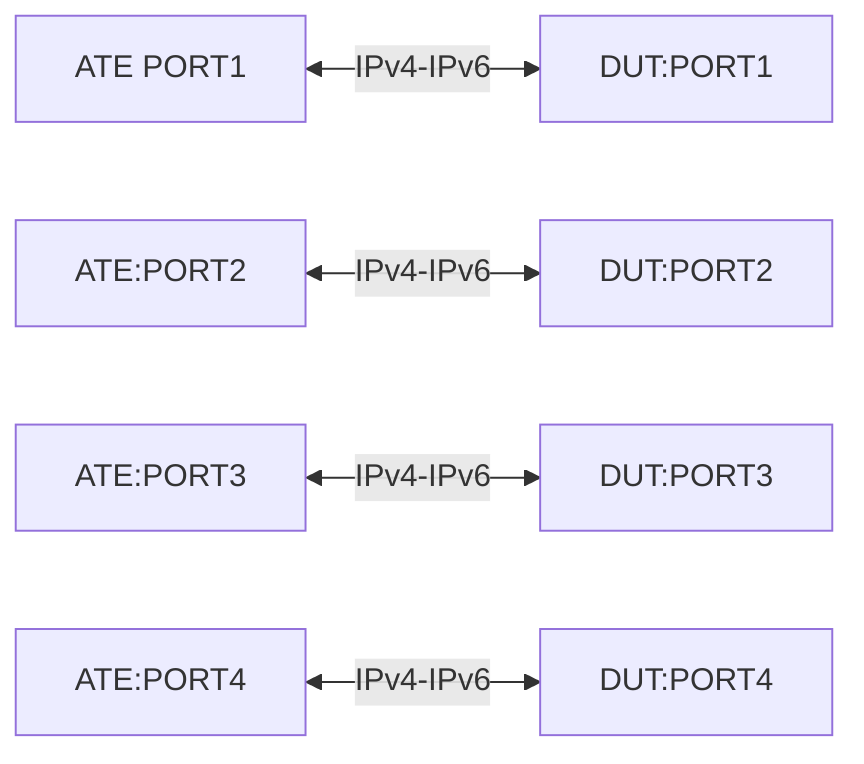

# TUN-2.9: ECMP hashing on outer and inner packets with MPLSoUDP encapsulation

Create AFT entries using gRIBI to match on next hop group in a
network-instance and encapsulate the matching packets in MPLS in UDP with
outer header as IPv4 Header or IPv6 header. Do ECMP hashing based on the 5-tuple
for the test.

The MPLS in UDP encapsulation is expected to follow
[rfc7510](https://datatracker.ietf.org/doc/html/rfc7510#section-3),
but relaxing the requirement for a well-known destination UDP port. gRIBI is
expected to be able to set the destination UDP port.

## Testbed Type

* [`featureprofiles/topologies/atedut_4.testbed`](https://github.com/openconfig/featureprofiles/blob/main/topologies/atedut_4.testbed)

## Topology:



## Procedure

### Initial setup

*   Connect ATE port-1 to DUT port-1, ATE port-2 to DUT port-2, ATE port-3 to
    DUT port-3, ATE port-4 to DUT port-4
*   Assign the ipv4 and ipv6 address to the ports as below
    DUT-port1 [40.1.1.1/24]<---> ATE-port1 [40.1.1.2/24]
    DUT-port2 [41.1.1.1/24]<---> ATE-port2 [41.1.1.2/24]
    DUT-port3 [42.1.1.1/24]<---> ATE-port3 [42.1.1.2/24]
    DUT-port4 [43.1.1.1/24]<---> ATE-port4 [43.1.1.2/24]

## Test setup

inner_ipv6_dst_A = "2001:aa:bb::1/128"
inner_ipv6_dst_B = "2001:aa:bb::2/128"
inner_ipv6_default = "::/0"

ipv4_inner_dst_A = "10.5.1.1/32"
ipv4_inner_dst_B = "10.5.1.2/32"
ipv4_inner_default = "0.0.0.0/0"

outer_ipv6_src =      "2001:f:a:1::0"
outer_ipv6_dst_A =    "2001:f:c:e::1"
outer_ipv6_dst_B =    "2001:f:c:e::2"
outer_ipv6_dst_def =  "2001:1:1:1::0"
outer_dst_udp_port =  "6635"
outer_dscp =          "26"
outer_ip-ttl =        "64"

## Procedure

### TUn 2.9 Match and Encapsulate using gRIBI aft modify

#### gRIBI RPC content

The gRIBI client should send this proto message to the DUT to create AFT
entries.

```proto
#
# aft entries used for network instance "NI_A"
IPv6Entry {2001:DB8:2::2/128 (NI_A)} -> NHG#100 (DEFAULT VRF)
IPv4Entry {203.0.113.2/32 (NI_A)} -> NHG#100 (DEFAULT VRF) -> {
  {NH#101, DEFAULT VRF}
}

# this nexthop specifies a MPLS in UDP encapsulation
NH#101 -> {
  encap_-_headers {
    encap_header {
      index: 1
      mpls {
        pushed_mpls_label_stack: [101,]
      }
    }
    encap_header {
      index: 2
      udp_v6 {
        src_ip: "outer_ipv6_src"
        dst_ip: "outer_ipv6_dst_A"
        dst_udp_port: "outer_dst_udp_port"
        ip_ttl: "outer_ip-ttl"
        dscp: "outer_dscp"
      }
    }
  }
  next_hop_group_id: "nhg_A"  # new OC path /network-instances/network-instance/afts/next-hop-groups/next-hop-group/state/
  network_instance: "DEFAULT"
}
```

* Create 5-tuple traffic profile from ATE port 1 to DUT port 1, DUT port 2, 
  DUT port 3 with the following parameters created.
  ipv6 source -> "outer_ipv6_src"
  ipv6 destination -> "outer_ipv6_dst_A"
  udp src port -> range (10000-30000)
  udp dst port -> outer_dst_udp_port
  total no of flows -> 100000
* Configure ECMP hashing configuration on the following parameters
  src IP, dst IP, src UDP port, dst UDP port
* Using OTG, validate ATE port 2-4 receives the traffic with MPLS-IN-UDP encap
  * Validate destination IPs are outer_ipv6_dst_A and outer_ipv6_dst_B
  * Validate MPLS label is set
  * Validate the ecmp hashing is working fine and load balance is happening 
    across all the 3 ports with tolerance of 1%.

## Canonical OC
### TODO: Fix Canonical OC
```json
{}
```

## OpenConfig Path and RPC Coverage

```yaml
paths:

# afts state paths set via gRIBI
  # TODO: need new OC for user defined next-hop-group/state/id, needed for policy-forwarding rules pointing to a NHG
  # /network-instances/network-instance/afts/next-hop-groups/next-hop-group/state/next-hop-group-id:

  # TODO: new OC path for aft NHG pointing to a different network-instance
  # /network-instances/network-instance/afts/next-hop-groups/next-hop-group/state/network-instance:

  # Paths added for TE-18.1.1 Match and Encapsulate using gRIBI aft modify
  /network-instances/network-instance/afts/next-hop-groups/next-hop-group/state/id:
  /network-instances/network-instance/afts/next-hop-groups/next-hop-group/next-hops/next-hop/state/index:
  /network-instances/network-instance/afts/next-hops/next-hop/encap-headers/encap-header/state/index:
  /network-instances/network-instance/afts/next-hops/next-hop/encap-headers/encap-header/state/type:
  
  /network-instances/network-instance/afts/next-hops/next-hop/encap-headers/encap-header/mpls/state/mpls-label-stack:
  /network-instances/network-instance/afts/next-hops/next-hop/encap-headers/encap-header/udp-v4/state/src-ip:
  /network-instances/network-instance/afts/next-hops/next-hop/encap-headers/encap-header/udp-v4/state/dst-ip:
  /network-instances/network-instance/afts/next-hops/next-hop/encap-headers/encap-header/udp-v4/state/dst-udp-port:
  /network-instances/network-instance/afts/next-hops/next-hop/encap-headers/encap-header/udp-v4/state/ip-ttl:
  /network-instances/network-instance/afts/next-hops/next-hop/encap-headers/encap-header/udp-v4/state/dscp:

  /network-instances/network-instance/afts/next-hops/next-hop/encap-headers/encap-header/udp-v6/state/src-ip:
  /network-instances/network-instance/afts/next-hops/next-hop/encap-headers/encap-header/udp-v6/state/dst-ip:
  /network-instances/network-instance/afts/next-hops/next-hop/encap-headers/encap-header/udp-v6/state/dst-udp-port:
  /network-instances/network-instance/afts/next-hops/next-hop/encap-headers/encap-header/udp-v6/state/ip-ttl:
  /network-instances/network-instance/afts/next-hops/next-hop/encap-headers/encap-header/udp-v6/state/dscp:

rpcs:
  gribi:
    gRIBI.Modify:
      afts:next-hops:next-hop:encap-headers:encap-header:udp_v6:
      afts:next-hops:next-hop:encap-headers:encap-header:mpls:
    gRIBI.Flush:
```

## Required DUT platform

* FFF

