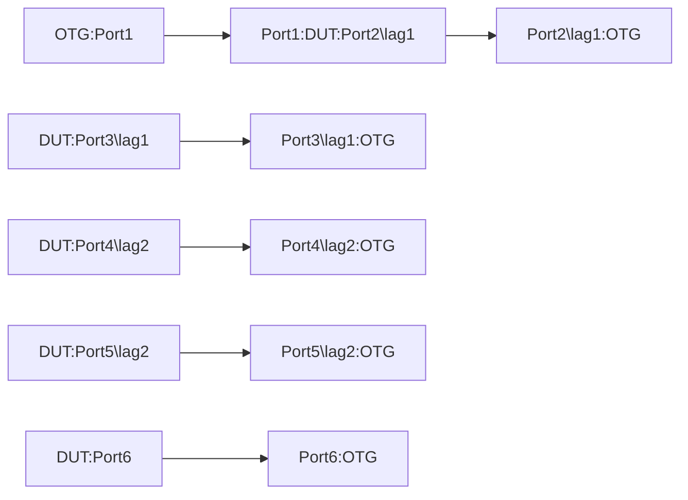

# TUN-1.6: Tunnel End Point Resize for Ecapsulation - Interface Based GRE Tunnel

## Summary
* Tunnel End Point Resize test for Interface Based GRE Tunnels to ensure inflight increase or decrease in tunnel endpoints do not cause packet drops for encap function.

## Topology

## Subtest-1: Setup Tunnels as per requirements
1. The test should configure 32 GRE tunnel interfaces per address family and each should be configured with different /32 and /128 tunnel destination prefixes of the same /27 and /64 prefix range. Each of these tunnel interfaces should use the loopback address as the source-address for their respective address-families. Hence, we will have total 64xtunnel interfaces, 32 per address-family as source and destination addresses of the tunnels.
2. Add static routes to provide reachability for the /27 IPv4 and /64 IPv6 tunnel destination prefixes in bullet#1 above to point at lag1, lag2 and port6 for ECMP.
3. Configure dualstack IPv4 and an IPv6 addresses for each of the 64xtunnel interfaces. The IP addresses can be of /30 and /127 prefix-lengths.
4. Pick 2 different /24 IPv4 and /64 IPv6 subnets each to emulate destination of payload traffic to be tunneled. Note: This is for the destination prefixes of the flows generated by OTG:Port1.
5. Add 128 different v4 and v6 static routes (64 for each address-family) for the 2 sets of /24 IPv4 and /64 IPv6 payload prefixes in bullet#4 above. The static routes should be such that, the first set of 1x /24 IPv4 and 1x /64 IPv6 prefixes should point at the 32x tunnel interfaces configured w/ IPv4 tunnel destination and the second set of 1x /24 IPv4 and 1x /64 IPv6 prefixes should point at the 32x tunnel interfaces w/ IPv6 tunnel destinations.

### Verification:
 *   Ensure all tunnel interfaces are up
 *   Ensure all LAG and singleton interfaces are up
 *   Run Health-1.1. checks

## Subtest-2: Gather baseline stats by passing traffic
 *   Start with the configuration in Subtest-1 above.
 *   The test should send 2000 IPv4 and 2000 1Pv6 flows from the ATE:Port1 to the "tunnel payload destination prefixes". These flows should equally be split between the 2x /24 IPv4 and 2x /64 IPv6 destination prefixes mentioned in Subtest-1 bullet#4 above. The flows should use variations in the following,
        * Source IP address
        * Source Port
        * Destination IP adresses.
        * Destination Port
        * Payload protocol
 *   Incoming traffic on DUT:PORT1 should be load shared across all 64 Tunnel interfaces for encapsulation and then routed out the combination of lag and singleton interfaces, i.e. lag1, lag2 and Port6.
 *   Follow all the "verifications" steps in [*] below

## Subtest-3: Removal of static routes to prevent using some of the tunnels 
 *   Start with the state in Subtest-2 above with active traffic flow.
 *   Reduce the number of Tunnel interfaces, e.g. from 32 to 16 for each of the tunnel destination group by address-family:
        * If the static routes are used to forward traffic to tunnel, please disable or delete the static routes in this test to simulate the reduction in available paths.
 *   Incoming traffic on DUT:PORT1 should now be load shared across all remaining 16 Tunnel interfaces per tunnel-destination by address-family.
 *   Follow all the verifications steps in [*] below.

## Subtest-4: Restore static routes to start using all 32 tunnels 
 *   Start from the condition in Subtest-3 above with inflight traffic from OTG:Port1.
 *   Increase number of Tunnel interfaces, e.g. From 16 to 32 per tunnel-destination by address-family.
 *   Incoming traffic on DUT:PORT1 should now be load shared across all 32 Tunnel interfaces per tunnel-destination by address-family. Follow all the verifications steps in [*] below

## Subtest-5: gNMI configuration push test to validate tunnel configuration as a single atomic operation
 *   Start w/o any tunnel interface and corresponding static routes configuration 
 *   Use a single gNMI.Replace operation to configure 32 tunnel interfaces and corresponding routes in a single request.
 *   Start traffic. Follow verification steps in [*] below to confirm success
 *   While the traffic flow is happening, make another gNMI.Replace operation for just 16 tunnels and corresponding static routes
 *   Follow the verification steps in [*] below for success.
   

#### [*] Verification steps
 *   Verify the next hop counters for packets being diverted or sent for encapsulation. Test should fail if drops recorded.
 *   Verify the tunnel interfaces counters to confirm traffic encapsulation. Test should fail if the counts dont match the original count of packets sent by OTG
 *   Verify the tunnel interfaces for optimal load balancing of traffic/flow. Acceptable deviation is <=3%
 *   Verify the tunnel interfaces for optimal load balancing of traffic/flow. Acceptable deviation is <=3%. This is true for tunnel destinations of both address families.
 *   Validate system for:
        * Health-1.1. checks.
        

    
## Config Parameter coverage

TODO: OpenConfig definition required for Tunnel protocol under interfaces/interfaces/interface/tunnel/ as GRE, IP-IP, GUE etc. 
 *   interfaces/interfaces/interface/tunnel/config/dest/
 *   interfaces/interfaces/interface/tunnel/config/src/
 *   interfaces/interfaces/interface/tunnel/ipv4/addresses/address/config/ip
 *   interfaces/interfaces/interface/tunnel/ipv4/addresses/address/config/prefix-length
 *   interfaces/interfaces/interface/tunnel/ipv6/addresses/address/config/ip
 *   interfaces/interfaces/interface/tunnel/ipv6/addresses/address/config/prefix-length

## Telemetry Parameter coverage

 *   /interfaces/interface/tunnel/state/src
 *   /interfaces/interface/tunnel/state/dst
 *   /interfaces/interface/tunnel/ipv4/addresses/address/state/ip
 *   /interfaces/interface/tunnel/ipv4/addresses/address/state/prefix-length
 *   /interfaces/interface/tunnel/ipv6/addresses/address/state/ip
 *   /interfaces/interface/tunnel/ipv6/addresses/address/state/prefix-length
 *   Following stats for lag and singleton interfaces as well as for tunnel/ipv4/state/ and tunnel/ipv6/state/
        *   state/counters/in-pkts 
        *   state/counters/in-octets 
        *   state/counters/out-pkts 
        *   state/counters/out-octets 
        *   state/counters/in-error-pkts 
        *   state/counters/in-forwarded-pkts 
        *   state/counters/in-forwarded-octets 
        *   state/counters/in-discarded-pkts 
        *   state/counters/out-error-pkts 
        *   state/counters/out-forwarded-pkts 
        *   state/counters/out-forwarded-octets 
        *   state/counters/out-discarded-pkts
