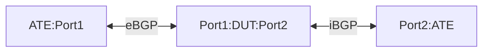

# URPF-1.1: uRPF validation from non-default network-instance
## Summary
This test verifies that uRPF validation occurs in a non-default network-instance while the forwarding lookup takes place in the default network-instance.

## Topology
- Create the following connections:



## Configuration generation of DUT and ATE
### Baseline DUT configuration
- Configure EBGP[ASN200:ASN100] between ATE port1 – DUT port1
- Configure IBGP[ASN100] between ATE port 2 – DUT
- Configure a non-default vrf to host routes learned from eBGP neighborship(ATE port1) and to constraint the uRPF lookup in the non-default vrf
- Routes in non-default VRF:
    - Configure the route leaking from Default network-instance to non-default instance based on dynamic prefix-lists based on BGP community/tag
    - The below routes learned on DUT from ATE:Port1 EBGP neighborship needs to be leaked from default vrf to non-default vrf
        - IPv4Prefix1/24 IPv6Prefix1/64 community 200:200
    - Routes learned on DUT from ATE:Port2 IBGP neighborship should not be leaked from default VRF to non-default VRF
    - Configure a static ipv4 and ipv6 default route in non-default vrf pointing towards default vrf
- DUT has DUT:Port1 and DUT:Port2 in the default network-instance
- DUT's IP sub-interfaces belong to Default VRF
- DUT port1 has uRPF policy at the ingress DUT:PORT1
### Baseline ATE configuration
- Configure EBGP[ASN200] on ATE:Port1
#### ATE Route Advertisements:
- ATE:Port1 advertises following valid prefixes over EBGP to DUT:Port1
    - IPv4Prefix1/24 IPv6Prefix1/64 community 200:200
- ATE:Port1 advertises following invalid prefixes over EBGP to DUT:Port1
    - IPv4prefix5/24 IPv6prefix5/64
- ATE:Port2 advertises following prefixes over IBGP to DUT:Port2
    - IPv4Prefix21/24 IPv6Prefix21/64
## Procedure:
1. Verify the uRPF functionality for the flows with valid source IP address
    - Flow type: Native IPv4 or IPv6 traffic
    - The valid prefixes should be installed in non-default vrf dynamically using community/tags
    - Simulate the below stated flows from ATE:Port1 to ATE:Port2:
	    - IPv4Prefix1/24 to IPv4Prefix21/24 at a rate of 100 packets/sec
        - IPv6Prefix1/24 to IPv6Prefix21/24 at a rate of 100 packets/sec
    - Success Criteria:
        - All traffic should reach port 2 and there should be no packet loss
        - The packets sent by the sender tester is equal to the packets on the receiving tester port and also should be equal to the sum of packets seen by default.
2. Verify the uRPF functionality for the flows with invalid source IP address
    - Flow type: Native IPv4 or IPv6 traffic
    - The invalid prefixes should not installed in non-default vrf dynamically based on community/tags
    - Simulate the below stated flows from ATE:Port1 to ATE:Port2:
        - IPv4prefix5/64 to IPv4Prefix21/64 at a rate of 100 packets/sec
        - IPv6prefix5/64 to IPv6Prefix21/64 at a rate of 100 packets/sec
    - Success Criteria:
        - All traffic should be dropped by DUT since the non-default vrf couldn't validate the SIP
        - Validation shouldn't happen against the default route present in non-default vrf
        - The uRPF drop packet counter should increment and should be equal to the packets sent by the sender tester
        - The packets sent by the sender tester are not equal to the packets on the receiving tester port and also the sum of packets seen by the Port2 should be zero packets.
3. Verify the dynamic route leaking from default vrf to non-default vrf
    - Flow type: Native IPv4 or IPv6 traffic
    - ATE:Port1 eBGP session advertises below additional IP prefixes other than baseline prefixes:
        - IPv4Prefix11/24 IPv6Prefix11/64 community 200:200
        - IPv4Prefix12/24 IPv6Prefix12/64 community 200:200
    - Simulate the below stated flows from ATE:Port1 to ATE:Port2:
        - IPv4Prefix11/24 to IPv4Prefix21/24 at a rate of 100 packets/sec
        - IPv6Prefix11/64 to IPv6Prefix21/64 at a rate of 100 packets/sec
        - IPv4Prefix12/24 to IPv4Prefix21/24 at a rate of 100 packets/sec
        - IPv6Prefix12/64 to IPv6Prefix21/64 at a rate of 100 packets/sec
    - Success Criteria:
        - All traffic should reach ATE:Port 2 and there should be no packet loss.
        - The non-default vrf has been dynamically updated with the additional routes advertised by ATE port1. 
        - The  packets sent by the sender tester are equal to the packets on the receiving tester port and also the sum of packets seen by the Port2 should be equal to the sum of the packets sent by the sender tester port.
4. Verify the uRPF functionality for the flows with valid source IP address that needs GUE encapsulation on DUT
    - Flow type: Native IPv4 or IPv6 traffic encapsulated by GUE variant 1 on DUT
    - The uRPF check should happen before the encapsulation is performed by the DUT
    - GUE IP header: 
        - Source IP: DUT IP address 
        - Destination IP: ATE port2 IP address
    - GUE UDP ports:
        - Source port: fixed (say:udp1)
        - Destination port(depending on payload protocol): 
            - IPv4:fixed (say: udp2)
            - IPv6: fixed (say: udp3)
    - Configure the DUT to change the next-hop for ATE:Port2 learned routes to enable GUE encapsulation:
        - IPv4Prefix21 Next-hop is a Private IPv4 address
        - IPv6Prefix21 Next-hop is a Private IPv6 address
    - Configure the DUT with GUE encapsulation in respect to the Next-hop Private IPv4 address pointing towards the ATE port2 IPv4 address.
    - Configure the DUT with GUE encapsulation in respect to the Next-hop Private IPv6 address pointing towards the ATE port2 IPv6 address.
    - Final encapsulated Packet format:
        - [[[src IP: DUT | Dst IP: ATE:Port2][udp src port: udp1 | udp dst port: udp2 or udp3]]over[payload]]
    - Simulate the below stated flows from ATE:Port1 to ATE:Port2:
    	- IPv4Prefix1/24 to IPv4Prefix21/24 at a rate of 100 packets/sec
        - IPv6Prefix1/64 to IPv6Prefix21/64 at a rate of 100 packets/sec
    - Success Criteria:
        - All traffic should reach port 2 and there should be no packet loss.
        - The  packets sent by the sender tester are equal to the packets on the receiving tester port and also the sum of packets seen by the Port2 should be equal to the sum of the packets sent by the sender tester port.
5. Verify the uRPF functionality for the flows with invalid source IP address that needs GUE encapsulation on DUT
    - Flow type: Native IPv4 or IPv6 traffic encapsulated by GUE variant 1 on DUT
    - The uRPF check should happen before the encapsulation is performed by the DUT
        - GUE IP header: 
            - Source IP: DUT IP address 
            - Destination IP: ATE port2 IP address
        - GUE UDP ports:
            - Source port: fixed (say: udp1)
            - Destination port(depending on payload protocol): 
                - IPv4:fixed (say: udp2)
                - IPv6: fixed (say: udp3)
    - ATE:Port1 advertises following invalid prefixes over EBGP to DUT:Port1
        - IPv4prefix5/24 IPv6prefix5/64
    - ATE:  Port2 advertises following prefixes over EBGP to DUT:Port1
        - IPv4Prefix21 Next-hop is a Private IPv4 address
        - IPv6Prefix21 Next-hop is a Private IPv6 address
    - Configure the DUT to change the next-hop for ATE:Port2 learned routes to enable GUE encapsulation:
        - IPv4Prefix21 > Next-hop Private IPv4 address
        - IPv6Prefix21 > Next-hop Private IPv6 address
    - Configure the DUT with GUE encapsulation in respect to the Next-hop Private IPv4 address pointing towards the ATE port2 IPv4  address.
    - Configure the DUT with GUE encapsulation in respect to the Next-hop Private IPv6 address pointing towards the ATE port2 IPv6  address.
    - Final encapsulated Packet format:
        - [[[src IP: DUT | Dst IP: ATE:Port2][udp src port: udp1 | udp dst port: udp2 or udp3]]over[payload]]
    - Simulate the below stated flows from ATE:Port1 to ATE:Port2:
        - IPv4prefix5/24 to IPv4Prefix21/24 at a rate of 100 packets/sec
        - IPv6prefix5/64 to IPv6Prefix21/64 at a rate of 100 packets/sec
    - Success Criteria:
        - All traffic should be dropped by DUT since the non-default vrf couldn't validate the source IP address of the flow
        - Validation shouldn't happen against the default route present in non-default vrf
        - The uRPF drop packet counter should increment and should be equal to the packets sent by the sender tester
        - The packets sent by the sender tester are not equal to the packets on the receiving tester port and also the sum of packets seen by the Port2 should be zero packets.

## OpenConfig Path and RPC Coverage
```yaml
paths:
    # TODO propose new OC paths for uRPF validation from non-default vrf

    # telemetry
        # TODO propose new telemetry OC paths for uRPF drop counters with non-default vrf

rpcs:
  gnmi:
    gNMI.Set:
      union_replace: true
      replace: true
    gNMI.Subscribe:
      on_change: true
```