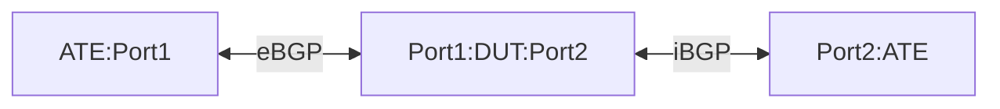

# URPF-1.1: uRPF validation from non-default network-instance
## Summary
This test verifies that uRPF validation occurs in a non-default network-instance while the forwarding lookup takes place in the default network-instance.

## Topology
- Create the following connections:


```mermaid
graph LR;
    A[ATE:Port1] <--eBGP--> B[Port1:DUT:Port2];B <--iBGP--> C[Port2:ATE];
```

## Configuration generation of DUT and ATE
### Baseline DUT configuration
- Configure EBGP[ASN200:ASN100] between ATE port1 – DUT port1
- Configure IBGP[ASN100] between ATE port 2 – DUT
- Configure a non-default vrf to host routes learned from eBGP neighborship(ATE port1) and to constraint the uRPF lookup in the non-default vrf
- Routes in non-default VRF:
    - Configure the static routes for `IPv4Prefix1/24` `IPv6Prefix1/64` in non-default VRF
    - Configure a static route for the connected interface subnet for DUT port1 in non-deafult VRF. This aids the ATE port1 – DUT port1 eBGP peering in transitioning into the Established state and remaining functional.
    - No default should be configured or leaked into non-deafult VRF.
- DUT has DUT:Port1 and DUT:Port2 in the default network-instance
- DUT's IP sub-interfaces belong to Default VRF
- DUT port1 has uRPF policy at the ingress DUT:PORT1
### Baseline ATE configuration
- Configure EBGP[ASN200] on ATE:Port1
#### ATE Route Advertisements:
- ATE:Port1 advertises following valid prefixes over EBGP to DUT:Port1
    - IPv4Prefix1/24 IPv6Prefix1/64
- ATE:Port1 advertises following invalid prefixes over EBGP to DUT:Port1
    - IPv4prefix2/24 IPv6prefix2/64
- ATE:Port2 advertises following prefixes over IBGP to DUT:Port2
    - IPv4prefix3/24 IPv6prefix3/64
## Procedure:
### URPF-1.1.1 - uRPF with valid source IP address
- Flow type: Native IPv4 or IPv6 traffic
- Simulate the below stated flows from ATE:Port1 to ATE:Port2:
  - IPv4Prefix1/24 to IPv4prefix3/24 at a rate of 100 packets/sec
  - IPv6Prefix1/24 to IPv6prefix3/24 at a rate of 100 packets/sec
- Success Criteria:
    - All traffic should reach port 2 and there should be no packet loss
    - The packets sent by the sender tester is equal to the packets on the receiving tester port and also should be equal to the sum of packets seen by default.
### URPF-1.1.2 - uRPF with invalid source IP address
- Flow type: Native IPv4 or IPv6 traffic
- The invalid prefixes should not be installed in non-default vrf
- Simulate the below stated flows from ATE:Port1 to ATE:Port2:
  - IPv4prefix2/64 to IPv4prefix3/64 at a rate of 100 packets/sec
  - IPv6prefix2/64 to IPv6prefix3/64 at a rate of 100 packets/sec
- Success Criteria:
  - All traffic should be dropped by DUT since the non-default vrf couldn't validate the SIP
  - The uRPF drop packet counter should increment and should be equal to the packets sent by the sender tester
  - The packets sent by the sender tester are not equal to the packets on the receiving tester port and also the sum of packets seen by the Port2 should be zero packets.
### URPF-1.1.3 - uRPF with valid source IP address and GUE encapsulation
- Flow type: Native IPv4 or IPv6 traffic encapsulated by GUE variant 1 on DUT
- The uRPF check should happen before the encapsulation is performed by the DUT
- Use canonical OC from [RT-3.53](https://github.com/openconfig/featureprofiles/blob/main/feature/policy_forwarding/encapsulation/otg_tests/static_encap_gue_ipv4/README.md) for enabling GUE encapsulation on DUT
    - Configure the DUT to provision the outer IP header source and destination address as below:
      - Source address is DUT Loopback address
      - Destination address is ATE:PORT2 IPv4 address
    - Final encapsulated Packet format:
    - ```[[src IP: DUT Loopback | Dst IP: ATE:Port2][udp src port: udp1 | udp dst port: udp2 or udp3]]over[payload]```
- Simulate the below stated flows from ATE:Port1 to ATE:Port2:
	- IPv4Prefix1/24 to IPv4prefix3/24 at a rate of 100 packets/sec
  - IPv6Prefix1/64 to IPv6prefix3/64 at a rate of 100 packets/sec
- Success Criteria:
  - All traffic should reach port 2 and there should be no packet loss.
  - The packets sent by the sender tester are equal to the packets on the receiving tester port and also the sum of packets seen by the Port2 should be equal to the sum of the packets sent by the sender tester port.
### URPF-1.1.4 - uRPF with invalid source IP address and GUE encapsulation
- Flow type: Native IPv4 or IPv6 traffic encapsulated by GUE variant 1 on DUT
- The uRPF check should happen before the encapsulation is performed by the DUT
- Use canonical OC from [RT-3.53](https://github.com/openconfig/featureprofiles/blob/main/feature/policy_forwarding/encapsulation/otg_tests/static_encap_gue_ipv4/README.md) for enabling GUE encapsulation on DUT
  - Configure the DUT to provision the outer IP header source and destination address as below:
    - Source address is DUT Loopback address
    - Destination address is ATE:PORT2 IPv4 address
  - Final encapsulated Packet format:
    - ```[[src IP: DUT Loopback| Dst IP: ATE:Port2][udp src port: udp1 | udp dst port: udp2 or udp3]]over[payload]```
- Simulate the below stated flows from ATE:Port1 to ATE:Port2:
    - IPv4prefix2/24 to IPv4prefix3/24 at a rate of 100 packets/sec
    - IPv6prefix2/64 to IPv6prefix3/64 at a rate of 100 packets/sec
- Success Criteria:
    - All traffic should be dropped by DUT since the non-default vrf couldn't validate the source IP address of the flow
    - The uRPF drop packet counter should increment and should be equal to the packets sent by the sender tester
    - The packets sent by the sender tester are not equal to the packets on the receiving tester port and also the sum of packets seen by the Port2 should be zero packets.

## Canonical OC
TODO: URPF via instance OC path are being proposed by to be updated by [#1320](https://github.com/openconfig/public/pull/1320)

```json
{
    "openconfig-network-instance:network-instances": {
    "network-instance": [
      {
        "name": "VRF-1",
        "config": {
          "name": "VRF-1",
          "type": "L3VRF"
        }
      }
    ]
  },
  "openconfig-interfaces:interfaces": {
    "interface": [
      {
        "name": "example-interface-name",
        "subinterfaces": {
          "subinterface": [
            {
              "index": 0,
              "config": {
                "index": 0,
                "enabled": true
              },
              "openconfig-if-ip:ipv4": {
                "urpf": {
                  "config": {
                    "enabled": true,
                    "mode": "LOOSE",
                    "lookup-network-instance": "VRF-1"
                  }
                },
                "state": {
                  "counters": {
                    "urpf-drop-pkts": "0"
                  }
                }
              },
              "openconfig-if-ip:ipv6": {
                "urpf": {
                  "config": {
                    "enabled": true,
                    "mode": "LOOSE",
                    "lookup-network-instance": "VRF-1"
                  }
                },
                "state": {
                  "counters": {
                    "urpf-drop-pkts": "0"
                  }
                }
              }
            }
          ]
        }
      }
    ]
  }
}
```

## OpenConfig Path and RPC Coverage
TODO: URPF via instance OC path are being proposed by to be updated by [#1320](https://github.com/openconfig/public/pull/1320)

```yaml
paths:
  ## Config Parameter Coverage
  /interfaces/interface/subinterfaces/subinterface/ipv4/urpf/config/enabled:
  /interfaces/interface/subinterfaces/subinterface/ipv4/urpf/config/mode:
  /interfaces/interface/subinterfaces/subinterface/ipv4/urpf/config/allow-default-route:
  /interfaces/interface/subinterfaces/subinterface/ipv4/urpf/config/allow-drop-next-hop:
  /interfaces/interface/subinterfaces/subinterface/ipv4/urpf/config/allow-feasible-path:
  /interfaces/interface/subinterfaces/subinterface/ipv6/urpf/config/enabled:
  /interfaces/interface/subinterfaces/subinterface/ipv6/urpf/config/mode:
  /interfaces/interface/subinterfaces/subinterface/ipv6/urpf/config/allow-default-route:
  /interfaces/interface/subinterfaces/subinterface/ipv6/urpf/config/allow-drop-next-hop:
  /interfaces/interface/subinterfaces/subinterface/ipv6/urpf/config/allow-feasible-path:
  /interfaces/interface/subinterfaces/subinterface/ipv4/urpf/config/lookup-network-instance:
  /interfaces/interface/subinterfaces/subinterface/ipv6/urpf/config/lookup-network-instance:
  
  ## Telemetry Parameter Coverage
  /interfaces/interface/subinterfaces/subinterface/ipv4/urpf/state/enabled:
  /interfaces/interface/subinterfaces/subinterface/ipv4/urpf/state/mode:
  /interfaces/interface/subinterfaces/subinterface/ipv4/state/counters/urpf-drop-pkts:
  /interfaces/interface/subinterfaces/subinterface/ipv4/state/counters/urpf-drop-bytes:
  /interfaces/interface/subinterfaces/subinterface/ipv6/urpf/state/enabled:
  /interfaces/interface/subinterfaces/subinterface/ipv6/urpf/state/mode:
  /interfaces/interface/subinterfaces/subinterface/ipv6/state/counters/urpf-drop-pkts:
  /interfaces/interface/subinterfaces/subinterface/ipv6/state/counters/urpf-drop-bytes:


rpcs:
  gnmi:
    gNMI.Set:
      union_replace: true
      replace: true
    gNMI.Subscribe:
      on_change: true
```

## Required DUT platform

* Specify the minimum DUT-type:
  * FFF - fixed form factor
